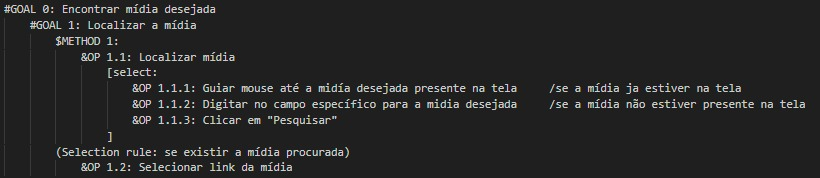
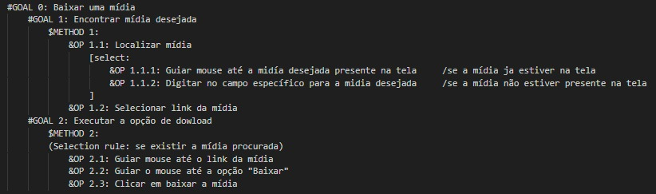
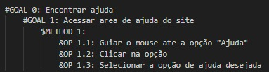
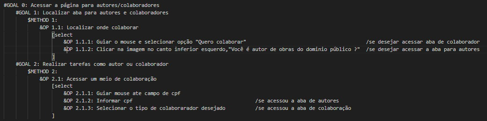
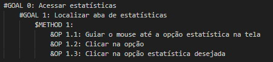

# Análise de Tarefas

## Introdução

A análise de tarefas GOMS (Goals, Operators, Methods, and Selection rules), é um técnica que analisa como o usuário se comporta em uma determinada tarefa, podendo ser capaz de prever um desempenho maior na usabilidade de interfaces de usuário e sistemas.

## Metodologia

## GOMS (Goals, Operators, Methods and Selection Rules)

O método CNM-GOMS (Goals, Operators, Methods, and Selection rules) é uma técnica de modelagem de tarefas cognitivas. Ele é utilizado para prever a quantidade de tempo necessária para realizar uma tarefa específica, levando em consideração os objetivos do usuário, os operadores mentais e físicos envolvidos, os métodos utilizados e as regras de seleção que governam as escolhas feitas durante a execução da tarefa.

A análise de tarefas GOMS envolve os seguintes elementos apresentados na Tabela 1:

Tabela 1: Elementos da análise de tarefas GOMS 

| Elementos                           | Descrição                                                                                                                                                                                                                            |
| ----------------------------------- | ------------------------------------------------------------------------------------------------------------------------------------------------------------------------------------------------------------------------------------ |
| Goals (Objetivos)                   | Os objetivos representam as metas que o usuário está tentando alcançar ao realizar uma determinada tarefa. Eles podem incluir ações como "abrir um arquivo", "imprimir um documento", "enviar um e-mail", etc.                       |
| Operators (Operadores)              | Os operadores são as ações mentais e físicas realizadas pelo usuário para atingir os objetivos. Isso inclui operadores cognitivos, como lembrar informações, e operadores físicos, como pressionar botões ou mover o mouse.          |
| Methods (Métodos)                   | Os métodos referem-se à sequência de operadores que são usados para atingir um objetivo específico. Eles descrevem a estratégia ou plano que o usuário segue para realizar uma tarefa.                                               |
| Selection rules (Regras de seleção) | As regras de seleção são as diretrizes que governam as decisões feitas pelo usuário durante a execução da tarefa. Elas determinam como o usuário escolhe entre diferentes métodos e operadores disponíveis para atingir um objetivo. |

Fonte: BARBOSA e SILVA, 2011  <a id="anchor_1" href="#FRM1">¹</a>

Para utilizar o método GOMS, você geralmente realiza as seguintes etapas:

1. Identifique e defina claramente os objetivos da tarefa que deseja analisar.
2. Liste e descreva os operadores necessários para alcançar cada objetivo.
3. Determine os métodos ou sequências de operadores que podem ser usados para atingir os objetivos.
4. Estabeleça as regras de seleção que governam as escolhas feitas pelo usuário durante a execução da tarefa.

Ao aplicar o método GOMS, é possível quantificar e prever o tempo que os usuários levarão para realizar uma tarefa específica, o que pode ser útil para projetar interfaces mais eficientes e compreender melhor o processo cognitivo dos usuários durante a interação com um sistema.

As seguintes tarefas tiveram como apoio os problemas também relacionados na análise de tarefas HTA.

### Pesquisar por mídia

Nessa tarefa, o usuário tem como objetivo pesquisar uma midia desejada.

Figura 1: Descrição GOMS da tarefa "Pesquisar por mídia"

Fonte: [Harryson Campos](https://github.com/harry-cmartin) e [Gustavo França](https://github.com/gustavofbs), 2023

### Fazer download da mídia

Nessa tarefa, o usuário tem como objetivo realizar um download da mídia escolhida.

Figura 2: Descrição GOMS da tarefa "Fazer download da mídia"

Fonte: [Harryson Campos](https://github.com/harry-cmartin) e [Gustavo França](https://github.com/gustavofbs), 2023

### Acessar ajuda

Nessa tarefa, o usuário tem como objetivo acessar um painel para buscar ajuda.

Figura 3: Descrição GOMS da tarefa "Acessar ajuda"

Fonte: [Harryson Campos](https://github.com/harry-cmartin) e [Gustavo França](https://github.com/gustavofbs), 2023

### Acessar aba para autores/colaboradores

Nessa tarefa, o usuário tem como objetivo acessar um painel para colaborar com o site.

Figura 4: Descrição GOMS da tarefa "Acessar aba para autores/colaboradores"

Fonte: [Harryson Campos](https://github.com/harry-cmartin) e [Gustavo França](https://github.com/gustavofbs), 2023

### Acessar estatísticas

Nessa tarefa, o usuário tem como objetivo acessar um painel para buscar estatísticas sobre o site.

Figura 5: Descrição GOMS da tarefa "Acessar estatísticas"

Fonte: [Harryson Campos](https://github.com/harry-cmartin) e [Gustavo França](https://github.com/gustavofbs), 2023

## Referências Bibliográficas

> <a id="FRM3" href="#anchor_1">1.</a> BARBOSA, S. D. J.; SILVA, B. S. Interação Humano-Computador. Rio de Janeiro: Elsevier, 2011.
>

## Bibliografia

> Bilheteria Digital. Análise Hierárquica de Tarefas. Repositório do Grupo Bilheteria Digital da disciplina de Interação Humano Computador da Universidade de Brasília, 2023. Disponível em: https://interacao-humano-computador.github.io/2023.1-BilheteriaDigital/analise-de-requisitos/analise-de-tarefas/hta/. Acesso em: 13 de out. 2023.
>
> Lichess. Análise de Tarefas. Repositório do Grupo Lichess da disciplina de Interação Humano Computador da Universidade de Brasília, 2023. Disponível em: https://interacao-humano-computador.github.io/2022.2-Lichess/analise_requisitos/analise_tarefas/. Acesso em: 13 de out 2023.
>
> Prates, R. Modelagem de tarefas. Disponível em: https://homepages.dcc.ufmg.br/~rprates/ihc/aula14_modelagem_tarefas.pdf. Acesso em: 13 de out. 2023

## Histórico de versões

| Versão | Data       | Descrição                 | Autor(es)                                                                                              | Revisor(es)                                                                                                                                     |
| ------ | ---------- | ------------------------- | ------------------------------------------------------------------------------------------------------ | ----------------------------------------------------------------------------------------------------------------------------------------------- |
| 1.0    | 11/10/2023 | Criação do documento GOMS | [Harryson Martins](https://github.com/harry-cmartin) e [Gustavo França](https://github.com/gustavofbs) | [Ana Catarina](https://github.com/an4catarina), [Pedro Henrique](https://github.com/pedro-hsf) e [Victor Hugo](https://github.com/ViictorHugoo) |
| 1.2    | 15/10/2023 | Corrige introdução e metodologia                     | [Gustavo França](https://github.com/gustavofbs) | [Ana Catarina](https://github.com/an4catarina) |
|1.3     | 16/10/2023 | Conserto das imagens GOMS | [Harryson Martins](https://github.com/harry-cmartin) | [Pedro Henrique](https://github.com/pedro-hsf)|