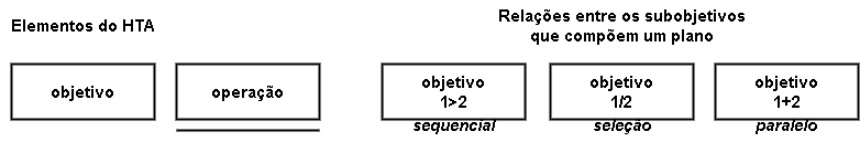
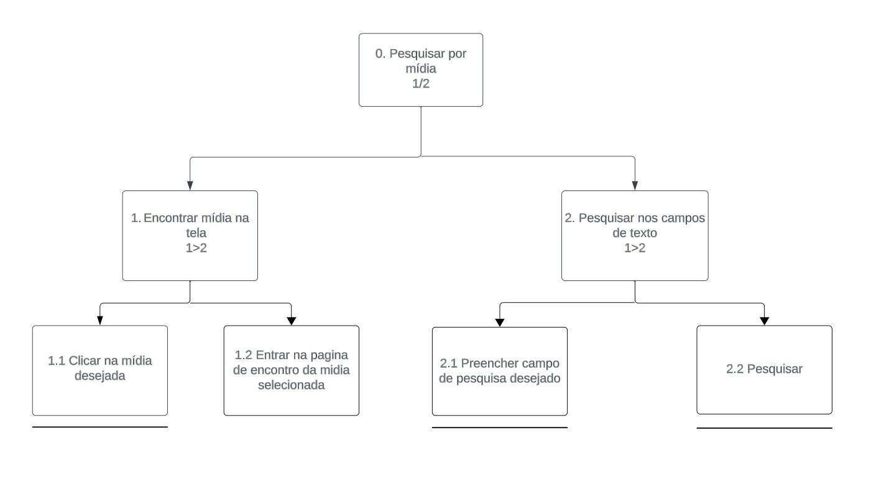
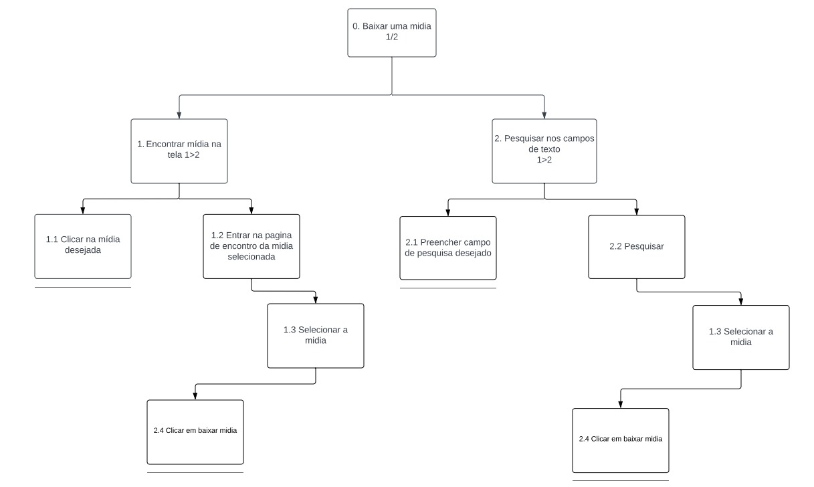
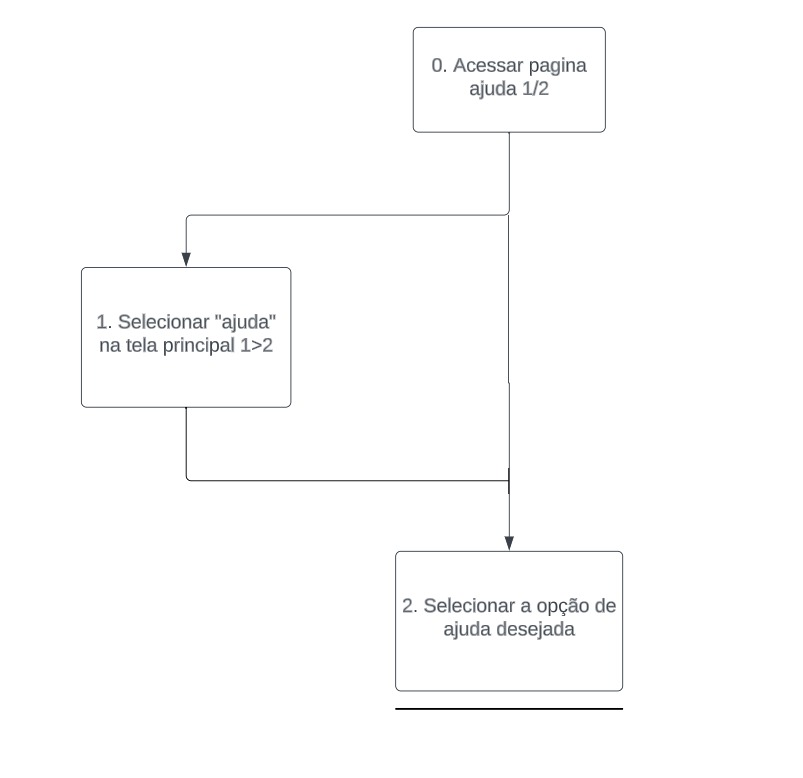
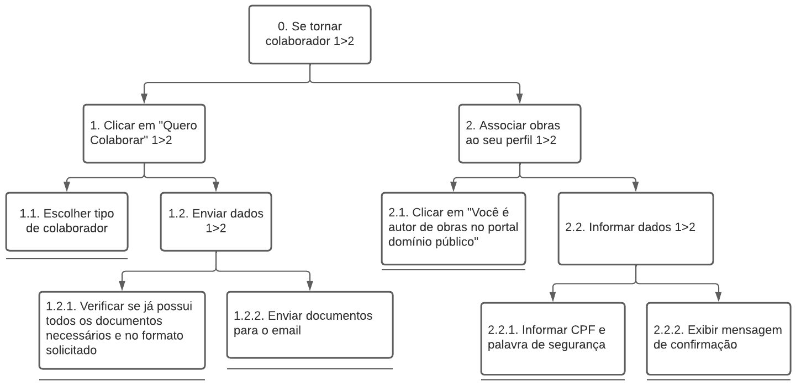
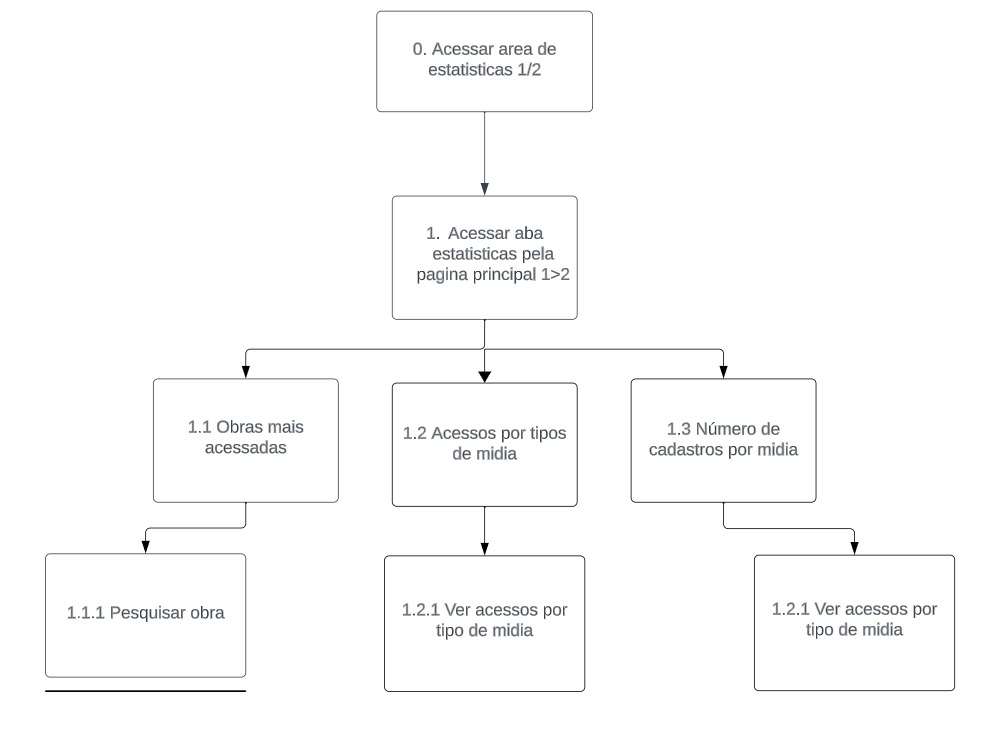

# Análise de Tarefas

## Introdução

 A análise de tarefas é um processo sistemático e detalhado que visa entender como uma tarefa é executada, e para esta primeira etapa uitilizaremos o HTA (Análise Hierárquica de Tarefas), no qual o seu objetivo é decompor as tarefas encontradas para captarmos o que pode ser melhorado em determinada tarefa.

# Metodologia

## HTA (Hierarchical Task Analysis)

A abordagem HTA é uma técnica de análise de tarefas que divide uma tarefa complexa em etapas menores e mais gerenciáveis, organizados em uma estrutura hierárquica. O propósito principal é adquirir uma compreensão da estrutura e das relações entre as sub-tarefas, identificar as interdependências e avaliar o desempenho eficaz da tarefa.

Para essa abordagem, são definidos os elementos de uma HTA na Figura 1:

Figura 1: Elementos de um diagrama HTA 

Fonte: BARBOSA e SILVA, 2011  <a id="anchor_1" href="#FRM1">¹</a>

### Pesquisar por mídia

Nessa tarefa o usuário tem por objetivo pesquisar por uma mídia. A Figura 2 mostra o Diagrama HTA desenvolvido e a Tabela 1 mostra as especificações do diagrama:

Figura 2: Diagrama da representação HTA da tarefa "Pesquisar por mídia" 

Fonte: [Harryson Campos](https://github.com/harry-cmartin) e [Gustavo França](https://github.com/gustavofbs), 2023

Tabela 1: Tabela da representação HTA da tarefa "Pesquisar por mídia" 

| Objetivos / Operações                                 | Relações | Problemas e Recomendações                                                                           |
| ----------------------------------------------------- | -------- | --------------------------------------------------------------------------------------------------- |
| 0. Pesquisar uma mídia                                | 1 / 2    | input: mídia desejada   feedback: a midia desejada é buscada e mostrada                       |
| 1. Encontrar mídia na tela                            | 1 > 2    | feedback: é mostrada a mídia na tela inicial   plano: clicar no evento mostrado                  |
| 1.1 Clicar na mídia desejada                          |          | feedback: é redirecionado a pagina de dowload   plano: clicar na midia                           |
| 1.2 Entrar na página de encontro da mídia selecionada |          | feedback: usuário direcionado a pagina da mídia                                                     |
| 2. Pesquisar nos campos de pesquisa                   | 1 > 2    | input: dados desejados para pesquisa    plano: digitar a mídia e ser redirecionado a seu arquivo |
| 2.1 Preencher campo de pesquisa desejado              |          | input: nome da mídia   plano: preencher os campos e pesquisar                                    |
| 2.2 Gerar pesquisa                                    |          | feedback: usuário redirecionado a página da pesquisa <bt> plano: encontrar a mídia desejada         |

Fonte: [Harryson Campos](https://github.com/harry-cmartin) e [Gustavo França](https://github.com/gustavofbs), 2023

### Fazer download da mídia

Nessa tarefa o usuário tem por objetivo fazer o dowload da mídia por ele pesquisada ou encontrada. No planejamento do site avaliado, essa tarefa está relacionado a heurística "Controle e liberdade do usuário".  A Figura 3 mostra o Diagrama HTA desenvolvido e a Tabela 2 mostra as especificações do diagrama:  

Figura 3: Diagrama da representação HTA da tarefa "Fazer download da mídia" 

Fonte: [Harryson Campos](https://github.com/harry-cmartin) e [Gustavo França](https://github.com/gustavofbs), 2023

Tabela 2: Tabela da representação HTA da tarefa "Fazer download da mídia" 

| Objetivos / Operações                                 | Relações | Problemas e Recomendações                                                                                     |
| ----------------------------------------------------- | -------- | ------------------------------------------------------------------------------------------------------------- |
| 0. Baixar uma mídia                                   | 1 / 2    | feedback: mostrado o arquivo baixado   plano: usuário deve ser capaz de baixar e acessar o arquivo         |
| 1. Encontrar mídia na tela                            | 1 > 2    | feedback: usuário é redirecionado a página correspondente                                                     |
| 1.1 Clicar na mídia desejada                          |          | feedback: usuário é redirecionado a tela da mídia clicada                                                     |
| 1.2 Entrar na página de encontro da mídia selecionada |          | feedback: é mostrado as características da mídia                                                              |
| 1.3 Selecionar a mídia                                |          | feedback: o usuário é redirecionado a página correspondente                                                   |
| 1.4 Clicar em baixar mídia                            |          | feedback: é mostrado o arquivo baixado   plano: o usuário deve ser capaz de acessar e utilizar o dowload   |
| 2. Pesquisar nos campos de pesquisa                   | 1 > 2    | input: nomes das mídias desejadas   plano: usuário deve preencher os campos, pesquisar e ser correspondido |
| 2.1 Preencher campo de pesquisa desejado              |          | plano: usuário deve preencher os campos, pesquisar e encontrar a mídia                                        |
| 2.2 Gerar pesquisa                                    |          |                                                                                                               |
| 2.3 Selecionar a mídia                                |          |                                                                                                               |
| 2.4 Clicar em baixar mídia                            |          | feedback: é mostrado os arquivos da mídia baixada                                                             |

Fonte: [Harryson Campos](https://github.com/harry-cmartin) e [Gustavo França](https://github.com/gustavofbs), 2023

### Acessar ajuda

Nessa tarefa o usuário tem por objetivo acessar a parte de ajuda ao usuário desenvolvida pelo site. No planejamento do site avaliado, essa tarefa está relacionado a heurística "Visibilidade do status do sistema". A Figura 4 apresenta seu diagrama HTA e a Tabela 3 suas especificações:

Figura 4: Diagrama da representação HTA da tarefa "Acessar ajuda" 

Fonte: [Harryson Campos](https://github.com/harry-cmartin) e [Gustavo França](https://github.com/gustavofbs), 2023

Tabela 3: Diagrama da representação HTA da tarefa "Acessar ajuda" 

| Objetivos / Operações                   | Relações | Problemas e Recomendações                                                                                                                 |
| --------------------------------------- | -------- | ----------------------------------------------------------------------------------------------------------------------------------------- |
| 0. Acessar página de ajuda              | 1 / 2    |                                                                                                                                           |
| 1. Selecionar "ajuda" na tela principal | 1 > 2    | feedback: o usuário é redirecionado a página correspondente   plano: o usúario deve acessar a página e encontrar a ajuda que necessita |
| 2. Selecionar a opção de ajuda desejada |          | feedback: é mostrado as opções relacionadas a seleção do usuário                                                                          |

Fonte: [Harryson Campos](https://github.com/harry-cmartin) e [Gustavo França](https://github.com/gustavofbs), 2023

### Acessar aba para autores/colaboradores

Nessa tarefa, o objetivo do usuário é acessar a aba para autores e colaboradores disponível no site em questão. No planejamento do site avaliado, essa tarefa está relacionado a heurística "Controle e liberdade do usuário" e "Projeto estético e minimalista" A Figura 5 apresenta seu diagram HTA e a Tabela 4 suas especificações:  

Figura 5: Diagrama da representação HTA da tarefa "Acessar aba para autores/colaboradores" 

Fonte: [Harryson Campos](https://github.com/harry-cmartin) e [Gustavo França](https://github.com/gustavofbs), 2023

Tabela 4: Tabela da representação HTA da tarefa "Acessar aba para autores/colaboradores" 

| Objetivos / Operações                         | Relações | Problemas e Recomendações                                                                                                                    |
| --------------------------------------------- | -------- | -------------------------------------------------------------------------------------------------------------------------------------------- |
| 0. Acessar página para autores de obras       | 1 / 2    |                                                                                                                                              |
| 1. Acessar página através da página principal | 1 > 2    |                                                                                                                                              |
| 1.1 Informar CPF                              |          |                                                                                                                                              |
| 1.2 Informar letras para segurança            |          |                                                                                                                                              |
| 1.3 Selecionar botão enviar                   |          | feedback: o usuário deve ser redirecionado a aba dos autores                                                                                 |
| 2. Acessar aba "Quero colaborar"              | 1 > 2    | feedback: o usuário é redirecionadoa página correspondente   plano: o usuário deve ver as opções dispóniveis para autores e colaboradores |
| 2.1 Selecionar como quer colaborar            |          | feedback: é redirecionado para a página de instruções da opção selecionada                                                                   |
| 2.2 Enviar email conforme orientado na página |          | plano: o usuário ao enviar email deve ser correspondido pelo destinatário                                                                    |

Fonte: [Harryson Campos](https://github.com/harry-cmartin) e [Gustavo França](https://github.com/gustavofbs), 2023

### Acessar estatísticas

Nessa tarefa, o usuário tem por objetivo acessar a área de estatísticas do site em estudo. No planejamento do site avaliado, essa tarefa está relacionado a heurística "Visibilidade do status do sistema" e "Reconhecimento em vez de memorização" A Figura 6 apresenta seu diagram HTA e a Tabela 5 suas especificações: 

Figura 6: Diagrama da representação HTA da tarefa "Acessar estatísticas" 

Fonte: [Harryson Campos](https://github.com/harry-cmartin) e [Gustavo França](https://github.com/gustavofbs), 2023

Tabela 5: Diagrama da representação HTA da tarefa "Acessar estatísticas" 

| Objetivos / Operações                               | Relações | Problemas e Recomendações                                                                                                                                              |
| --------------------------------------------------- | -------- | ---------------------------------------------------------------------------------------------------------------------------------------------------------------------- |
| 0. Acessar área de estatísticas                     | 1 / 2    |                                                                                                                                                                        |
| 1. Acessar aba "Estatísticas" pela página principal | 1 > 2    | feedback: o usuário deve ser redirecionado a página de estatisticas   palno: ao acessar a página o usuário é capaz de acessar as opções de estatisticas disponíveis |
| 1.1 Obras mais acessadas                            |          | plano: o usuário deve poder ver as obras mais acessadas                                                                                                                |
| 1.1.1 Pesquisar obra                                |          | plano: o usuário deve poder pesquisar dentro das obras mais acessadas                                                                                                  |
| 1.2 Acessos por tipos de mídia                      |          | plano: o usuário deve ser capaz de ver os acessos de terceiros a outros tipod de mídia                                                                                 |
| 1.2.1 Ver acessos por tipo de mídia                 |          | feedback: o usuário pode ver a tabela de acessos por tipo de mídia presente                                                                                            |
| 1.3 Número de cadastros por mídia                   |          | plano: ao acessar o usuário deve ser capaz de ver o número de cadastros por mídia presente                                                                             |
| 1.3.1 Ver cadastros por tipo de mídia               |          |                                                                                                                                                                        |

Fonte: [Harryson Campos](https://github.com/harry-cmartin) e [Gustavo França](https://github.com/gustavofbs), 2023

## Referências Bibliográficas

> <a id="FRM3" href="#anchor_1">1.</a> BARBOSA, S. D. J.; SILVA, B. S. Interação Humano-Computador. Rio de Janeiro: Elsevier, 2011.

## Bibliografia

> Bilheteria Digital. Análise Hierárquica de Tarefas. Repositório do Grupo Bilheteria Digital da disciplina de Interação Humano Computador da Universidade de Brasília, 2023. Disponível em: https://interacao-humano-computador.github.io/2023.1-BilheteriaDigital/analise-de-requisitos/analise-de-tarefas/hta/. Acesso em: 11 de out. 2023.
>
> Simples Nacional. Análise de Tarefas. Repositório do Grupo Simples Nacional da disciplina de Interação Humano Computador da Universidade de Brasília, 2023. Disponível em: https://interacao-humano-computador.github.io/2022.2-SimplesNacional/Tarefas/Analise/. Acesso em: 10 de out 2023.

## Histórico de versões

| Versão | Data       | Descrição                                | Autor(es)                                                                                              | Revisor(es)                                    |
| ------ | ---------- | ---------------------------------------- | ------------------------------------------------------------------------------------------------------ | ---------------------------------------------- |
| 1.0    | 11/10/2023 | Criação do Artefato                     | [Harryson Martins](https://github.com/harry-cmartin) e [Gustavo França](https://github.com/gustavofbs) | [Victor Hugo](https://github.com/ViictorHugoo) |
| 1.1    | 11/10/2023 | Adição da Analise Hierarquica de Tarefas | [Harryson Martins](https://github.com/harry-cmartin) e [Gustavo França](https://github.com/gustavofbs) | [Maria Alice](https://github.com/Maliz30)      |
| 1.2    | 11/10/2023 | Adição dos diagramas HTA                 | [Harryson Martins](https://github.com/harry-cmartin) e [Gustavo França](https://github.com/gustavofbs) | [Victor Hugo](https://github.com/ViictorHugoo) |
| 1.3    | 15/10/2023 | Corrige introdução e metodologia                     | [Gustavo França](https://github.com/gustavofbs) | [Ana Catarina](https://github.com/an4catarina) |
