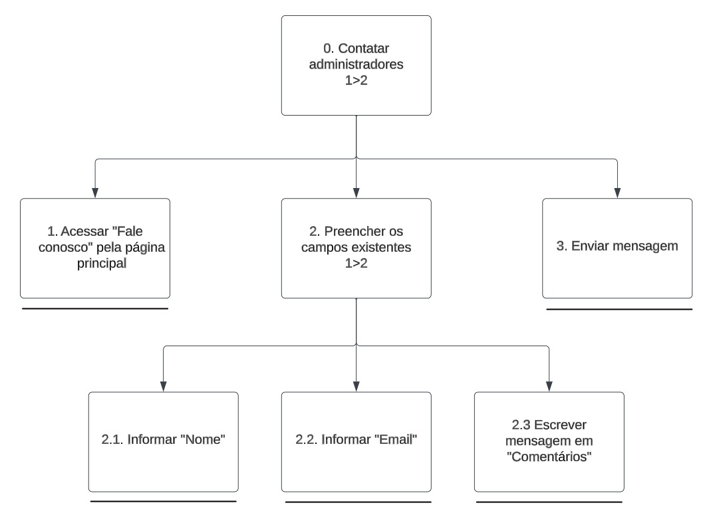

# Análise de Tarefas

## Introdução

A análise de tarefas é um processo sistemático e detalhado que visa entender como uma tarefa é executada, e para esta primeira etapa uitilizaremos o HTA (Análise Hierárquica de Tarefas), no qual o seu objetivo é decompor as tarefas encontradas para captarmos o que pode ser melhorado em determinada tarefa.

## Metodologia

## HTA (Hierarchical Task Analysis)

A abordagem HTA é uma técnica de análise de tarefas que divide uma tarefa complexa em etapas menores e mais gerenciáveis, organizados em uma estrutura hierárquica. O propósito principal é adquirir uma compreensão da estrutura e das relações entre as sub-tarefas, identificar as interdependências e avaliar o desempenho eficaz da tarefa.

Para essa abordagem, são definidos os elementos de uma HTA na Figura 1:

Figura 1: Elementos de um diagrama HTA 

Fonte: BARBOSA e SILVA, 2011  <a id="anchor_1" href="#FRM1">¹</a>

### Pesquisar por mídia

Nessa tarefa o usuário tem por objetivo pesquisar por uma mídia. A Figura 2 mostra o Diagrama HTA desenvolvido e a Tabela 1 mostra as especificações do diagrama:

Figura 2: Diagrama da representação HTA da tarefa "Pesquisar por mídia" 

Fonte: [Harryson Campos](https://github.com/harry-cmartin) e [Gustavo França](https://github.com/gustavofbs), 2023

Tabela 1: Tabela da representação HTA da tarefa "Pesquisar por mídia" 

| Objetivos / Operações                                 | Relações | Problemas e Recomendações                                                                           |
| ----------------------------------------------------- | -------- | --------------------------------------------------------------------------------------------------- |
| 0. Pesquisar uma mídia                                | 1 / 2    | input: mídia desejada   feedback: a midia desejada é buscada e mostrada                       |
| 1. Encontrar mídia na tela                            | 1 > 2    | feedback: é mostrada a mídia na tela inicial   plano: clicar no evento mostrado                  |
| 1.1 Clicar na mídia desejada                          |          | feedback: é redirecionado a pagina de dowload   plano: clicar na midia                           |
| 1.2 Entrar na página de encontro da mídia selecionada |          | feedback: usuário direcionado a pagina da mídia                                                     |
| 2. Pesquisar nos campos de pesquisa                   | 1 > 2    | input: dados desejados para pesquisa    plano: digitar a mídia e ser redirecionado a seu arquivo |
| 2.1 Preencher campo de pesquisa desejado              |          | input: nome da mídia   plano: preencher os campos e pesquisar                                    |
| 2.2 Gerar pesquisa                                    |          | feedback: usuário redirecionado a página da pesquisa <bt> plano: encontrar a mídia desejada         |

Fonte: [Harryson Campos](https://github.com/harry-cmartin) e [Gustavo França](https://github.com/gustavofbs), 2023

### Fazer download da mídia

Nessa tarefa o usuário tem por objetivo fazer o dowload da mídia por ele pesquisada ou encontrada. No planejamento do site avaliado, essa tarefa está relacionado a heurística "Controle e liberdade do usuário".  A Figura 3 mostra o Diagrama HTA desenvolvido e a Tabela 2 mostra as especificações do diagrama:  

Figura 3: Diagrama da representação HTA da tarefa "Fazer download da mídia" 

Fonte: [Pedro Henrique](https://github.com/pedro-hsf), 2023

Tabela 2: Tabela da representação HTA da tarefa "Fazer download da mídia" 

| Objetivos / Operações                     | Relações | Problemas e Recomendações                                                                                                                                                                    |
| ----------------------------------------- | -------- | -------------------------------------------------------------------------------------------------------------------------------------------------------------------------------------------- |
| 0. Baixar uma mídia                       | 1 / 2    | feedback: O usuário deve conseguir concluir o processo de Download    plano: usuário deve ser capaz de baixar e acessar o arquivo                                                         |
| 1. Entrar na página da mídia selecionada  | 1 + 2    | feedback: O usuário deverá ter acesso a página da mídia selecionada    plano: O usuário deve conseguir ver todos os dados da determinada mídia para conseguir prosseguir para o Download. |
| 1.1 Clicar na mídia desejada              |          | feedback: usuário é redirecionado a tela da mídia clicada                                                                                                                                    |
| 1.2 Entrar na página da mídia selecionada |          | feedback: é mostrado as características da mídia                                                                                                                                             |
| 1.3 Clicar em baixar                      |          | feedback: é mostrado o arquivo baixado                                                                                                                                                       |
| 2. Pesquisar nos campos de texto          | 1 + 2    | input: nomes das mídias desejadas   plano: usuário deve preencher os campos, pesquisar e ser correspondido                                                                                |
| 2.1 Preencher campo de pesquisa desejado  |          | plano: usuário deve preencher os campos, pesquisar e encontrar a mídia                                                                                                                       |
| 2.2 Pesquisar                             |          |                                                                                                                                                                                              |
| 2.3 Selecionar a mídia                    |          |                                                                                                                                                                                              |
| 2.4 Clicar em baixar                      |          | feedback: é mostrado os arquivos baixado                                                                                                                                                     |

Fonte: [Pedro Henrique](https://github.com/pedro-hsf), 2023

### Receber ajuda

Nessa tarefa o usuário tem por objetivo acessar a parte de ajuda ao usuário desenvolvida pelo site. No planejamento do site avaliado, essa tarefa está relacionado a heurística "Visibilidade do status do sistema". A Figura 4 apresenta seu diagrama HTA e a Tabela 3 suas especificações:

Figura 4: Diagrama da representação HTA da tarefa "Receber ajuda" 

Fonte: [Luciano Ricardo](https://github.com/l-ricardo), 2023

Tabela 3: Diagrama da representação HTA da tarefa "Receber ajuda" 

| Objetivos / Operações                                                      | Relações    | Problemas e Recomendações                                                                                                                 |
| -------------------------------------------------------------------------- | ----------- | ----------------------------------------------------------------------------------------------------------------------------------------- |
| 0. Receber ajuda                                                           |             |                                                                                                                                           |
| 1. Clicar em "Ajuda" na barra de navegação                                 | 1.1/1.2     | feedback: o usuário é redirecionado a página correspondente   plano: o usúario deve acessar a página e encontrar a ajuda que necessita |
| 1.1. Visualizar listagem de problemas comuns                               |             |                                                                                                                                           |
| 1.1.1. Visualizar passo a passo da solução do problema                     |             | feedback: é mostrado ao usuario uma confirmação de sucesso                                                                                |
| 1.2. Clicar em receber ajuda de Inteligência Artificial                    | 1.2.1/1.2.2 | feedback: o usuario ve um menu lateral de chat                                                                                            |
| 1.2.1. Iniciar conversa com Inteligência Artificial via prompt recomendado |             |                                                                                                                                           |
| 1.2.2. Iniciar conversa com Inteligência Artificial via chat               |             |                                                                                                                                           |

Fonte: [Luciano Ricardo](https://github.com/l-ricardo), 2023

### Se tornar um colaborador

Nessa tarefa, o objetivo do usuário é acessar a aba para autores e colaboradores disponível no site em questão. No planejamento do site avaliado, essa tarefa está relacionado a heurística "Controle e liberdade do usuário" e "Projeto estético e minimalista" A Figura 5 apresenta seu diagram HTA e a Tabela 4 suas especificações:  

Figura 5: Diagrama da representação HTA da tarefa "Acessar aba para autores/colaboradores" 

Fonte: [Maria Alice](https://github.com/Maliz30), 2023

Tabela 4: Tabela da representação HTA da tarefa "Acessar aba para autores/colaboradores" 

| Objetivos / Operações                                                                 | Relações | Problemas e Recomendações                                                                                                                                                                                                                                                                                                                                                                                                                                                                               |
| ------------------------------------------------------------------------------------- | :------: | ------------------------------------------------------------------------------------------------------------------------------------------------------------------------------------------------------------------------------------------------------------------------------------------------------------------------------------------------------------------------------------------------------------------------------------------------------------------------------------------------------- |
| 0. Se tornar colaborador                                                              |  1 > 2   | _problema:_ As instruções para se tornar um colaborador e associar obras cadastradas ao seu perfil ficam em áreas totalmente diferentes do site, o que dificulta para o usuário associar as duas ações   _recomendação:_ colocar os botões para estas ações em locais próximos ou que indiquem que uma ação deve ser realizada antes da outra   _plano:_ o usuário deve enviar a solicitação para se tornar um colaborador, clicando em "Quero Colaborar" *e depois* Associar obras ao seu perfil |
| 1. Clicar em "Quero Colaborar"                                                        |  1 > 2   | _plano:_ o usuário deve escolher para qual tipo de colaborador ele deseja se inscrever *e depois* enviar dados                                                                                                                                                                                                                                                                                                                                                                                          |
| 1.1. Escolher tipo de colaborador                                                     |          |                                                                                                                                                                                                                                                                                                                                                                                                                                                                                                         |
| 1.2. Enviar dados                                                                     |  1 > 2   | _plano:_ o usuário deve verificar se já possui todos os documentos necessários e no formato solicitado *e depois* enviar os documentos para o email                                                                                                                                                                                                                                                                                                                                                     |
| 1.2.1. Verificar se já possui todos os documentos necessários e no formato solicitado |          |                                                                                                                                                                                                                                                                                                                                                                                                                                                                                                         |
| 1.2.2. Enviar documentos para o email                                                 |          | _problema:_ Os dados devem ser enviados em um site externo, o que pode fazer com que o usuário envie os documentos para o remetente errado ou percam o interesse em fazer essa solicitação.   _recomendação:_ incluir um formulário para que essas solicitações sejam realizadas diretamente no site                                                                                                                                                                                                 |
| 2. Associar obras ao seu perfil                                                       |  1 > 2   | __plano:__ o usuário deve primeiro clicar em "Você é autor de obras no portal domínio público" *e depois* informar dados                                                                                                                                                                                                                                                                                                                                                                                |
| 2.1. Clicar em "Você é autor de obras no portal domínio público"                      |          |                                                                                                                                                                                                                                                                                                                                                                                                                                                                                                         |
| 2.2. Informar dados                                                                   |  1 > 2   | __plano:__ informar seu CPF e palavra de segurança *e depois* exibir mensagem de confirmação                                                                                                                                                                                                                                                                                                                                                                                                            |
| 2.2.1. Informar CPF e palavra de segurança                                            |          |                                                                                                                                                                                                                                                                                                                                                                                                                                                                                                         |
| 2.2.2. Exibir mensagem de confirmação                                                 |          |                                                                                                                                                                                                                                                                                                                                                                                                                                                                                                         |

Fonte: [Maria Alice](https://github.com/Maliz30), 2023

### Acessar estatísticas

Nessa tarefa, o usuário tem por objetivo acessar a área de estatísticas do site em estudo. No planejamento do site avaliado, essa tarefa está relacionado a heurística "Visibilidade do status do sistema" e "Reconhecimento em vez de memorização" A Figura 6 apresenta seu diagram HTA e a Tabela 5 suas especificações: 

Figura 6: Diagrama da representação HTA da tarefa "Acessar estatísticas" 

Fonte: [Harryson Campos](https://github.com/harry-cmartin) e [Gustavo França](https://github.com/gustavofbs), 2023

Tabela 5: Diagrama da representação HTA da tarefa "Acessar estatísticas" 

| Objetivos / Operações                               | Relações | Problemas e Recomendações                                                                                                                                              |
| --------------------------------------------------- | -------- | ---------------------------------------------------------------------------------------------------------------------------------------------------------------------- |
| 0. Acessar área de estatísticas                     | 1 / 2    |                                                                                                                                                                        |
| 1. Acessar aba "Estatísticas" pela página principal | 1 > 2    | feedback: o usuário deve ser redirecionado a página de estatisticas   plano: ao acessar a página o usuário é capaz de acessar as opções de estatisticas disponíveis |
| 1.1 Obras mais acessadas                            |          | plano: o usuário deve poder ver as obras mais acessadas                                                                                                                |
| 1.1.1 Pesquisar obra                                |          | plano: o usuário deve poder pesquisar dentro das obras mais acessadas                                                                                                  |
| 1.2 Acessos por tipos de mídia                      |          | plano: o usuário deve ser capaz de ver os acessos de terceiros a outros tipod de mídia                                                                                 |
| 1.2.1 Ver acessos por tipo de mídia                 |          | feedback: o usuário pode ver a tabela de acessos por tipo de mídia presente                                                                                            |
| 1.3 Número de cadastros por mídia                   |          | plano: ao acessar o usuário deve ser capaz de ver o número de cadastros por mídia presente                                                                             |
| 1.3.1 Ver cadastros por tipo de mídia               |          |                                                                                                                                                                        |

Fonte: [Harryson Campos](https://github.com/harry-cmartin) e [Gustavo França](https://github.com/gustavofbs), 2023

### Avaliar mídias

Nesta tarefa, o objetivo do usuário é avaliar as midias que já foram consumidas, baixadas ou lidas. No planejamento do site avaliado, essa tarefa está relacionado a heurística " ajuda e documentação" A Figura 7 apresenta seu diagram HTA e a Tabela 6 suas especificações: 

Figura 7: Diagrama da representação HTA da tarefa "Avaliar Mídia" 

Fonte: [Victor Hugo](https://github.com/ViictorHugoo), 2023

Tabela 6: Tabela da representação HTA da tarefa "Avaliar Mídia"

| Objetivos/Operações                                                       | Problemas e Recomendações                                                                                                                                                                                                                                                                                                                        |
| ------------------------------------------------------------------------- | ------------------------------------------------------------------------------------------------------------------------------------------------------------------------------------------------------------------------------------------------------------------------------------------------------------------------------------------------ |
| 0. Avaliar Midia 1>2                                                      | Input: formulário de avaliação de mídia, com campos de nota de tradução, formatação, estrutura de capítulos e nota geral, nome, data de nascimento, e-mail e comentário.   Feedback: um novo comentário aparece   Plano: informar detalhes da avaliação e do avaliador, e depois enviar mensagem de confirmação da publicação da avaliação |
| 1. Inserir dados da avaliação 1+2                                         | Plano: Dar nota de tradução, formatação, estrutura de capítulos e nota geral e  informar, nome, data de nascimento, e-mail e comentário                                                                                                                                                                                                          |
| 1.1 Dar nota de tradução, formatação, estrutura de capítulos e nota geral |
| 1.2 Informar, nome, data de nascimento, e-mail e comentário               |
| 2. Enviar confirmação de publicação da avaliação                          |                                                                                                                                                                                                                                                                                                                                                  |  |

Fonte: [Victor Hugo](https://github.com/ViictorHugoo), 2023

### Contatar administradores

Nessa tarefa, o usuário tem como objetivo acessar um painel para enviar uma mensagem aos administradores do site. A Figura 8 apresenta seu diagram HTA e a Tabela 7 suas especificações: 

Figura 8: Diagrama da representação HTA da tarefa "Contatar administrador"

Fonte: [Gustavo França](https://github.com/gustavofbs), 2023

Tabela 7: Tabela da representação HTA da tarefa "Avaliar Mídia"

| Objetivos / Operações                           | Relações | Problemas e Recomendações                                                                                                                     |
| ----------------------------------------------- | -------- | --------------------------------------------------------------------------------------------------------------------------------------------- |
| Contatar administradores                        | 1 > 2    | plano: encontrar um meio de contato, inserir informações relevantes e enviar a sua mensagem                                                   |
| 1. Acessar "Fale conosco" pela página principal |          | feedback: o usuário deve ser redirecionado a página "Fale conosco"   plano: ao acessar a página o usuário é capaz de enviar a sua mensagem |
| 2. Preencher os campos existentes               | 1 > 2    | plano: inserir o nome, email e depois a mensagem                                                                                              |
| 2.1. Informar "Nome"                            |          |
| 2.2. Informar "Email"                           |          |                                                                                                                                               |
| 2.3. Escrever mensagem em "Comentários"         |          |                                                                                                                                               |
| 3. Clicar em "Enviar"                           |          | feedback: aparecer uma mensagem de que o envio foi bem sucedido                                                                               |

Fonte: [Gustavo França](https://github.com/gustavofbs), 2023

## Referências Bibliográficas

> <a id="FRM3" href="#anchor_1">1.</a> BARBOSA, S. D. J.; SILVA, B. S. Interação Humano-Computador. Rio de Janeiro: Elsevier, 2011.

## Bibliografia

> Bilheteria Digital. Análise Hierárquica de Tarefas. Repositório do Grupo Bilheteria Digital da disciplina de Interação Humano Computador da Universidade de Brasília, 2023. Disponível em: <<https://interacao-humano-computador.github.io/2023.1-BilheteriaDigital/analise-de-requisitos/analise-de-tarefas/hta/>>. Acesso em: 11 de out. 2023.
>
> Simples Nacional. Análise de Tarefas. Repositório do Grupo Simples Nacional da disciplina de Interação Humano Computador da Universidade de Brasília, 2023. Disponível em: <<https://interacao-humano-computador.github.io/2022.2-SimplesNacional/Tarefas/Analise/>>. Acesso em: 10 de out 2023.

## Histórico de versões

| Versão | Data       | Descrição                                       | Autor(es)                                                                                              | Revisor(es)                                     |
| ------ | ---------- | ----------------------------------------------- | ------------------------------------------------------------------------------------------------------ | ----------------------------------------------- |
| 1.0    | 11/10/2023 | Criação do Artefato                             | [Harryson Martins](https://github.com/harry-cmartin) e [Gustavo França](https://github.com/gustavofbs) | [Victor Hugo](https://github.com/ViictorHugoo)  |
| 1.1    | 11/10/2023 | Adição da Analise Hierarquica de Tarefas        | [Harryson Martins](https://github.com/harry-cmartin) e [Gustavo França](https://github.com/gustavofbs) | [Maria Alice](https://github.com/Maliz30)       |
| 1.2    | 11/10/2023 | Adição dos diagramas HTA                        | [Harryson Martins](https://github.com/harry-cmartin) e [Gustavo França](https://github.com/gustavofbs) | [Victor Hugo](https://github.com/ViictorHugoo)  |
| 1.3    | 15/10/2023 | Corrige introdução e metodologia                | [Gustavo França](https://github.com/gustavofbs)                                                        | [Ana Catarina](https://github.com/an4catarina)  |
| 1.4    | 22/10/2023 | Adição de Avaliar Midia                         | [Victor Hugo](https://github.com/ViictorHugoo)                                                         | [Maria Alice](https://github.com/Maliz-30)      |
| 1.5    | 23/10/2023 | Adição de Contatar Administradores              | [Gustavo França](https://github.com/gustavofbs)                                                        | [Victor Hugo](https://github.com/ViictorHugoo)  |
| 1.6    | 23/10/2023 | Correção na HTA da ação "Se tornar colaborador" | [Maria Alice](https://github.com/Maliz30)                                                              | [Gustavo França](https://github.com/gustavofbs) |
| 1.7    | 06/12/23   | Correção do Artefato                            | [Pedro Henrique](https://github.com/pedro-hsf)                                                         | [Ana Catarina](https://github.com/an4catarina)  |
| 1.7    | 06/12/23   | Correção do Artefato                            | [Luciano Ricardo](https://github.com/l-ricardo)                                                        | [Gustavo França](https://github.com/gustavofbs) |
