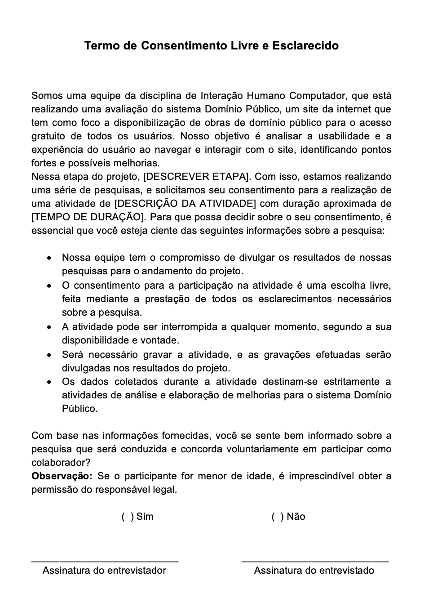

# Aspectos Éticos

## Introdução

A pesquisa envolvendo seres humanos é uma parte fundamental do avanço do conhecimento em diversas áreas. No entanto, a condução de pesquisas com seres humanos levanta uma série de questões éticas críticas que precisam ser cuidadosamente consideradas e abordadas. Esses aspectos éticos das pesquisas envolvendo pessoas são fundamentais para garantir o respeito, a segurança e o bem-estar dos participantes, bem como para preservar a integridade da pesquisa. Tendo isso em mente, deve-se garantir que todo o processo seja reconhecido cientificamente, se baseando nos princípios éticos, no Brasil a [resolução nº 466/2012](../assets/aspectos-eticos/reso466.pdf) do Conselho Nacional de Saúde estabelece diretrizes e normas para pesquisas científicas que envolvem seres humanos, pautando-se em princípios fundamentais, como:

- Princípio da autonomia: abrange a necessidade de obter o consentimento voluntário e bem informado das pessoas envolvidas na pesquisa, ao mesmo tempo em que protege grupos vulneráveis e indivíduos legalmente incapazes, como menores, alunos ou subordinados. Isso implica que qualquer pesquisa com seres humanos deve tratá-los com respeito, considerando sua capacidade de tomar decisões e cuidando daqueles que estão em situações de fragilidade.
- Princípio da beneficência: envolve a avaliação equilibrada dos riscos e benefícios, tanto no presente quanto no futuro, tanto para indivíduos quanto para grupos. Deve-se buscar maximizar os benefícios da pesquisa e minimizar os danos e riscos potenciais. Esses danos podem se manifestar em várias dimensões, como física, psicológica, moral, intelectual, social, cultural ou espiritual, em qualquer estágio da pesquisa ou após sua conclusão.
- Princípio da não maleficência: implica na obrigação de evitar danos previsíveis relacionados à pesquisa, sejam eles imediatos ou posteriores.
- Princípio da justiça e equidade: está relacionado à importância social da pesquisa, priorizando benefícios substanciais para os participantes da pesquisa e minimizando as cargas impostas aos participantes vulneráveis. Isso garante a consideração justa dos interesses envolvidos e mantém o propósito humanitário e social da pesquisa em foco.

## Termo de Consentimento

O Termo de Consentimento Livre e Esclarecido (TCLE) tem como propósito oferecer aos participantes uma compreensão completa da pesquisa em pauta, abordando de maneira detalhada os possíveis riscos e benefícios envolvidos. Essa prática é crucial para assegurar que a decisão de participar seja fundamentada em uma escolha consciente e voluntária. Além disso, garante a autorização no uso dos dados colhidos durante a pesquisa, incluindo o direito de imagem em casos de gravações.

Sempre que a pesquisa envolver seres humanos, o grupo deve utilizar ao modelo de termo de uso representado na Figura 1, quando necessário. O membro encarregado da atividade deverá preencher os detalhes de acordo com a natureza específica da pesquisa em questão.

Figura 1: Termo de Consentimento

Fonte: [Ana Catarina](https://github.com/an4catarina) e [Pedro Henrique](https://github.com/pedro-hsf) 

## Referências

> BARBOSA, S. D. J.; SILVA, B. S. Interação Humano-Computador. Rio de Janeiro: Elsevier, 2011. Aceso em: 10 de out. de 2023

> Aspectos éticos - Bilheteria Digital. Disponível em: <<https://interacao-humano-computador.github.io/2023.1-BilheteriaDigital/apresentacao/apresentacao1/>>. Acesso em 10 de out. de 2023.

## Histórico de versões

| Versão | Data       | Descrição                   | Autor(es)                                                                                       | Revisor(es) |
| ------ | ---------- | --------------------------- | ----------------------------------------------------------------------------------------------- | ----------- |
| 1.0    | 10/10/2023 | Estrutura do Site escolhido | [Ana Catarina](https://github.com/an4catarina) e [Pedro Henrique](https://github.com/pedro-hsf) |             |
