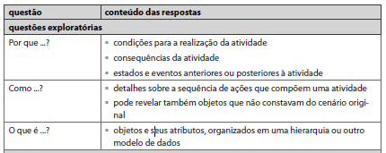
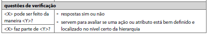

# Cenários

## Introdução
Os cenários são basicamente histórias sobre pessoas realizando uma atividade. Como forma de elaborar cenários mais completos, utilizamos a técnica do **questionamento sistemático**. Nessa técnica, segmentamos os cenários em proposições e investigamos cada uma delas, a partir de um conjunto de perguntas, que as respostam geram mais proposições. Repetimos esse ciclo até que tudo esteja completo. As perguntas sugeridas são: Por quê? Como? O que é? X pode ser feito da forma y? X faz parte de y? Conforme podemos ver nas Figuras 1 e 2.

### Questões exploratórias

Figura 1: Questões exploratórias 

Fonte: Barbosa, S., & Silva, B. (Ano de Publicação). Interação Humano-Computador (3ª ed.). Editora.

### Questões de verificação

Figura 2: Questões de verificação 

Fonte: Barbosa, S., & Silva, B. (Ano de Publicação). Interação Humano-Computador (3ª ed.). Editora.

## Cenários
Segundo Cooper, 1999, Rosson e Carroll, 2002, os cenários não precisam ser criados somente após a definição das personas e podem ser realizados em diversas etapas do processo, visando diferentes objetivos. Neste caso, decidimos usar os cenários como forma de auxiliar a equipe a fazer a identificação das personas e onde cada uma delas está inserida. 

### Pesquisar por mídia

Maria, é uma estudante universitária apaixonada por literatura clássica. Maria está em sala de aula da universidade, sentada em frente ao computador, com uma xícara de café ao lado. Durante a aula de literatura, o professor menciona a importância de um livro pouco conhecido de Machado de Assis, despertando o interesse de Maria. Maria abre o navegador e acessa o site do Domínio Público, lembrando-se das aulas de pesquisa online, ela insere o nome do autor, o título da obra e ajusta os filtros para buscar apenas livros disponíveis gratuitamente. Maria se depara com diversas obras de Machado de Assis, mas ainda não encontra o livro específico que o professor mencionou, após raciocinar ela refina sua busca, utilizando palavras-chave relacionadas ao conteúdo do livro. Após algumas tentativas, Maria encontra o livro desejado no Domínio Público. Ela sente uma mistura de satisfação e alívio ao ver a obra disponível para download gratuito. 

 O uso eficiente da plataforma do Domínio Público contribui para uma experiência positiva de pesquisa, consolidando a importância do acesso aberto à cultura.

### Fazer Download de mídia

Carlos é um cinéfilo e estudante de cinema. Carlos está em seu quarto, rodeado de pôsteres de filmes clássicos e equipamentos de filmagem. Ele está utilizando seu laptop para realizar pesquisas e projetos relacionados ao cinema, ele se lembra que durante uma aula de história do cinema, o professor menciona a importância de um filme específico dos anos 1950 para entender a evolução da linguagem cinematográfica. Carlos acessa o site do Domínio Público em busca do filme mencionado utilizando filtros de pesquisa para encontrar a obra desejada e, ao identificá-la, clica no botão de download. Durante o download, Carlos aproveita para explorar outras obras disponíveis no site, ampliando sua coleção de filmes clássicos para futuras análises. O filme é baixado com sucesso, e Carlos encontra-se agora com uma cópia digitalizada rica em qualidade. Ele abre o arquivo, verifica a integridade da obra, sorri e fica feliz ao perceber que terá acesso a uma versão restaurada do filme para aprofundar sua pesquisa acadêmica, trazendo-lhe uma sensação de realização.

### Receber ajuda

Carlos é um professor de história empenhado em encontrar materiais educativos no Domínio Público para sua nova unidade de ensino. Carlos está em seu escritório, rodeado por estantes de livros e papéis utilizando um computador para buscar recursos no Domínio Público. Carlos, ao explorar o site, encontra-se perdido em relação a certos recursos avançados do Domínio Público e percebe a necessidade de ajuda. Com o objetivo de obter orientação e suporte para maximizar a eficiência na busca por materiais educativos no Domínio Público ele localiza a opção “Ajuda" no site e, ao clicar, é redirecionado para uma seção abrangente que oferece ajuda de acesso e suporte. Carlos encontra respostas para algumas de suas dúvidas, expressa alívio e gratidão pela assistência recebida, reconhecendo a eficiência do suporte do Domínio Público.

### Acessar estatística

Iniciando sua busca por dados estatísticos, Ana, a pesquisadora na área de saúde, depara-se com desafios na navegação do site. Determinada, logo encontra uma barra de navegação onde nela está localizada uma seção "Estatísticas". Após a persistência, alcança o objetivo de obter as estatísticas desejadas por meio de filtros que existem. Experimentando um misto de alívio e satisfação. As ferramentas de visualização são habilmente empregadas, proporcionando a Ana uma compreensão mais profunda das tendências da doença em sua região. Motivada e grata pela disponibilidade dessas informações no Domínio Público, Ana destaca a relevância crucial do acesso fácil a dados para o progresso na pesquisa médica.

### Contatar administradores

Luiz, um estudante que é focado em seus afazeres da universidade, busca o Domínio Público mas logo fica em dúvida sobre uma determinada ação, então ele tenta localizar algo que lhe remeta a contato, e logo encontra o "Fale Conosco", e ao acessar a categoria, ele encontra um formulário de contato, onde preenche-o minuciosamente, descrevendo o problema ocorrido e envia a mensagem, recebendo rapidamente um e-mail de confirmação, seguido por uma solução detalhada em 24 horas. A eficiência do suporte técnico deixa Luiz aliviado e satisfeito, ressaltando a importância de um processo de contato rápido e eficaz para melhorar a experiência do usuário.

### Se tornar colaborador

André é um entusiasta de tecnologia e cultura, músico, apaixonado por preservação digital. André está em casa, navegando no computador, imerso em seus estudos sobre preservação e acesso aberto à cultura. Ele participa de uma conferência online sobre acesso aberto e preservação digital, onde os palestrantes destacam a importância do engajamento da comunidade. Inspirado pela conferência, André visita o site do Domínio Público e encontra a opção “Quero colaborar”, ele clica na opção e é oferecido quatro formas de colaborar: Voluntário, Autor, Parceiro e Tradutor. André clica na opção autor e cede algumas de suas músicas autorais para o site. André recebe uma confirmação automática do Domínio Público, agradecendo por seu interesse em contribuir. Isso o motiva ainda mais a se envolver ativamente. André, ao receber a notícia de sua aceitação como colaborador, sente uma mistura de gratidão e empolgação. A sensação de contribuir para a preservação da cultura e compartilhar seu conhecimento tecnológico o enche de orgulho.

### Avaliar mídia

Lucas conclui uma obra recém obtida no Domínio Público, e com afinco de proporcionar uma avaliação para que mais pessoas possam saber a respeito da obra, ele busca uma seção "Avaliar Mídia" onde é adicionado uma avaliação de 5 estrelas e comentando sobre os pontos que ele achou interessante, Sentindo-se realizado por contribuir para a comunidade, ele espera que sua avaliação inspire outros usuários a explorarem a obra e aprofundarem seu interesse por conteúdos clássicos disponíveis gratuitamente. A experiência reforça a importância de usuários compartilharem suas perspectivas para enriquecer a experiência coletiva no site.

## Bibliografia 

>  BARBOSA, S. D. J.; SILVA, B. S. Interação Humano-Computador. Rio de Janeiro: Elsevier, 2010.

## Histórico de versões

| Versão | Data       | Descrição            | Autor(es)                                                                                              | Revisor(es)                                    |
| ------ | ---------- | -------------------- | ------------------------------------------------------------------------------------------------------ | ---------------------------------------------- |
| 1.0    | 15/10/2023 | Criação dos cenários | [Maria Alice](https://github.com/Maliz30)                                                              | [Ana Catarina](https://github.com/an4catarina) |
| 1.1    | 04/12/2023 | Correção de erros    | [Harryson Martins](https://github.com/harry-cmartin) e [Gustavo França](https://github.com/gustavofbs) | [Maria Alice](https://github.com/Maliz30)      |