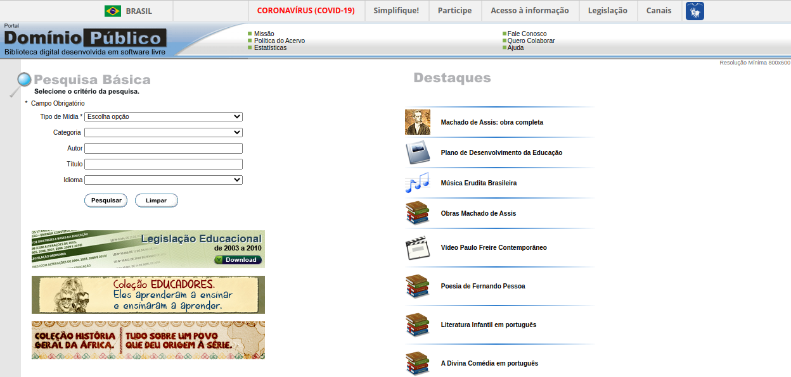
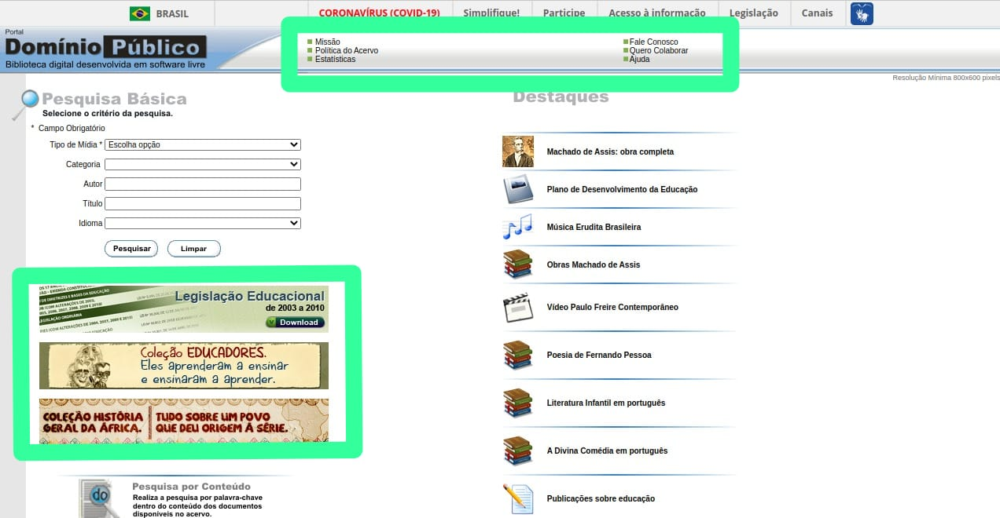
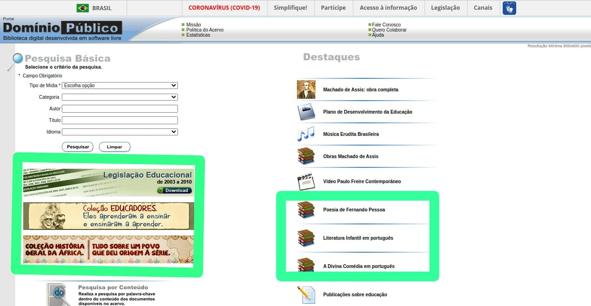

# Metas de Usabilidade

## Introdução

As metas de usabilidade compreende a identificação dos critérios de qualidade de uso que devem receber atenção especial no projeto, a determinação da maneira de como serão avaliados durante o processo de design e a definição das faixas de valores considerados inaceitáveis, aceitáveis e ideais para cada indicador relevante. Essa priorização costuma ser influenciada pelos resultados atuais do desempenho dos usuários ao interagir com o sistema <a id="anchor_1" href="#FRM1">¹</a>.

## Metodologia

Para atingir os critérios de qualidade que deverão ser priorizados, utilizaremos os seguintes fatores de usabilidade propostos por Nilsen (1993): Eficácia, Eficiência, Segurança, Utilidade, Facilidade de Aprendizado, Facilidade de Recordação e Satisfação que serão analisados no site Domínio Público.

## Eficácia

A eficácia de um sistema diz respeito a quão bem esse sistema faz o que foi desenvolvido para se fazer.

**No site avaliado:**

O site escolhido realiza aquilo que foi planejado, possuindo um meio de pesquisa e dowload de obras públicas brasileiras.

## Eficiência

A eficiência de um sistema interativo diz respeito ao tempo necessário para a realização de uma atividade. O tempo estabelecido é definido em como o usuário realiza um atividade com o apoio computacional <a id="anchor_1" href="#FRM1">¹</a>.

**No site avaliado:**

O site em quetão não é eficiente ja que os passos para se realizar uma tarefa são muito longos e desnecessarios, varias etapas poderiam ser resumidas a poucas ações, por exemplo na Figura 1 no campo de pesquisa, há necessidade de se preencher variados campos de texto para realizar a busca, ao invés de se ter um unico campo ao qual englobaria e filtraria todos os tipos de pesquisa pelas midias.

Figura 1: Meta de usabilidade Eficiência 

Fonte: Domíno Público

## Segurança 

A segurança no uso diz respeito ao grau de proteção de um sistema contra condições desfavoráveis ou até mesmo perigosas para os usuários. Para isso, existem duas formas para alcançarmos a segurança no uso: buscando evitar problemas e auxiliando o usuário a se recuperar de uma situação problemática que tenha acontecido <a id="anchor_1" href="#FRM1">¹</a>.

**No site avaliado:**

O site não oferece elementos claros para que o usuário saia de uma situção de erro possivelmente ocorrida, causando uma perda de controle de suas ações como pode ser visto na Figura 2 a seguir:

Figura 2: Meta de usabilidade segurança 

Fonte: Domíno Público

## Utilidade

A utilidade de um sistema é medida pela adequação de suas funções para atender às necessidades dos usuários. Em outras palavras, um sistema é útil se oferece as ferramentas necessárias para que os usuários realizem suas atividades de forma eficiente.

**No site avaliado:**

O site oferece  as ferramentas necessárias que permitem ao usuário alcançar seu objetivo final. Porém essas ferramentas poderiam ser organizadas de forma mais intuitiva e fácil de navegar, para que os usuários possam encontrar o que precisam com mais agilidade ainda.

## Facilidade de Aprendizado

A facilidade de aprendizado diz respeito ao tempo e esforços necessários para que o usuário aprenda a utilizar o sistema com um determinado nível de competência e desempenho. Isso se justifica quando novas tecnologias da informação e comunicação são utilizadas no cotidiano dos usuários, facilitando o processo de aprendizado durante uma realização de atividade  <a id="anchor_1" href="#FRM1">¹</a>. 

**No site avaliado:**

Algumas funcionalidades presentes no site são muito escondidas ou mascaradas pelas imagens, os elementos não muito intuitivos ou chamativos não facilitam com que o usuário ache o que procura, como pode ser visto na Figura 3. Com isso em mente, é possível reagrupar os itens necessários para que sejam de mais fácil acesso e visualização, enquanto os itens desnecessários podem ter menos destaque. Isso melhoraria a navegação do site e a facilidade de aprendizado.

Figura 3: Meta de usabilidade facilidade de aprendizagem 

Fonte: Domíno Público

## Facilidade de Recordação

A facilidade de recordação diz respeito ao esforço cognitivo do usuário necessário para lembrar como interagir com a interface do sistema interativo, conforme uma vez aprendido. Uma aplicação possuir uma fácil recordação permite ao usuário evitar de vir a cometer possíveis erros em partes nas quais ele já veio a utilizar previamente <a id="anchor_1" href="#FRM1">¹</a>. 

**No site avaliado:**

Icones iguais dificultam a memoria do usuario de saber onde estão os objetos desejados como pode ser visto na Figura 4, uma adaptação mudando as imagens iguais e uma reagrupação do que não é muito importante seria eficiente para melhorar essa questão.

Figura 4: Meta de usabilidade memorização 

Fonte: Domíno Público

## Conclusão

Como mencionado anteriormente, as metas prioritárias do projeto são a eficiência, a segurança, a aprendizagem e a memorização. Essas metas são importantes para garantir o sucesso do projeto, pois impactam diretamente na satisfação dos usuários, na qualidade do produto e na segurança dos dados.

No entanto, uma análise preliminar identificou alguns pontos que podem ser aprimorados em cada uma dessas metas. Por exemplo, a eficiência pode ser aprimorada deixando as tarefas mais rápidas e intuitivas, a segurança pode ser aprimorada implementando controles de acesso, como avisos de confirmação com pop ups entre outros e a aprendizagem pode ser aprimorada oferecendo recursos de apoio para o usuário identificar por meio de ícones e aparatos visuais, assim como a memorização.

Para garantir que essas metas sejam alcançadas, é necessário um esforço cuidadoso e dedicado. A equipe do projeto irá realizar uma análise detalhada de cada meta, identificando oportunidades de melhoria e desenvolvendo planos de ação para implementá-las.

## Bibliografia

> Bilheteria Digital. Metas de usabilidade. Repositório do Grupo Bilheteria Digital da disciplina de Interação Humano Computador da Universidade de Brasília, 2023. Disponível em: https://interacao-humano-computador.github.io/2023.1-BilheteriaDigital/analise-de-requisitos/metas-usabilidade/. Acesso em: 11 de out. 2023.

> PERILLO, Matheus; SANTANA, Natan Tavares. Metas de usabilidade. Repositório do Grupo Agência Virtual Neoenergia Brasília da disciplina de Interação Humano Computador da Universidade de Brasília, 2022. Disponível em: <https://interacao-humano-computador.github.io/2022.1-AgenciaVirtualNeoenergia/analise_de_requisitos/metas_usabilidade/>. Acesso em: 20 de outubro 2023.

## Referências Bibliográficas

> <a id="FRM3" href="#anchor_1">1.</a> BARBOSA, S. D. J.; SILVA, B. S. Interação Humano-Computador. Rio de Janeiro: Elsevier, 2011.

## Histórico de versões

| Versão | Data       | Descrição                                       | Autor(es)                                                                                              | Revisor(es)                                                                                                                                     |
| ------ | ---------- | ----------------------------------------------- | ------------------------------------------------------------------------------------------------------ | ----------------------------------------------------------------------------------------------------------------------------------------------- |
| 1.0    | 21/10/2023 | Criação do artefato Metas de Usabilidade        | [Harryson Martins](https://github.com/harry-cmartin) e [Gustavo França](https://github.com/gustavofbs) | [Ana Catarina](https://github.com/an4catarina), [Pedro Henrique](https://github.com/pedro-hsf) e [Victor Hugo](https://github.com/ViictorHugoo) |
| 1.1    | 21/10/2023 | Construção do documento de metas de usabilidade | [Harryson Martins](https://github.com/harry-cmartin) e [Gustavo França](https://github.com/gustavofbs) | [Maria Alice](https://github.com/Maliz30)                                                                                                       |
| 1.2    | 06/12/23   | Correção do Artefato                            | [Pedro Henrique](https://github.com/pedro-hsf)                                                         | [Ana Catarina](https://github.com/an4catarina)                                                                                                  |

