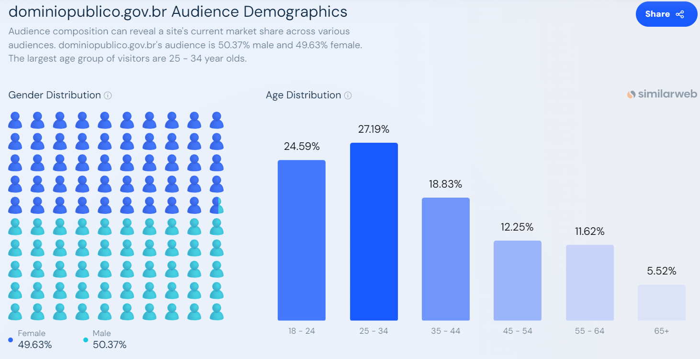
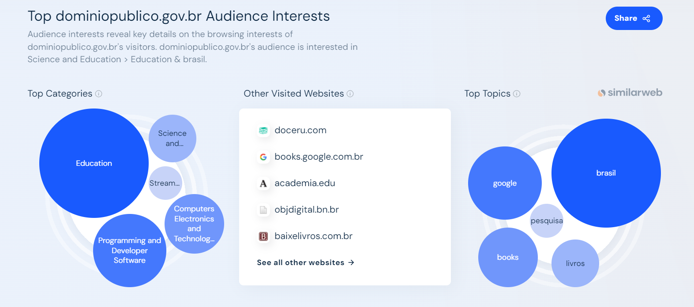
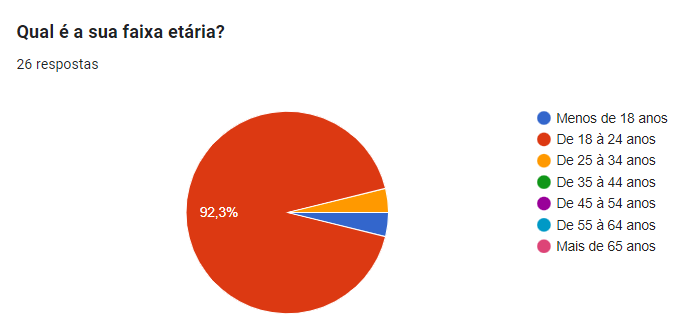
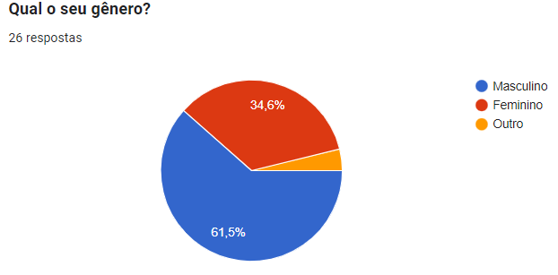
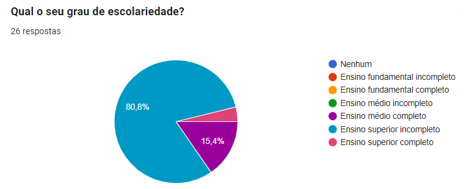
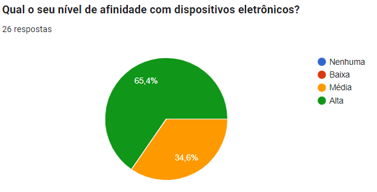
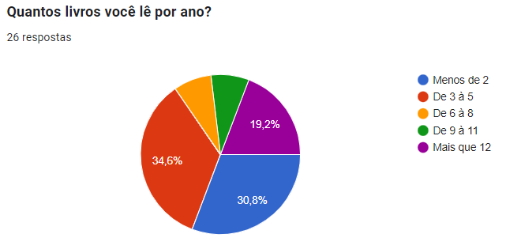
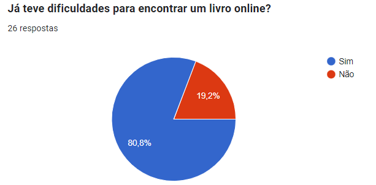
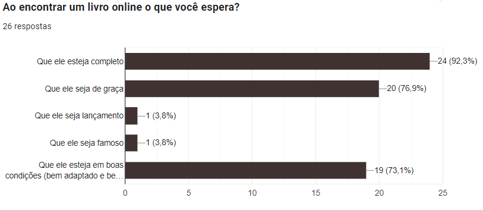

# Perfil de Usuário

## Introdução

Segundo Barbosa e Silva (2010) perfil de usuário é uma descrição detalhada das características dos usuários cujos objetivos devem ser apoiados pelo sistema sendo projetado.

## Metodologia

Para determinar o perfil de usuário do site foram utilizadas duas abordagens, sendo elas a ferramenta de tráfico de rede [Similarweb](https://www.similarweb.com/website/dominiopublico.gov.br/#demographics) e um questionário. 

## Resultados da ferramenta de tráfico

Ao utilizar a ferramenta de tráfico de rede [Similarweb](https://www.similarweb.com/website/dominiopublico.gov.br/#demographics) foi possivel concluir conforme as Figuras 1 e 2 que o os usuarios são estudantes de 24 à 34 anos. Note que aqui consideramos o sexo irrelevante visto que a diferança percentual é minima, como pode ser visto na Figura 1.

Figura 1: Sexo e idade dos visitantes do site 

Fonte: [Similarweb](https://www.similarweb.com/website/dominiopublico.gov.br/#demographics). Acesso em: 15 de out. de 2023.

Figura 2: Interesses dos visitantes do site 

Fonte: [Similarweb](https://www.similarweb.com/website/dominiopublico.gov.br/#demographics). Acesso em: 15 de out. de 2023.

## Resultados do questionário

O questionário teve um total de 7 perguntas de aspectos gerais do site e foi respondido por XX pessoas. Para as perguntas houve um enfoque no tipo de conteudo majoritario do site, que são livros de dominio publico. O questionário tambem contou com um Termo de Consentimento Livre e Esclarecido confome descrito na secçao de [aspectos éticos](aspectos_eticos.md)

As perguntas e respostas do questionário serão descritas a seguir.

#### Qual é a sua faixa etária?

De acordo com o gráfico apresentado na Figura 3 a faixa etária dos usuarios do site é majoritariamente 18 à 14 anos.

Figura 3: Respostas da pergunta 1 

Fonte: [Luciano Ricardo](https://github.com/l-ricardo), 2023

#### Qual o seu gênero?

De acordo com o gráfico apresentado na Figura 4 o gênero dos usuarios do site é majoritariamente masculino.

Figura 4: Respostas da pergunta 2 

Fonte: [Luciano Ricardo](https://github.com/l-ricardo), 2023

#### Qual o seu grau de escolariedade?

De acordo com o gráfico apresentado na Figura 5 o grau de escolariedade dos usuarios do site é majoritariamente de pessoas com o ensino superior incompleto.

Figura 5: Respostas da pergunta 3 

Fonte: [Luciano Ricardo](https://github.com/l-ricardo), 2023

#### Qual o seu nível de afinidade com dispositivos eletrônicos?

De acordo com o gráfico apresentado na Figura 6 o nível de afinidade com dispositivos eletrônicos dos usuarios do site é majoritariamente alta.

Figura 6: Respostas da pergunta 4 

Fonte: [Luciano Ricardo](https://github.com/l-ricardo), 2023

#### Quantos livros você lê por ano?

De acordo com o gráfico apresentado na Figura 7 os usuarios do site é leem de 3 à 5 livros por ano.

Figura 7: Respostas da pergunta 5 

Fonte: [Luciano Ricardo](https://github.com/l-ricardo), 2023

#### Já teve dificuldades para encontrar um livro online?

De acordo com o gráfico apresentado na Figura 8, 80.8% dos usuarios já tiveram dificuldades para encontrar um livro online.

Figura 8: Respostas da pergunta 6 

Fonte: [Luciano Ricardo](https://github.com/l-ricardo), 2023

#### Ao encontrar um livro online o que você espera?

De acordo com o gráfico apresentado na Figura 9 os usuarios esperam que um livro online esteja completo, seja gratuito e esteja em boas condições (bem adaptado e bem digitalizado).

Figura 9: Respostas da pergunta 7 

Fonte: [Luciano Ricardo](https://github.com/l-ricardo), 2023

## Resultados do questionário

Com base nessas duas abordagens podemos montar o perfil do usuario descrito na Tabela 1.

Tabela 1: Perfil do usuario 

| Característica                    | Descrição                                        |
| --------------------------------- | ------------------------------------------------ |
| Idade                             | Jovens de 18 à 14 anos                           |
| Genero                            | Indiferente, devido a proximidade dos resultados |
| Grau de escolaridade              | Superior incompleto                              |
| Nível de conhecimento tecnológico | Experiente                                       |
| Afinidade com leitura             | Leem com frequência mediana                      |
| Espectativas/Objetivos            | Buscam acessar livros legiveis e gratuitos       |

Fonte: [Luciano Ricardo](https://github.com/l-ricardo), 2023

## Referências 

>  BARBOSA, S. D. J.; SILVA, B. S. Interação Humano-Computador. Rio de Janeiro: Elsevier, 2010.

## Histórico de versões

| Versão | Data       | Descrição           | Autor(es)                                       | Revisor(es)                                    |
| ------ | ---------- | ------------------- | ----------------------------------------------- | ---------------------------------------------- |
| 1.0    | 15/10/2023 | Criação do artefato | [Luciano Ricardo](https://github.com/l-ricardo) | [Maria Alice](https://github.com/Maliz30)      |
| 1.1    | 16/10/2023 | Adição dos graficos | [Luciano Ricardo](https://github.com/l-ricardo) | [Victor Hugo](https://github.com/ViictorHugoo) |