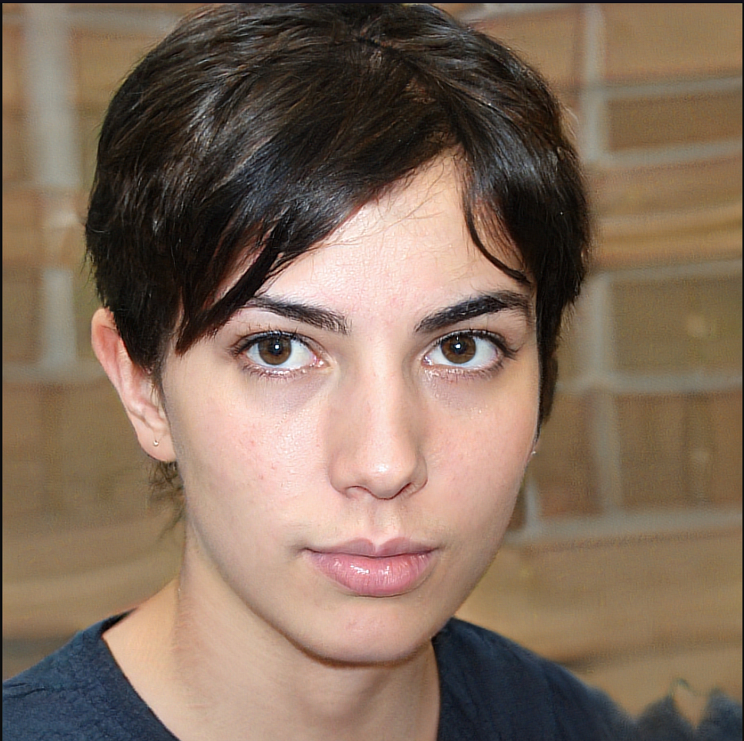

# Personas

## Introdução
Personas são personagens fictícios criados a partir de usuários reais, são criados com o proposito de descrever um usuário típico.<a id="anchor_1" href="#REF1">¹</a> Para manter todos focados no mesmo alvo durante reuniões de design, são usadas representando um grupo de usuário finais. Após um processo de refinamentos sucessivos, as personas são definidas principalmente por seus objetivos. <a id="anchor_2" href="#REF2">²</a>

## Metodologia 
A partir do [perfil de usuário](./perfil_de_usuario.md) foram elabarados os perfis de cada persona. O elenco conta com 4, sendo 2 personas primárias, 1 personas secundária e 1 antipersonas. Quantidade estibelecida devido intervalo recomendado por Courage e Baxter<a id="anchor_2" href="#REF2">²</a>.

## Elenco de personas
As Tabelas de 1 a 4 representam o elenco estabelecido e as Figuras de 1 a 4 explicitam as fotos correspondentes as personas.

Tabela 01: Persona primária Claudia de Jesus.

| 
Figura 01 - Persona Primária Claudia de Jesus
<figure markdown><figcaption>Fonte: Elaborada por [Victor Hugo](https://github.com/ViictorHugoo) (2023).<a id="fnref:1" href="#fn:1">1</a></figcaption></figure>            |
| --------------------------------------------------------------------------------------------------------------------------------------------------------------------------------------------------------------------------------------------------------------------------------------------------------------------------------------- |
| **Status**: Persona Primária.                                                                                                                                                                                                                                                                                                           |
| **Nome**: Claudia de Jesus                                                                                                                                                                                                                                                                                                              |
| **Gênero**: Feminino.                                                                                                                                                                                                                                                                                                                   |
| **Idade**: 20 anos.                                                                                                                                                                                                                                                                                                                     |
| **Profissão**: Estudante.                                                                                                                                                                                                                                                                                                               |
| **Escolaridade**: Ensino Superior Incompleto                                                                                                                                                                                                                                                                                            |
| **Estado Civil**: Solteira.                                                                                                                                                                                                                                                                                                             |
| **Relacionamento**: Pais, amigos de infancia, professor Carlos, colegas da escola                                                                                                                                                                                                                                                       |
| **Tarefas**: Acorda cedo para ir a escola enquanto lê algum livro específico da sua grade atual, assiste as aulas, faz as atividades das matérias, estuda para a semana de provas que acontecerá.                                                                                                                                       |
| **Habilidades e Experiências**: Leitora assídua desde os 4 anos de idade, escritora de _fanfics_(histórias baseadas em famosos), estudante no quarto semestre da sua faculdade e possui um alto conhecimento sobre tecnologias sobre conteúdo literálico.                                                                               |
| **Objetivo**:  **Pessoal**: Como amante de livros e escritora informal, pretende buscar fontes para suas histórias. Além de ter um bom desempenho escolar  **Prático**: Aumentar suas notas nas disciplinas de Engenharia Ambiental e História Modular  **Corporativo**: Aumentar seu conhecimento acerca de contos históricos |
| **Expectativa**: Espera um sistema de facil acesso e que não exija muito conhecimento técnico para baixar livros ou artigos                                                                                                                                                                                                             |
| **Requisitos**: Realizar buscas e downloads seguros dos livros necessários                                                                                                                                                                                                                                                              |

Tabela 02: Persona primária Carlos de Costa.

| 
Figura 02 - Persona Primária Carlos de Costa
<figure markdown><figcaption>Fonte: Elaborada por [Victor Hugo](https://github.com/ViictorHugoo) (2023).<a id="fnref:1" href="#fn:1">1</a></figcaption></figure>                                                     |
| ---------------------------------------------------------------------------------------------------------------------------------------------------------------------------------------------------------------------------------------------------------------------------------------------------------------------------------------------------------------------------------- |
| **Status**: Persona Primária.                                                                                                                                                                                                                                                                                                                                                      |
| **Nome**: Carlos de Costa                                                                                                                                                                                                                                                                                                                                                          |
| **Gênero**: Masculino.                                                                                                                                                                                                                                                                                                                                                             |
| **Idade**: 34 anos.                                                                                                                                                                                                                                                                                                                                                                |
| **Profissão**: Professor.                                                                                                                                                                                                                                                                                                                                                          |
| **Escolaridade**: Pós-doutorado.                                                                                                                                                                                                                                                                                                                                                   |
| **Estado Civil**: Divorciado.                                                                                                                                                                                                                                                                                                                                                      |
| **Relacionamento**: Com a filha que mora com a ex-mulher e com a Claudia que é sua aluna e com alguns amigos de doutorado.                                                                                                                                                                                                                                                         |
| **Tarefas**: Acorda cedo e toma um café amargo e forte para se preparar para dar aulas, se desloca de carro para a escola enquanto ouve um de seus livros, passa atividades que fazem os alunos buscarem fontes para realizarem e saindo da escola vai para academia e no psicólogo.                                                                                               |
| **Habilidades e Experiências**: ótimo escritor e professor, leciona com amor, amante de literatura e por isso decidiu seguir a profissão lecionar                                                                                                                                                                                                                                  |
| **Objetivo**:  **Pessoal**: Propagar o amor que sente por literatura clássica para seus alunos  **Prático**: Aumentar o conhecimento geral sobre obras de alto renome e fazer com que o desejo dos seus alunos de obterem conhecimento permaneça vivo **Corporativo**: Lecionar conforme a ementa estabelecida pela escola sem que tenha que recorrer à fontes não legais |
| **Expectativa**: Espera um sistema que apresente as funcionalidades sem necessidade de rodeios para acessá-las e que permita downloads seguros                                                                                                                                                                                                                                     |
| **Requisitos**: Encontrar os materias necessários para aulas baseadas em livros de fácil acesso                                                                                                                                                                                                                                                                                    |

Tabela 03: Persona Secundária Luis di Frenchy.

| 
Figura 03 - Persona Secundaria Luiz di Frenchy
<figure markdown><figcaption>Fonte: Elaborada por [Victor Hugo](https://github.com/ViictorHugoo) (2023).<a id="fnref:1" href="#fn:1">1</a></figcaption></figure>                                             |
| ---------------------------------------------------------------------------------------------------------------------------------------------------------------------------------------------------------------------------------------------------------------------------------------------------------------------------------------------------------------------------- |
| **Status**: Persona Secundária.                                                                                                                                                                                                                                                                                                                                              |
| **Nome**: Luiz di Frenchy                                                                                                                                                                                                                                                                                                                                                    |
| **Gênero**: Masculino.                                                                                                                                                                                                                                                                                                                                                       |
| **Idade**: 20 anos.                                                                                                                                                                                                                                                                                                                                                          |
| **Profissão**: Autonomo.                                                                                                                                                                                                                                                                                                                                                     |
| **Escolaridade**: Ensino Superior Incompleto.                                                                                                                                                                                                                                                                                                                                |
| **Estado Civil**: Solteiro.                                                                                                                                                                                                                                                                                                                                                  |
| **Relacionamento**: Com os artistas que vendem arte na mesma praia, com a sua namorada, com a tia doente, com a irmã Claudia, com o José da barraca de coco e com o Matheus cobrador do ônibus                                                                                                                                                                               |
| **Tarefas**: Acordar cedo para apreciar o nascer do sol em um momento de meditação, café da manhã, sai para a praia em busca de inspirações para suas obras renascentistas, almoça, busca por livros clássicos para expandir sua gama de conhecimento acerca de acontecimentos da época, momento de reflexão e visita a namorada que está ansiosa sobre o casamento          |
| **Habilidades e Experiências**: Conhecimento emergente sobre renascentismo, Escrita poética, empatia em entender o que o cliente deseja, flexível e experiente com tecnologias                                                                                                                                                                                               |
| **Objetivo**:  **Pessoal**: Se tornar o melhor artista contemporâneo da região **Prático**: Criar obras que façam as pessoas se sentirem dentro de uma história única, criada pensando nas individualidades do ser humano moderno e as problemáticas da sociedade atual **Corporativo**: Melhorar sua base de conhecimento sobre arte e inspiração para novas obras |
| **Expectativa**: Obter fácil acesso as obras de forma a dar o seu devido reconhecimento                                                                                                                                                                                                                                                                                      |
| **Requisitos**: Conseguir achar obras mais requisitadas durante uma época ou por autor de forma segura                                                                                                                                                                                                                                                                       |

Tabela 04: Antipersona Abadia Pereira.

| 
Figura 4 - Antipersona  Abadia Pereira
<figure markdown><figcaption>Fonte: Elaborada por [Victor Hugo](https://github.com/ViictorHugoo) (2023).<a id="fnref:1" href="#fn:1">1</a></figcaption></figure> |
| -------------------------------------------------------------------------------------------------------------------------------------------------------------------------------------------------------------------------------------------------------------------------------------------------------------------- |
| **Status**: Antipersona.                                                                                                                                                                                                                                                                                             |
| **Nome**: Abadia Pereira                                                                                                                                                                                                                                                                                             |
| **Gênero**: Feminino.                                                                                                                                                                                                                                                                                                |
| **Idade**: 68 anos.                                                                                                                                                                                                                                                                                                  |
| **Profissão**: Aposentada.                                                                                                                                                                                                                                                                                           |
| **Escolaridade**: Ensino Superior Completo.                                                                                                                                                                                                                                                                          |
| **Estado Civil**: Solteira.                                                                                                                                                                                                                                                                                          |
| **Relacionamento**: Viuva.                                                                                                                                                                                                                                                                                           |
| **Tarefas**: Abadia não se interessa por tecnologia e prefere atividades ao ar livre, como jardinagem e caminhadas. Ela também gosta de passar tempo com suas amigas da igreja, além de participar ativamente do projeto de vigilância comunitária da rua em que mora.                                               |
| **Habilidades e Experiências**: Abadia tem experiência na manutenção de jardins e pode realizar manuais com facilidade. Ela também é conhecida por sua habilidade em cozinhar pratos tradicionais, especialmente receitas de família que ela aprendeu com a sua mãe quando chegou da Itália.                         |
| **Objetivo**:  **Pessoal**: Que todos a conheçam e que a respeitem  **Prático**: Fazer comentários aconselhando aqueles que a cercam **Corporativo**: Abadia quer ser a representante do bairro.                                                                                                            |
| **Expectativa**: Abadia busca desfrutar da aposentadoria e contribuir o máximo que puder para a sua comunidade.                                                                                                                                                                                                      |
| **Requisitos**: Conseguir apoiar os seus amigos utilizando novos métodos que podem ser encontrados na internet.                                                                                                                                                                                                      |

## Referências 

> <a id="REF1" href="#anchor_1">1.</a> BARBOSA, S. D. J.; SILVA, B. S. Interação Humano-Computador. Rio de Janeiro: Elsevier, 2011. 
> 
> <a id="REF2" href="#anchor_2">2.</a> Courage, C. & Baxter, K. Understanding your users: a practical guide to user requirements, methods, tools, and techniques. San Francisco, CA: Morgan KaufmannPublishers, 2005.

## Bibliografia 

> Personas, Bilheteria Digital. Disponível em: <<interacao-humano-computador.github.io/2023.1-BilheteriaDigital/analise-de-requisitos/personas/>>. Acesso em 15 de outubro de 2023.

## Histórico de versões

| Versão | Data       | Descrição              | Autor(es)                                                                                        | Revisor(es)                                    |
| ------ | ---------- | ---------------------- | ------------------------------------------------------------------------------------------------ | ---------------------------------------------- |
| 1.0    | 15/10/2023 | Criação e estruturação | [Victor Hugo](https://github.com/ViictorHugoo)                                                   | [Maria Alice](https://github.com/Maliz30)      |
| 1.1    | 15/10/2023 | Criação e estruturação | [Victor Hugo](https://github.com/ViictorHugoo) e [Luciano Ricardo](https://github.com/l-ricardo) | [Maria Alice](https://github.com/Maliz30)      |
| 1.2    | 04/12/2023 | Correção do artefato   | [Gustavo França](https://github.com/gustavofbs)                                                  | [Victor Hugo](https://github.com/ViictorHugoo) |