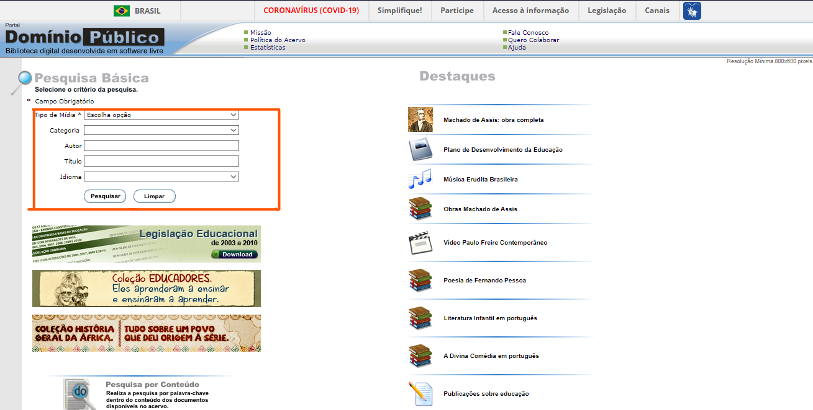
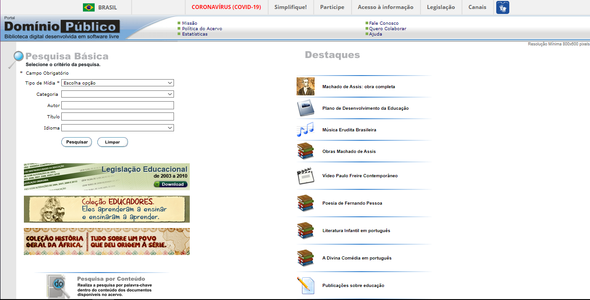
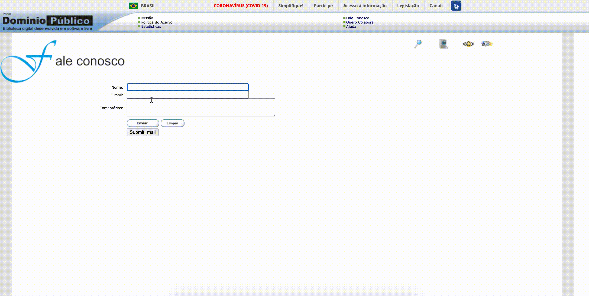

# Princípios Gerais

## Introdução

Para que um modelo conceitual possa efetivamente atender às necessidades específicas de um usuário, possibilitando uma aprendizagem rápida e clara, é imprescindível que sua estrutura seja construída de acordo com uma série de princípios e diretrizes gerais. Esses princípios, que servem como alicerce do projeto, desempenham um papel crucial, fazendo com que tenha uma relação satisfatória e saudável entre os usuários e o produto final. Estes princípios serão utilizados como base na criação e formulação dos artefatos projeto do site do Domínio Público, como o protótipo de papel, o storyboard e o protótipo de alta fidelidade, para a disciplina de Interação Humano Computador.

## Metodologia

Com o propósito de analisar os princípios gerais do site 'Domínio Público', utilizamos como referência os Princípios e Diretrizes apresentados no livro 'Interação Humano-Computador' de Barbosa [1]. Durante essa análise, identificaremos possíveis desvios desses princípios e diretrizes, juntamente, ofereceremos sugestões para aprimorar e aplicar esses conceitos no projeto.

### Correspondência com as expectativas dos usuários.

Um dos princípios essenciais em Interação Humano-Computador trata-se da capacidade de corresponder às expectativas dos usuários. Isso implica na concepção de interfaces de usuário de maneira a tornar os elementos e ações intuitivos, alinhados com as expectativas dos usuários. Em outras palavras, os usuários devem ser capazes de interagir com o sistema de forma fluída, sem encontrar surpresas desagradáveis ao longo de sua experiência. Isso assegura que a usabilidade do sistema seja otimizada e que a interação seja intuitiva e eficaz.

#### Análise

Quando se adiciona um tipo de mídia e, em seguida, realiza uma pesquisa, são exibidas várias informações, como títulos, autores, fontes, formatos, tamanhos de arquivos e os acessos. Em teoria, seria possível ordenar todos esses elementos conforme necessário. No entanto, em alguns casos, como nos títulos e autores, a funcionalidade de ordenação não está operando conforme o esperado. Além disso, o modo de ordenar não é muito intuitivo, devido ao tamanho reduzido e à falta de eficácia das setas de referência para essa ordenação, fazendo com que o usuário clique no nome para que essa ordenação ocorra tornando a experiência menos eficiente do que o desejado conforme a Figura 1.

Figura 1: Ordenação incorreta dos Itens

Fonte: [Domínio Público](http://www.dominiopublico.gov.br/pesquisa/PesquisaObraForm.jsp)

### Simplicidade nas estruturas das tarefas.

A simplicidade na estrutura das tarefas garante simplificação das atividades, a redução dos problemas e do esforço mental para realizá-las. Norman [2] sugere quatro abordagens tecnológicas para atingir esse objetivo:

- Oferecer múltiplos tipos de suporte para que os usuários possam aprender e executar a tarefa de maneira mais eficaz.
- Utilizar tecnologia para tornar visíveis aspectos que seriam inicialmente imperceptíveis, melhorando o feedback e a capacidade do usuário de manter o controle sobre a tarefa.
- Automatizar total ou parcialmente a tarefa, mantendo-a igual ao processo original.
- Modificar a natureza da tarefa, se for possível.

#### Análise

O modo de busca do site é bastante intuitivo como é mostrado na Figura 2, embora possa ser considerado um pouco ultrapassado do ponto de vista estético. No entanto, ele desempenha sua função adequadamente. Para aprimorar a experiência do usuário, seria benéfico adicionar suportes adicionais que permitam aos usuários aprender e executar a tarefa de forma ainda mais eficaz. Por exemplo, dar mais destaque ao método de pesquisa na página inicial poderia melhorar a usabilidade e tornar a funcionalidade de busca mais proeminente, sem comprometer sua eficiência atual.

Figura 2: Simplicidade nas estruturas das tarefas.

Fonte: [Domínio Público](http://www.dominiopublico.gov.br/pesquisa/PesquisaObraForm.jsp)

### Equilíbrio entre controle e liberdade do usuário.

Estabelecer um equilíbrio entre o controle e a liberdade do usuário implica em proporcionar uma sensação de autonomia ao utilizar o sistema, sem sobrecarregá-lo com opções excessivas. Dado que o dispositivo pertence ao usuário, é essencial que ele se sinta no comando, sem se perder no processo. Isso engloba facilitar a exploração, fornecer a capacidade de desfazer ações e oferecer configurações flexíveis, mantendo valores padrão apropriados.

#### Análise

Após uma análise detalhada, foi observado que o site oferece diversas opções de consulta, permitindo acesso a uma ampla variedade de dados, incluindo estatísticas do sistema e informações sobre as obras disponibilizadas.

### Consistência e padronização.

Manter a interface alinhada com o modelo conceitual facilita a sua utilização e aprendizado. Isso implica em seguir padrões, evitando confusões com terminologia e aderindo às convenções da plataforma. Ações, resultados, diálogos e informações devem manter uma consistência notável. Elementos automáticos não devem variar, mas caso os comportamentos sejam diferentes, a aparência deve ser distintamente perceptível. Às vezes, a intencionalidade de uma inconsistência pode demandar uma pausa para reflexão por parte do usuário, como em diálogos de confirmação com rótulos representativos dos efeitos desejados.

#### Análise

Ao acessar a página, conforme é possível avaliar na Figura 3, o usuário se depara com uma resolução diferente daquela que é mais comumente utilizada hoje em dia, que é de 800x600. Isso resulta em uma falta de adaptação aos sistemas e equipamentos modernos. Como exemplo disso, a aba de busca já ocupa a tela inteira, levando a uma despadronização, visto que cada elemento do site apresenta uma resolução distinta. Isso pode afetar negativamente a experiência do usuário, tornando a navegação menos consistente e eficaz.

Figura 3: Consistência e Padronização

Fonte: [Domínio Público](http://www.dominiopublico.gov.br/pesquisa/PesquisaObraForm.jsp)

### Promoção da eficiência do usuário.

A promoção da eficiência do usuário está relacionada à criação de designs que visam otimizar o desempenho do usuário, tornando as interações e tarefas tão eficazes e eficientes quanto possível. Isso implica na concepção de sistemas e interfaces que permitem que os usuários atinjam seus objetivos de forma rápida e sem esforço desnecessário, resultando em uma experiência mais produtiva e satisfatória.

#### Análise

Embora o site contenha vários elementos intuitivos, sua qualidade nessa área ainda é considerada insuficiente devido à sua natureza antiquada e ao design desatualizado. Com isso em mente, existem oportunidades significativas para melhorias em várias áreas do site. Por exemplo, poderia ser aprimorada a visualização das obras e dos autores, de forma a torná-la menos congestionada e mais agradável visualmente. Além disso, aprimorar a funcionalidade de busca, destacando-a de maneira mais proeminente, pode acelerar e aprimorar a eficiência da experiência do usuário, superando as limitações atuais. A interface atual do site é funcional e desempenha adequadamente suas funções. Os exemplos citados não implicam que o site não funcione, mas sugerem que haveria espaço para melhorias que aprimorariam ainda mais a experiência dos usuários e tornariam a utilização do site mais eficaz e agradável.

### Antecipação das necessidades do usuário.

Antecipar as necessidades do usuário envolve projetar um sistemas que têm a capacidade de prever e satisfazer as necessidades do usuário. Isso frequentemente se traduz em oferecer sugestões ou automatizar ações com base no contexto em que o usuário está inserido. Essa abordagem proativa não apenas aprimora a experiência do usuário, mas também simplifica e agiliza a interação com o sistema, tornando-a mais intuitiva e eficaz.

#### Análise

Como podemos observar na Figura 4, o sistema dispõe de opções "default", onde o usuário pode selecionar opções nos quais o sistema pré dispõe como o tipo de mídia, categoria, idioma e opções destaque nas quais o usuário pode se interessar em acessar.

Figura 4: Antecipação das necessidades do usuário

Fonte: [Domínio Público](http://www.dominiopublico.gov.br/pesquisa/PesquisaObraForm.jsp)

### Visibilidade e reconhecimento.

Antes de realizar uma ação, o sistema deve indicar claramente o que pode ser feito e como. Após a ação, o feedback deve ser imediato e compreensível, para que o usuário compreenda os resultados. A interface também deve manter o usuário informado sobre o progresso e estado do sistema, evitando que ele se sinta perdido. Isso promove uma interação eficaz e intuitiva.

#### Análise

O sistema demonstra eficiência ao fornecer feedback claro e imediato durante as operações. Esses procedimentos estão ilustrados na Figura 5.

Figura 5: Visibilidade e Reconhecimento

Fonte: [Domínio Público](http://www.dominiopublico.gov.br/pesquisa/PesquisaObraForm.jsp)

### Conteúdo relevante e expressão adequada.

A importância da relevância de conteúdo reside na capacidade de disponibilizar informações pertinentes às tarefas do usuário e de apresentá-las de maneira apropriada e compreensível. Isso significa que o conteúdo entregue é diretamente relacionado às necessidades e objetivos do usuário, garantindo que seja apresentado de forma clara e de fácil entendimento, contribuindo assim para uma experiência mais eficaz e satisfatória.

#### Análise

O site oferece informações relevantes e alinhadas com o que os usuários estão buscando, apresentando obras, autores e outras informações de maneira clara e compreensível. Embora o design possa não ser considerado esteticamente atraente, ele desempenha eficazmente seu propósito, fornecendo aos usuários o conteúdo desejado de forma acessível e compreensível.

### Projeto para erros.

O sitema deve antecipar e prever os erros dos usuários e facilitar sua recuperação, evitando ações irreversíveis e mantendo controles perigosos longe dos mais usados. Mensagens de erro devem ser claras e construtivas. Além disso, é essencial fornecer ajuda acessível e focada nas tarefas do usuário.

#### Análise

Conforme ilustrado na Figura 6, ao acessarmos a página 'Fale Conosco', o sistema nos oferece a possibilidade de inserir o Nome, E-mail do usuário e uma mensagem. No entanto, ao preencher o campo de e-mail com informações incorretas e clicar no botão 'Enviar', o sistema aceita as entradas sem realizar uma validação dos dados.

Figura 6: Tratamento de erros incorreto

Fonte: [Domínio Público](http://www.dominiopublico.gov.br/pesquisa/PesquisaObraForm.jsp)

## Referências

> <a id="REF1" href="#anchor_1">1.</a> BARBOSA, S. D. J.; SILVA, B. S. Interação Humano-Computador. Rio de Janeiro: Elsevier, 2011.
>
> <a id="REF2" href="#anchor_2">2.</a> Norman, D.A. & Draper, S.W. User Centered System Design. Hillsdale, NJ: Lawrence Erlbaum, 1986.

## Bibliografia

> Personas, Bilheteria Digital. Disponível em: <<https://interacao-humano-computador.github.io/2023.1-BilheteriaDigital/analise-de-requisitos/principios/>>. Acesso em 21 de outubro de 2023.

| Versão | Data       | Descrição                                    | Autor(es)                                                                                       | Revisor(es)                                     |
| ------ | ---------- | -------------------------------------------- | ----------------------------------------------------------------------------------------------- | ----------------------------------------------- |
| 1.0    | 21/10/2023 | Documentação e análise dos Princípios Gerais | [Ana Catarina](https://github.com/an4catarina) e [Pedro Henrique](https://github.com/pedro-hsf) | [Luciano Ricardo](https://github.com/l-ricardo) |
| 1.1    | 05/12/2023 | Correção dos artefatos                       | [Ana Catarina](https://github.com/an4catarina) e [Pedro Henrique](https://github.com/pedro-hsf) | [Luciano Ricardo](https://github.com/l-ricardo) |
