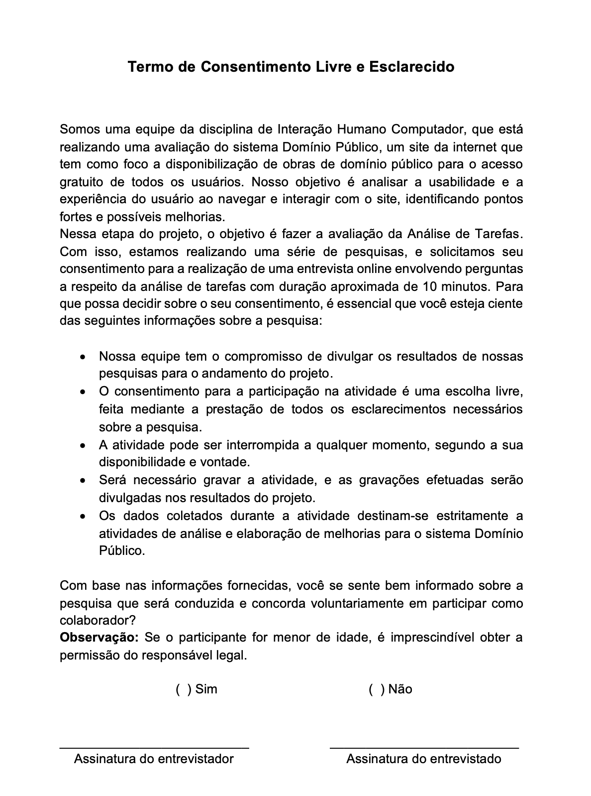

# Planejamento da Avaliação da Análise de Tarefas

## Introdução

## Metodologia

## D

## E

## C

## I - Aspectos Práticsdos da Avaliação

### Recrutamento

O recrutamendo dos usuários entrevistados serão definidos a partir do Perfil de usuários ja evidenciado anteriormente pelas Personas. O local definido para entrevista será estritamente online, por beneficiar tempo, custo e facilidade de ambas as partes envolvidas. O número de participantes da pesquisa será equivalente ao número de de integrantes, ou seja, 7 usuários a serem entrevistados.

### Preparação

As perguntas a serem feitas serão relizados pelos entrevistadores, no caso cada integrante da equipe realizará perguntas sobre sua respectiva tarefa. A entrevista será guiada pelas ações realizadas no respectivo storyboard. A entrevista será individual, ou seja, somente o entrevistador e seu usuário selecionado, a fim de facilitar a interação e observação das ações do entrevistado.

### Custos

Como definido anteriormente a entrevista seá realizada por meio de ferramentas online, o que não acarretará grandes custos as partes, podendo ser utilizado qualquer dispositivo com acesso a internet. Vale salientar que o único aspecto que será necessario disponibilizar será o tempo de ambas as partes e o acord através do Termo de Consentimento .

### Prazos

O cronograma das entrevistas com os usuários estão documentadas na tabela 1 com os seguintes tópicos:

- Entrevistador;
- Entrevistado;
- Horário de início e fim;
- Local e data que ocorreu a entrevista;

Tabela 1: Cronograma da entrevista 

|                  Entrevistador(es)                   | Entrevistado(s) | Horário de Início | Horário de Fim | Data |     Local      |
| :--------------------------------------------------: | :-------------: | :---------------: | :------------: | :--: | :------------: |
|    [Ana Catarina](https://github.com/an4catarina)    |                 |                   |                |      | Plataforma ... |
|   [Gustavo França](https://github.com/gustavofbs)    |                 |                   |                |      | Plataforma ... |
| [Harryson Martins](https://github.com/harry-cmartin) |                 |                   |                |      | Plataforma ... |
|      [Maria Alice](https://github.com/Maliz30)       |                 |                   |                |      | Plataforma ... |
|    [Pedro Henrique](https://github.com/pedro-hsf)    |                 |                   |                |      | Plataforma ... |
|    [Victor Hugo](https://github.com/ViictorHugoo)    |                 |                   |                |      | Plataforma ... |

Fonte: [Ana Catarina](https://github.com/an4catarina).

## D - Lidando com as Questões Éticas

Ao realizar avaliações com usuários, é importante seguir as diretrizes éticas para garantir respeito aos envolvidos, evitando qualquer dano durante e após a divulgação dos resultados. A condução de metodologias com terceiros requer a consciência dos participantes sobre os princípios éticos e a assinatura de um termo de consentimento.

Segue abaixo na Figura 2 o termo de consentimento em <a href= "docs/analise_de_requisitos/aspectos_eticos/aspectos_eticos.md"> Aspectos Éticos </a> a ser utilizado pelo Grupo 04:

Figura 2: Termo de Consentimento

Fonte: [Ana Catarina](https://github.com/an4catarina) e [Pedro Henrique](https://github.com/pedro-hsf) 

## E - Avaliação, Interpretação e Apresentação dos Dados

No ciclo de avaliação e interpretação dos dados, cada informação é documentada e analisada considerando o contexto em que foi gerada. Esse processo visa determinar a confiabilidade dos dados e sua capacidade de representar a população de usuários do site.

Durante a interação, são registrados os obstáculos e dificuldades, abrangendo aspectos de usabilidade, funcionalidades ausentes e possíveis problemas de desempenho do sistema. Cada problema é descrito, classificado e acompanhado de sugestões para aprimoramento, além de receber o feedback dos usuários.

Com as entrevistas concluídas e os dados coletados em mãos, realiza-se uma análise dos documentos para assegurar sua coerência com as perspectivas até então identificadas.

Além disso, se identificados problemas, elencados pelos usuários, tais fenômenos serão descritos e classificados, a fim de buscar sua melhora, também olhando pelas possíveis sugestões dos entrevistados.

Por fim, as informações adquiridas serão validadas novamente, e assim poderão ser desenvolvidas e implementadas, visando a melhoras das vicissitudes encontradas.

## Planejamento do Teste Piloto

## Resultado do Teste Piloto

## Bibliografia

> Bilheteria Digital. Metas de usabilidade. Repositório do Grupo Bilheteria Digital da disciplina de Interação Humano Computador da Universidade de Brasília, 2023. Disponível em: https://interacao-humano-computador.github.io/2023.1-BilheteriaDigital/analise-de-requisitos/metas-usabilidade/. Acesso em: 28 de out. 2023.

## Referências Bibliográficas

> <a id="FRM3" href="#anchor_1">1.</a> BARBOSA, S. D. J.; SILVA, B. S. Interação Humano-Computador. Rio de Janeiro: Elsevier, 2011.

## Histórico de Versões

| Versão | Data | Descrição | Autor(es) | Revisor(es) |
| ------ | ---- | --------- | --------- | ----------- |
