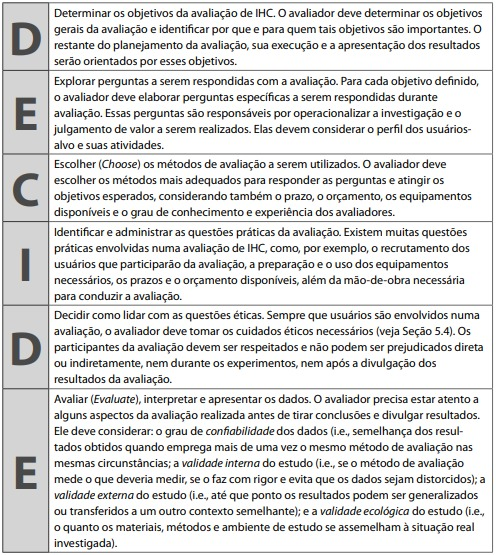

# Planejamento da Avaliação da Análise de Tarefas

## Introdução

Para realizar uma entrega de qualidade, é necessário avaliar se o produto resultante atende aos critérios de qualidade desejados, desta forma conseguimos corrigir os problemas antes que eles cheguem ao consumidor. Avaliar a qualidade de uso de um sistema apresenta diversas vantagens, dentre elas a correção rápida de problemas, a equipe de desenvolvimento pode se concentrar em solucionar problemas reais, redução no tempo de mercado e a identificação e correção de problemas mais robustos de IHC. Entretanto, estaremos avaliando um site que já está no ar, como forma de propor soluções aos problemas existentes. Serão analisados critérios de qualidade na perspectiva do usuário, avaliando usabilidade, experiência do usuário, acessibilidade e comunicabilidade. Vale ressaltar o teste piloto não está incluso no framework DECIDE, mas será realizado para validar o planejamento da avaliação.

## Metodologia

Para a realização do planejamento da avaliação, utilizaremos o framework DECIDE, proposto por Sharp, Rogers e Preece, onde cada letra é uma etapa a ser seguida. Como pode ser visto na Figura 1:

Figura 1: Framework DECIDE.

Fonte: Barbosa e Silva, 2011 <a id="anchor_1" href="#FRM1">¹</a>.

Diante disso, a seguir encontra-se o detalhamento do planejamento utilizando o Framework em questão:

## D - Objetivos da avaliação

O objetivo geral desta avaliação é identificar problemas de usabilidade no site domínio público e identificar as formas de interação do usuário com os artefados do site presente na <a href= "../../../analise_de_requisitos/analise_de_tarefas/hta.md">análise de tarefas</a>, além de possíveis desafios encontrados. Serão considerados, também, os seguintes aspectos na avaliação:

- Abrangência do conteúdo (se o conteúdo é fácil de encontrar e se é organizado de forma lógica);
- Atualização do conteúdo (se o conteúdo está atualizado e se é fácil de encontrar as informações mais recentes);

Desta forma, avaliaremos se o site é útil, coeso e permite que seus usuários concluam seus objetivos.

## E - Exploração de perguntas

A partir do objetivo anterior podemos aumentar seu nível de detalhamento definindo perguntas verificáveis a serem respondidas na avaliação. Além de auxiliar na investigação e avaliação do site, as pesguntas tem como finalidade guiar e operacionalizar todo o processo de avaliação.

### O que iremos avaliar ?

- apropriação de tecnologia pelos usuários;
- ideias e alternativas de design;
- conformidade com um padrão;
- facilidade na utilização das ferramentas;
- problemas na interação e na interface.

### Perguntas
 
A Tabela 1 apresenta o roteiro de perguntas, que tem como base a "Tabela 11.1: Exemplos de perguntas que uma avaliação de IHC pode responder" do livro "Interação Humano-Computador e Experiência do Usuário" de Simone D. J. Barbosa e Bruno Santana da Silva<a id="anchor_1" href="#FRM1">¹</a>.

Tabela 1: Roteiro de Perguntas.

| Número | Pergunta                                                                                | Possível resposta                                                                                                                                                                                                                                          |
| :----: | :-------------------------------------------------------------------------------------- | :--------------------------------------------------------------------------------------------------------------------------------------------------------------------------------------------------------------------------------------------------------- |
|   1    | Qual o seu nome?                                                                        | Resposta discursiva                                                                                                                                                                                                                                        |
|   2    | Quantos anos você tem?                                                                  | Resposta discursiva                                                                                                                                                                                                                                        |
|   3    | Qual seu nível de escolaridade?                                                         | Resposta discursiva                                                                                                                                                                                                                                        |
|   4    | Qual a sua ocupação?                                                                    | Resposta discursiva                                                                                                                                                                                                                                        |
|   5    | Qual seu grau de experiência com tecnologias?                                           | - Iniciante   - Intermediário   - Avançado   - Especialista                                                                                                                                                                                       |
|   6    | Você já utilizou o Domínio Público?                                                     | - sim   - não                                                                                                                                                                                                                                           |
|   7    | Quais atividades você tem/teria interesse em utilizar no domínio público?               | Resposta discursiva                                                                                                                                                                                                                                        |
|   8    | Como você costuma acessar livros e mídias sem domínio/gratuitos?                        | Resposta discursiva                                                                                                                                                                                                                                        |
|   9    | Com que frequência você lê livros?                                                      | - Todos os dias   - Quase todos os dias   - Algumas vezes por semana   - Uma vez por semana   - Uma vez por mês   - Uma vez por ano   - Menos de uma vez por ano                                                                         |
|   10   | Quais tipos de conteúdo você mais consome online?                                       | - Livros   - Artigos   - Vídeos   - Áudios   - Outros (especifique)                                                                                                                                                                            |
|   11   | Qual o principal objetivo ao acessar conteúdo gratuito ou de domínio público?           | - Pesquisa acadêmica   - Lazer e entretenimento   - Estudo autodidata   - Outro (especifique)                                                                                                                                                     |
|   12   | A pesquisa de mídias é fácil de usar? Por que?                                          | Resposta discursiva                                                                                                                                                                                                                                        |
|   13   | Quais são as suas sugestões para melhorar a pesquisa de mídias?                         | Resposta discursiva                                                                                                                                                                                                                                        |
|   14   | O sistema de retirar dúvidas é fácil e claro? Por que?                                  | Resposta discursiva                                                                                                                                                                                                                                        |
|   15   | O processo de inscrição como colaborador é claro e fácil? Por que?                      | Resposta discursiva                                                                                                                                                                                                                                        |
|   16   | A documentação de ajuda é clara e abrangente? Por que?                                  | Resposta discursiva                                                                                                                                                                                                                                        |
|   17   | O processo de download é fácil e rápido?                                                | Resposta discursiva                                                                                                                                                                                                                                        |
|   18   | As estatísticas do site são claras, completas e úteis? Por que?                         | Resposta discursiva                                                                                                                                                                                                                                        |
|   19   | O processo de contatar os administradores é fácil e rápido?                             | Resposta discursiva                                                                                                                                                                                                                                        |
|   20   | Quais são as suas sugestões para melhorar esse contato com os administradores?          | Resposta discursiva                                                                                                                                                                                                                                        |
|   21   | Qual é o seu nível de satisfação com o domínio público?                                 | - Alto. Gosto de como está e não desejo que sejam feitas alterações;   - Médio. Gosto do formato do site, mas gostaria que fossem feitas algumas alterações;   - Baixo. Não gosto do formato do site e gostaria que fossem feitas muitas alterações. |  |
|   22   | Você tem alguma outra fonte legal para acessar conteúdo gratuito ou de domínio público? | Resposta discursiva                                                                                                                                                                                                                                        |
|   23   | Você tem alguma outra sugestão ou melhoria para o site do Domínio Público?              | Resposta discursiva                                                                                                                                                                                                                                        |
 

Fonte: Barbosa e Silva, 2011 <a id="anchor_1" href="#FRM1">¹</a>.

 

## C - Métodos de Avaliação

A escolha dos métodos de avaliação de IHC é uma decisão importante que deve ser tomada de acordo com os objetivos da avaliação, o tempo e recursos disponíveis, e o nível de experiência dos usuários.

Para avaliar o domínio público, usaremos uma combinação de métodos de investigação, como entrevistas e observação. Esse método permite coletar informações qualitativas sobre a experiência dos usuários. A utilização de entrevistas e observação permitirá a coleta de informações como:

- Quais são as necessidades dos usuários em relação ao domínio público?
- Como os usuários estão usando o domínio público?
- Quais são os pontos positivos e negativos do domínio público?

## I - Aspectos Práticos da Avaliação

### Recrutamento

O recrutamendo dos usuários entrevistados serão definidos a partir do Perfil de usuários. O local definido para entrevista será online ou presencial, de forma a acordar com o usuário. O número de participantes da pesquisa será equivalente ao número de de integrantes, ou seja, 7 usuários a serem entrevistados.

### Preparação

As perguntas a serem feitas serão relizados pelos entrevistadores, no caso cada integrante da equipe realizará perguntas sobre sua respectiva tarefa. A entrevista será guiada pelas ações realizadas na respectiva análise de tarefas. A entrevista será individual, ou seja, somente o entrevistador e seu usuário selecionado, a fim de facilitar a interação e observação das ações do entrevistado.

### Custos

Como definido anteriormente a entrevista seá realizada por meio de ferramentas online, o que não acarretará grandes custos as partes, podendo ser utilizado qualquer dispositivo com acesso a internet. Vale salientar que o único aspecto que será necessario disponibilizar será o tempo de ambas as partes e o acordo através do Termo de Consentimento .

### Prazos

O cronograma das entrevistas com os usuários estão documentadas na Tabela 2 com os seguintes tópicos:

- Entrevistador;
- Entrevistado;
- Horário de início e fim;
- Local e data que ocorreu a entrevista;

Tabela 2: Cronograma da entrevista 

|                  Entrevistador(es)                   | Entrevistado(s) | Horário de Início | Horário de Fim | Data Planejada | Data Executada |           Tarefa            |           Local            |
| :--------------------------------------------------: | :-------------: | :---------------: | :------------: | :------------: | :------------: | :-------------------------: | :------------------------: |
|    [Ana Catarina](https://github.com/an4catarina)    |     Gustavo     |       19:10       |     19:20      |     01/11      |                |   Acessar as Estátisticas   | Plataforma Microsoft Teams |
|   [Gustavo França](https://github.com/gustavofbs)    |     Douglas     |       19:00       |     19:10      |     31/10      |                |       Contatar Admin        | Plataforma Microsoft Teams |
| [Harryson Martins](https://github.com/harry-cmartin) |    Luma Maia    |       22:30       |     22:40      |     31/10      |                |     Pesquisar por mídia     | Plataforma Microsoft Teams |
|   [Luciano Ricardo](https://github.com/l-ricardo)    |      Pedro      |       22:30       |     22:40      |     03/11      |                |         Pedir Ajuda         | Plataforma Microsoft Teams |
|      [Maria Alice](https://github.com/Maliz30)       |     Camila      |       13:50       |     14:00      |     03/11      |                | Cadidatura para Colaborador | Plataforma Microsoft Teams |
|    [Pedro Henrique](https://github.com/pedro-hsf)    |     Nicolas     |       18:50       |     19:00      |     01/11      |                |      Download de Mídia      | Plataforma Microsoft Teams |
|    [Victor Hugo](https://github.com/ViictorHugoo)    |  Douglas Alves  |       18:00       |     18:10      |     31/10      |                |        Avaliar Midia        | Plataforma Microsoft Teams |

Fonte: [Ana Catarina](https://github.com/an4catarina).

## D - Lidando com as Questões Éticas

Ao realizar avaliações com usuários, é importante seguir as diretrizes éticas para garantir respeito aos envolvidos, evitando qualquer dano durante e após a divulgação dos resultados. A condução de metodologias com terceiros requer a consciência dos participantes sobre os princípios éticos e a assinatura de um termo de consentimento.

Segue abaixo na Figura 2 o termo de consentimento em <a href= "docs/analise_de_requisitos/aspectos_eticos/aspectos_eticos.md"> Aspectos Éticos </a> a ser utilizado pelo Grupo 04:

Figura 2: Termo de Consentimento

Fonte: [Ana Catarina](https://github.com/an4catarina) e [Pedro Henrique](https://github.com/pedro-hsf) 

## E - Avaliação, Interpretação e Apresentação dos Dados

No ciclo de avaliação e interpretação dos dados, cada informação é documentada e analisada considerando o contexto em que foi gerada. Esse processo visa determinar a confiabilidade dos dados e sua capacidade de representar a população de usuários do site.

Durante a interação, são registrados os obstáculos e dificuldades, abrangendo aspectos de usabilidade, funcionalidades ausentes e possíveis problemas de desempenho do sistema. Cada problema é descrito, classificado e acompanhado de sugestões para aprimoramento, além de receber o feedback dos usuários.

Com as entrevistas concluídas e os dados coletados em mãos, realiza-se uma análise dos documentos para assegurar sua coerência com as perspectivas até então identificadas.

Além disso, se identificados problemas, elencados pelos usuários, tais fenômenos serão descritos e classificados, a fim de buscar sua melhora, também olhando pelas possíveis sugestões dos entrevistados.

Por fim, as informações adquiridas serão validadas novamente, e assim poderão ser desenvolvidas e implementadas, visando a melhoras das vicissitudes encontradas.

## Planejamento do Teste Piloto

De acordo com Barbosa e Silva[1], um teste piloto é a avaliação do planejamento com o objetivo de validar e conferir se o mesmo produz os dados necessários para responder a questões e objetivos do estudo. O avaliador deve fazer o teste piloto como se estivesse fazendo uma simulação real. A Tabela 3 contém as informações do teste piloto.

Tabela 3: Planejamento do teste piloto 

| Ordem | Data       | Horário de início e fim | Local                               | Entrevistadores | Entrevistado |
| ----- | ---------- | ----------------------- | ----------------------------------- | --------------- | ------------ |
| 1     | 30/10/2023 | 21:10 - 21:20           | Plataforma Microsoft Teams (Online) | Pedro Henrique  | Victor hugo  |

Fonte: [Ana Catarina](https://github.com/an4catarina).

No Vídeo 1, pode-se conferir a gravação do teste piloto realizado.

Vídeo 1: Teste piloto 

<iframe width="560" height="315" src="https://www.youtube.com/embed/2cvAxqO8TLM?si=apTDctLLIPrb2ksl" title="YouTube video player" frameborder="0" allow="accelerometer; autoplay; clipboard-write; encrypted-media; gyroscope; picture-in-picture; web-share" allowfullscreen></iframe>

Fonte: [Ana Catarina](https://github.com/an4catarina), [Victor Hugo](https://github.com/ViictorHugoo), [Pedro Henrique](https://github.com/pedro-hsf).

## Bibliografia

> RIBEIRO, Clara; SANTANA, Natan Tavares. Planejamento da avaliação da Análise de tarefas. Repositório do Grupo Agência Virtual Neoenergia Brasília da disciplina de Interação Humano Computador da Universidade de Brasília, 2022. Disponível em: <https://interacao-humano-computador.github.io/2022.1-AgenciaVirtualNeoenergia/design%2C_avalia%C3%A7%C3%A3o%2C_desenvolvimento/n%C3%ADvel%201/an%C3%A1lise_de_tarefas/planejamento_tarefas/>. Acesso em: 30 de outubro de 2023.

> GABRIEL, Lucas; SOUZA, Nicolas. Planejamento da avaliação da Análise de tarefas. Repositório do Grupo Lichess da disciplina de Interação Humano Computador da Universidade de Brasília, 2022. Disponível em: <https://interacao-humano-computador.github.io/2022.2-Lichess/design_avaliacao_desenvolvimento/nivel_1/analise_tarefas/planejamento_avaliacao/>. Acesso em: 30 de outubro de 2023.

> Bilheteria Digital. Metas de usabilidade. Repositório do Grupo Bilheteria Digital da disciplina de Interação Humano Computador da Universidade de Brasília, 2023. Disponível em: https://interacao-humano-computador.github.io/2023.1-BilheteriaDigital/analise-de-requisitos/metas-usabilidade/. Acesso em: 28 de out. 2023.

## Referências Bibliográficas

<a id="REF1" href="#anchor_1">1.</a> BARBOSA, S. D. J.; SILVA, B. S. Interação Humano-Computador. Rio de Janeiro: Elsevier, 2011

## Histórico de Versões

| Versão | Data       | Descrição                        | Autor(es)                                                                                  | Revisor(es)                                    |
| ------ | ---------- | -------------------------------- | ------------------------------------------------------------------------------------------ | ---------------------------------------------- |
| 1.0    | 30/10/2023 | Criação do Documento             | [Maria Alice](https://github.com/Maliz30)                                                  | [Ana Catarina](https://github.com/an4catarina) |
| 1.1    | 30/10/2023 | Detalhamento do framework DECIDE | [Ana Catarina](https://github.com/an4catarina) e [Maria Alice](https://github.com/Maliz30) | [Victor Hugo](https://github.com/ViictorHugoo) |
| 1.2    | 30/10/2023 | Criação do teste piloto          | [Pedro Henrique](https://github.com/pedro-hsf)                                             | [Victor Hugo](https://github.com/ViictorHugoo) |
| 1.3    | 01/11/2021 | Correções cronograma             | [Victor Hugo](https://github.com/ViictorHugoo)                                             | [Ana Catarina](https://github.com/an4catarina) |
