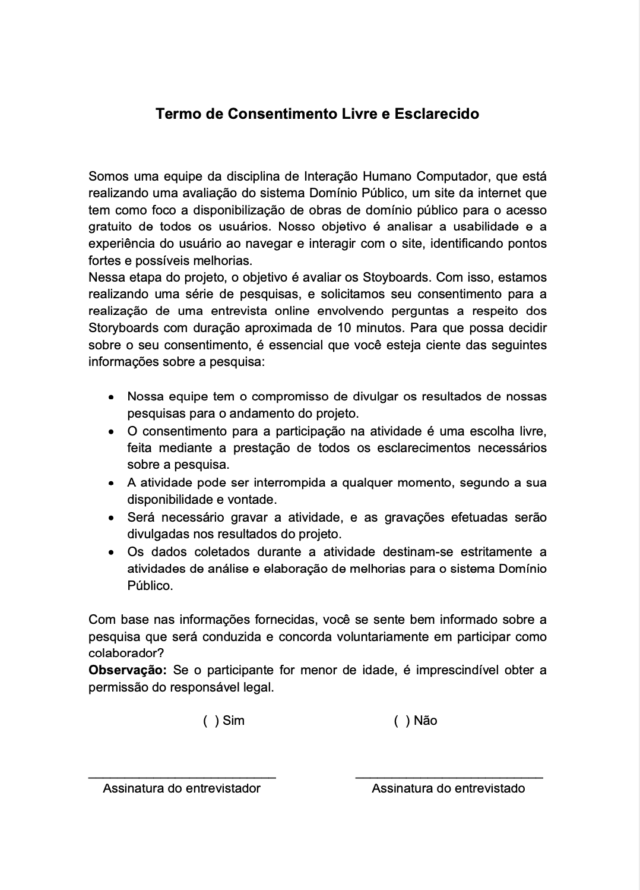

# Planejamento da Avaliação do Storyboard

## Introdução

Para realizar uma entrega de qualidade, é necessário avaliar se o produto resultante atende aos critérios de qualidade desejados, desta forma conseguimos corrigir os problemas antes que eles cheguem ao consumidor. Avaliar a qualidade de uso de um sistema apresenta diversas vantagens, dentre elas a correção rápida de problemas, a equipe de desenvolvimento pode se concentrar em solucionar problemas reais, redução no tempo de mercado e a identificação e correção de problemas mais robustos de IHC. Entretanto, estaremos avaliando um site que já está no ar, como forma de propor soluções aos problemas existentes. Serão analisados critérios de qualidade na perspectiva do usuário, avaliando usabilidade, experiência do usuário, acessibilidade e comunicabilidade. Vale ressaltar o teste piloto não está incluso no framework DECIDE, mas será realizado para validar o planejamento da avaliação.

## Metodologia

Na realização do seguinte planejamento será utilizado o framework DECIDE conforme orientado, onde cada letra é uma etapa a ser seguida. Como pode ser visto na figura 1:

Figura 1: Framework DECIDE.

Fonte: Barbosa e Silva, 2011 <a id="anchor_1" href="#FRM1">¹</a>.

## D - Objetivos da avaliação

Os objetivos dessa avaliação são, por meio do planejamento da construção de um protótipo de baixa fidelidade, identificar os problemas de design e usabilidade das interfaces e comparar as tarefas já avaliadas e sua conformidade com o padrão definido. Serão considerados, também, os seguintes aspectos na avaliação:

- 1: apropriação de tecnologia pelos usuários, incluindo o sistema computacional a ser avaliado mas não se limitando a ele;

## E - Exploração de perguntas

A partir do objetivo citado anteriormente, podemos aumentar seu nível de detalhamento definindo perguntas verificáveis a serem respondidas pela avaliação. Além de auxiliar na investigação e avaliação do site, as perguntas específicas, que podem ser encontradas na tabela 1, têm como finalidade guiar e operacionalizar todo o processo de avaliação.

Tabela 1: Perguntas a serem respondidas pela avaliação

| Ordem das perguntas | Perguntas |
| ------------------- | ---------------------- |
| 1 | O que é possível modificar nos storyboards para adequá-los melhor ao 
ambiente de trabalho e as necessidades do usuário? |
| 2 | A tecnologia disponível pode oferecer maneiras mais interessantes ou 
eficientes de os usuários atingirem seus objetivos? |

Fonte:[Harryson Martins](https://github.com/harry-cmartin) e [Gustavo França](https://github.com/gustavofbs)

## C - Métodos de Avaliação

O método de avaliação definido foi o de investigação, com uso de questiónario em uma entrevista aplicada. A opinião do usuário sobre o storyboard e o contexto de sua experiência pessoal será analisada a partir de tais perguntas. O método foi escolhido por trazer mais exatidão das informações adquiridas, por ter o contato direto com o usuário, além disso a facilidade do contato direto permite uma avaliação mais consisa e flexível a revisões e sugestões.

## I - Aspectos Práticos da Avaliação

### Recrutamento

O recrutamendo dos usuários entrevistados serão definidos a partir do Perfil de usuários. O local definido para entrevista será online ou presencial, de forma a acordar com o usuário. O número de participantes da pesquisa será equivalente ao número de de integrantes, ou seja, 7 usuários a serem entrevistados.

### Preparação

As perguntas a serem feitas serão relizados pelos entrevistadores, no caso cada integrante da equipe realizará perguntas sobre sua respectiva tarefa. A entrevista será guiada pelas ações realizadas no respectivo storyboard. A entrevista será individual, ou seja, somente o entrevistador e seu usuário selecionado, a fim de facilitar a interação e observação das ações do entrevistado.

### Custos

A avaliação irá gerar custos mínimos para a equipe de modo que os unicos gastos serão com a confecção dos [storyboards](./storyboards.md) que serão utilizados no decorrer da entrevista. O local da realização da avaliação também não deverá gerar custos para a equipe pois elas serão realizadas presencialmente em um local de acesso publico porém silencioso, ou online por meio de um dispositivo com acesso à internet.

### Prazos

O cronograma das entrevistas com os usuários estão documentadas na tabela 1 com os seguintes tópicos:

- Entrevistador;
- Entrevistado;
- Horário de início e fim;
- Data planejada da execução da entrevista;
- Tarefas a serem avaliadas.

Tabela 1: Cronograma da entrevista 

|                  Entrevistador(es)                   | Entrevistado(s) | Horário de Início | Horário de Fim | Data Planejada | Data Executada |           Tarefa            |           Local            |
| :--------------------------------------------------: | :-------------: | :---------------: | :------------: | :------------: | :------------: | :-------------------------: | :------------------------: |
|    [Ana Catarina](https://github.com/an4catarina)    |     Gustavo     |       19:10       |     19:20      |     01/11      |                |   Acessar as Estátisticas   | Plataforma Microsoft Teams |
|   [Gustavo França](https://github.com/gustavofbs)    |     Douglas     |       19:00       |     19:10      |     31/10      |                |       Contatar Admin        | Plataforma Microsoft Teams |
| [Harryson Martins](https://github.com/harry-cmartin) |    Luma Maia    |       22:30       |     22:40      |     31/10      |                |     Pesquisar por mídia     | Plataforma Microsoft Teams |
|   [Luciano Ricardo](https://github.com/l-ricardo)    |      Pedro      |       22:30       |     22:40      |     03/11      |                |         Pedir Ajuda         | Plataforma Microsoft Teams |
|      [Maria Alice](https://github.com/Maliz30)       |     Camila      |       13:50       |     14:00      |     03/11      |                | Cadidatura para Colaborador | Plataforma Microsoft Teams |
|    [Pedro Henrique](https://github.com/pedro-hsf)    |     Nicolas     |       18:50       |     19:00      |     01/11      |                |      Download de Mídia      | Plataforma Microsoft Teams |
|    [Victor Hugo](https://github.com/ViictorHugoo)    |  Douglas Alves  |       18:00       |     18:10      |     31/10      |                |        Avaliar Midia        | Plataforma Microsoft Teams |

Fonte: [Harryson Martins](https://github.com/harry-cmartin) e [Gustavo França](https://github.com/gustavofbs).

### Execução

A priori, as entrevistas devem ser realizadas utilizando as seguintes ferramentas já abordadas:

- [Storyboards](./storyboards.md);
- Questionários propostos (Tabela 2);
- Teste Piloto;
- [Termo de Consentimento](../../../analise_de_requisitos/aspectos_eticos.md).

Na parte inicial do encontro será disponibilizado termo de consentimento para acordo das partes, o entrevistador deve fazer essa mediação. A partir disso será realizado uma sequência de perguntas propostas como pode ser visto na Tabela 2:

Tabela 2: Perguntas propostas

| Pergunta                                                                                                      |
| ------------------------------------------------------------------------------------------------------------- |
| Qual o seu nome?                                                                                              |
| Quantos anos você tem?                                                                                        |
| Qual seu nível de escolaridade?                                                                               |
| Qual a sua ocupação?                                                                                          |
| Qual seu grau de experiência com tecnologias?                                                                 |
| Você já utilizou o Domínio Público?                                                                           |
| Quais atividades você tem/teria interesse em utilizar no domínio público?                                     |
| Como você costuma acessar livros e mídias sem domínio/gratuitos?                                              |
| Com que frequência você lê livros?                                                                            |
| Quais tipos de conteúdo você mais consome online?                                                             |
| Qual o principal objetivo ao acessar conteúdo gratuito ou de domínio público?                                 |
| Os atores envolvidos no storyboard são condizentes com a realidade?                                           |
| Você acha que as ações do storyboard levam para o objetivo final?                                             |
| O storyboard pode oferecer maneiras mais interessantes ou eficientes de os usuários atingirem seus objetivos? |
| Os storyboard representa fielmente a respectiva tarefa a qual ele esta relacionado ?                          |
| As ações presentes no storyboard seguem uma ordem identificável e fluida?                                     |

Fonte: [Harryson Martins](https://github.com/harry-cmartin) e [Gustavo França](https://github.com/gustavofbs).

## D - Aspectos Éticos

Ao realizar avaliações com usuários, é importante seguir as diretrizes éticas para garantir respeito aos envolvidos, evitando qualquer dano durante e após a divulgação dos resultados. A condução de metodologias com terceiros requer a consciência dos participantes sobre os princípios éticos e a assinatura ou concordância de um termo de consentimento.

O termo de consentimento que deve ser usado durante a entrevista pode ser visto na figura 2:

Figura 2: Termo de Consentimento

Fonte: [Ana Catarina](https://github.com/an4catarina) e [Pedro Henrique](https://github.com/pedro-hsf) 

## E - Avaliação, Interpretação e Apresentação dos Dados

No ciclo de avaliação e interpretação dos dados, cada informação é documentada e analisada considerando o contexto em que foi gerada. Esse processo visa determinar a confiabilidade dos dados e sua capacidade de representar a população de usuários do site.

Durante a interação, são registrados os obstáculos e dificuldades, abrangendo aspectos de usabilidade, funcionalidades ausentes e possíveis problemas de desempenho do sistema. Cada problema é descrito, classificado e acompanhado de sugestões para aprimoramento, além de receber o feedback dos usuários.

Com as entrevistas concluídas e os dados coletados em mãos, realiza-se uma análise dos documentos para assegurar sua coerência com as perspectivas até então identificadas.

Além disso, se forem identificados problemas elencados pelos usuários, esses fenômenos serão descritos e classificados, buscando a melhoria, e levando em consideração as possíveis sugestões dos entrevistados.

Por fim, as informações adquiridas serão validadas novamente, e assim poderão ser desenvolvidas e implementadas, visando a melhoras das vicissitudes encontradas.

## Planejamento do Teste Piloto

De acordo com Barbosa e Silva[1], um teste piloto é a avaliação do planejamento com o objetivo de validar e conferir se o mesmo produz os dados necessários para responder a questões e objetivos do estudo. O avaliador deve fazer o teste piloto como se estivesse fazendo uma simulação real. A tabela 3 contém as informações do teste piloto.

Tabela 3: Planejamento do teste piloto 

| Ordem | Data       | Horário de início e fim | Local                               | Entrevistadores | Entrevistado |
| ----- | ---------- | ----------------------- | ----------------------------------- | --------------- | ------------ |
| 1     | 20/10/2023 | 21:00 - 21:07           | Plataforma Microsoft Teams (Online) | Pedro Henrique  | Victor hugo  |

Fonte: [Ana Catarina](https://github.com/an4catarina).

No vídeo 1, pode-se conferir a gravação do teste piloto realizado.

Vídeo 1: Teste piloto 

<iframe width="560" height="315" src="https://www.youtube.com/embed/wyGxz_NfgXA?si=VAYE61b305sAOBpE" title="YouTube video player" frameborder="0" allow="accelerometer; autoplay; clipboard-write; encrypted-media; gyroscope; picture-in-picture; web-share" allowfullscreen></iframe>

Fonte: [Ana Catarina](https://github.com/an4catarina), [Victor Hugo](https://github.com/ViictorHugoo), [Pedro Henrique](https://github.com/pedro-hsf).

## Bibliografia

> Bilheteria Digital. Metas de usabilidade. Repositório do Grupo Bilheteria Digital da disciplina de Interação Humano Computador da Universidade de Brasília, 2023. Disponível em: https://interacao-humano-computador.github.io/2023.1-BilheteriaDigital/analise-de-requisitos/metas-usabilidade/. Acesso em: 28 de out. 2023.

## Referências Bibliográficas

> <a id="FRM3" href="#anchor_1">1.</a> BARBOSA, S. D. J.; SILVA, B. S. Interação Humano-Computador. Rio de Janeiro: Elsevier, 2011.

> <a id="FRM4" href="#anchor_2">2.</a> Domínio Público. Pesquisa de obras. Disponível em: <http://www.dominiopublico.gov.br/pesquisa/PesquisaObraForm.jsp\>. Acesso em: 28/10/2023.

## Histórico de Versões

| Versão | Data       | Descrição                               | Autor(es)                                                                                              | Revisor(es)                                                                                                                                     |
| ------ | ---------- | --------------------------------------- | ------------------------------------------------------------------------------------------------------ | ----------------------------------------------------------------------------------------------------------------------------------------------- |
| 1.0    | 28/10/2023 | Criação do Documento                    | [Harryson Martins](https://github.com/harry-cmartin) e [Gustavo França](https://github.com/gustavofbs) | [Ana Catarina](https://github.com/an4catarina), [Pedro Henrique](https://github.com/pedro-hsf) e [Victor Hugo](https://github.com/ViictorHugoo) |
| 1.1    | 28/10/2023 | Construção do documento de Planejamento | [Harryson Martins](https://github.com/harry-cmartin) e [Gustavo França](https://github.com/gustavofbs) | [Maria Alice](https://github.com/Maliz30)                                                                                                       |
| 1.2    | 28/10/2023 | Adicão Planejamento Teste piloto        | [Harryson Martins](https://github.com/harry-cmartin) e [Gustavo França](https://github.com/gustavofbs) | [Ana Catarina](https://github.com/an4catarina), [Pedro Henrique](https://github.com/pedro-hsf) e [Victor Hugo](https://github.com/ViictorHugoo) |
| 1.3    | 28/10/2023 | Correção de fontes                      | [Gustavo França](https://github.com/gustavofbs)                                                        | [Pedro Henrique](https://github.com/pedro-hsf)                                                                                                  |
| 1.4    | 30/10/2023 | Atualizando o termo de consentimento    | [Ana Catarina](https://github.com/an4catarina)                                                         | [Maria Alice](https://github.com/Maliz30)                                                                                                       |
| 1.5    | 28/10/2023 | Correção de fontes                      | [Gustavo França](https://github.com/gustavofbs)                                                        | [Pedro Henrique](https://github.com/pedro-hsf)                                                                                                  |
| 1.6    | 30/10/2023 | Adição do teste piloto                  | [Pedro Henrique](https://github.com/pedro-hsf)                                                         | [Maria Alice](https://github.com/Maliz30)                                                                                                       |
| 1.7    | 01/11/2021 | Correções cronograma                    | [Victor Hugo](https://github.com/ViictorHugoo)                                                         | [Ana Catarina](https://github.com/an4catarina)                                                                                                  |

