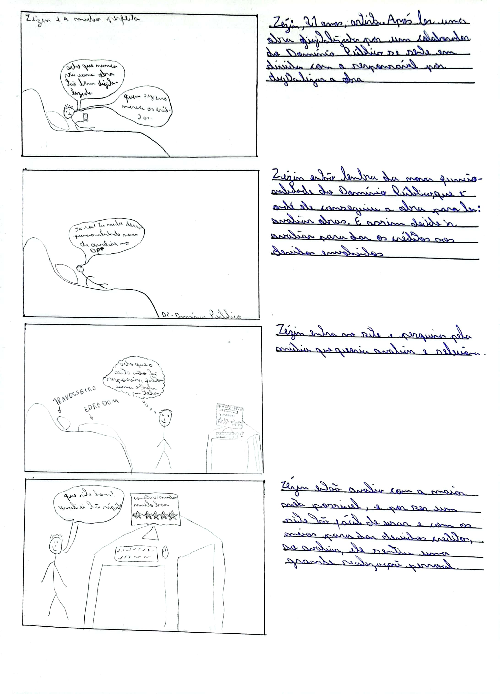

# Storyboards

## Introdução

O storyboard exemplifica um protótipo de baixa fidelidade, sendo extremamente vantajoso devido à sua simplicidade, custo reduzido e rápida criação. Sua natureza permite alterações rápidas, e é comumente empregado em conjunto com cenários <a id="anchor_1" href="#REF1">^1^</a>. Podem ser utilizados para representar interações e fluxos simples de interface, mostrando sequências de telas e passos de interação. auxiliando na compreensão visual da experiência do usuário, permitindo a identificação de problemas e aprimoramento da usabilidade antes da implementação.

## Metodologia 

Para a realização dos storyboards, segue na Tabela 1 quais foram realizadas:

Tabela 1: Tabela de storyboards

|                  Integrante                   | Storyboard | 
| :--------------------------------------------------: | :-------------: | 
|    [Ana Catarina](https://github.com/an4catarina)    |                 |
|   [Gustavo França](https://github.com/gustavofbs)    |       Contatar Admin          |
| [Harryson Martins](https://github.com/harry-cmartin) |       Pesquisar por mídia          |
|      [Maria Alice](https://github.com/Maliz30)       |                 |
|    [Pedro Henrique](https://github.com/pedro-hsf)    |                 |
|    [Victor Hugo](https://github.com/ViictorHugoo)    |       Avaliar mídia          |

Fonte: [Gustavo França](https://github.com/gustavofbs).

## Tarefa 1: 

## Tarefa 2: Contatar administradores

A figura 2 representa o storyboard relacionado a tarefa de Contatar Administradores.

Figura 2: Storyboard contatar administradores.

Fonte: [Gustavo França](https://github.com/gustavofbs) (2023).

## Tarefa 3: Pesquisar por mídia

A figura 1 representa o storyboard relacionado a tarefa de Pesquisar por Mídia.

Figura 1: Storyboard pesquisar por mídia.

Fonte: [Harryson Martins](https://github.com/harry-cmartin) (2023).

## Tarefa 4:
## Tarefa 5:
## Tarefa 6: Avaliar mídia

A figura 6 representa o storyboard relacionado a tarefa de Avaliar Midia.

Figura 6: Storyboard avaliar mídia.

Fonte: [Victor Hugo](https://github.com/ViictorHugoo) (2023).

## Tarefa 7:

## Referências Bibliográficas

> <a id="REF1" href="#anchor_1">1.</a> PREECE, Jennifer, SHARP, Helen, ROGERS, Yvonne. Interaction Design: beyond human-computer interaction. John Wiley & Sons, 2015.

## Histórico de Versões

| Versão | Data | Descrição | Autor(es) | Revisor(es) |
| ------ | ---- | --------- | --------- | ----------- |
|1.0|28/10/2023 | Tarefa pesquisar | [Harryson Martins](https://github.com/harry-cmartin)| [Gustavo França](https://github.com/gustavofbs) |
|1.1| 28/10/2023| Tarefa contatar administradores |[Gustavo França](https://github.com/gustavofbs) |[Harryson Martins](https://github.com/harry-cmartin)|
|1.2| 28/10/2023| Tarefa avaliar midia|[Victor Hugo](https://github.com/ViictorHugoo) | [Luciano Ricardo](https://github.com/l-ricardo) |