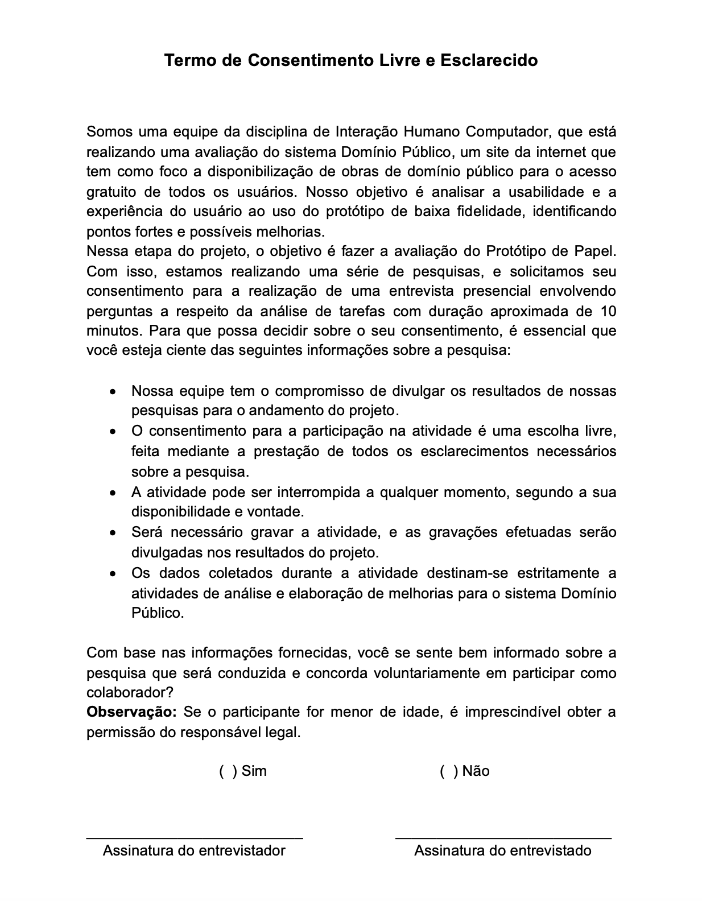

# Planejamento da Avaliação do Protótipo de Papel

## Introdução

Para realizar uma entrega de qualidade, é necessário avaliar se o protótipo resultante atende aos critérios de qualidade desejados, desta forma conseguimos corrigir os problemas antes que eles cheguem ao consumidor. Avaliar a qualidade de uso de um protótipo apresenta diversas vantagens, dentre elas a correção rápida de problemas, a equipe de desenvolvimento pode se concentrar em solucionar problemas reais, redução no tempo de desenvolvimento e a identificação e correção de problemas mais robustos de IHC.

No nosso caso, estamos avaliando um protótipo de papel, que é uma representação de baixa fidelidade de um sistema futuro. Este tipo de protótipo é particularmente útil nas fases iniciais do design, pois permite aos designers experimentarem diferentes abordagens sem o compromisso de tempo e recursos necessários para desenvolver protótipos de alta fidelidade.

Com isso, serão analisados critérios de qualidade na perspectiva do usuário, avaliando usabilidade, experiência do usuário, acessibilidade e comunicabilidade.

## Metodologia

Para a realização do planejamento da avaliação, será utilizado o framework DECIDE, proposto por Sharp, Rogers e Preece [1], onde cada letra representa uma etapa a ser seguida. Como pode ser visto na Figura 1:

Figura 1: Framework DECIDE.

Fonte: Barbosa e Silva, 2011 <a id="anchor_1" href="#FRM1">¹</a>.

Diante disso, a seguir encontra-se o detalhamento do planejamento utilizando o Framework em questão:

## D - Objetivos da avaliação

Os objetivos dessa avaliação são, por meio do planejamento da construção de um protótipo de baixa fidelidade, identificar os problemas de design e usabilidade das interfaces e comparar as tarefas já avaliadas e sua conformidade com o padrão definido. Serão considerados, também, os seguintes aspectos na avaliação:

- 1: Verificar a conformidade com um padrão;
- 2: Identificar problemas na interação e interface;

## E - Exploração de perguntas

A partir do objetivo citado anteriormente, podemos aumentar seu nível de detalhamento definindo perguntas verificáveis a serem respondidas durante a avaliação. Além de auxiliar na investigação e avaliação do site, as perguntas específicas têm como finalidade guiar e operacionalizar todo o processo de avaliação.

Com isso, foram desenvolvidas as perguntas listadas na Tabela 1:

Tabela 1: Perguntas a serem feitas na entrevista

| Ordem das perguntas | Objetivos Relacionados | Perguntas                                                                                                                           | Tipo de pergunta | Respostas possíveis                            |
| ------------------- | ---------------------- | ----------------------------------------------------------------------------------------------------------------------------------- | ---------------- | ---------------------------------------------- |
| 1°                  | 2                      | Houve algum momento durante a interação no site Domínio Público em que você encontrou dificuldades devido a problemas na interface? | Aberta           | Resposta discursiva                            |
| 2°                  | 1                      | A disposição dos elementos de interação no site Domínio Público auxiliaram na rapidez da execução da sua tarefa?                    | Fechada          | Sim Não                                    |
| 3°                  | 1                      | Em termos de layout e design do site Domínio Público, achou alguma parte que não faça sentido com o objetivo do site?               | Fechada          | Sim Não Caso sim, pedir para descrever |
| 4°                  | 2                      | Você imagina alguma forma de melhorar esta tarefa no site Domínio Público?                                                          | Aberta           | Resposta discursiva                            |

Fonte:[Harryson Martins](https://github.com/harry-cmartin) e [Gustavo França](https://github.com/gustavofbs)

## C - Métodos de Avaliação

Para a avaliação, foi selecionada a metodologia de prototipação em papel, que será submetida a uma simulação de uso.

Esta simulação é um procedimento eficaz e econômico para identificar problemas de usabilidade antes da implementação de uma solução interativa. Ela permite a avaliação de diferentes propostas de design, mesmo que parciais ou de baixa fidelidade.

A prototipação em papel é particularmente útil nas fases iniciais do design, pois permite aos designers experimentarem diferentes abordagens sem o compromisso de tempo e recursos necessários para desenvolver protótipos de alta fidelidade. Além disso, ela facilita a comunicação e a colaboração entre os membros da equipe de design e os usuários.

A simulação de uso permite aos usuários interagirem com o protótipo como se fosse o sistema real. Através da observação das interações dos usuários, os avaliadores podem identificar áreas problemáticas e oportunidades para melhorias. Ao final da simulação, é comum fazer perguntas aos usuários sobre sua experiência. As respostas a estas perguntas podem fornecer informações valiosas para refinar e melhorar o design.

## I - Aspectos Práticos da Avaliação

### Recrutamento

Dumas e Redish [3] destacam que uma avaliação de Interação Humano-Computador (IHC) geralmente envolve de cinco a 12 usuários. Nielsen [4], por sua vez, afirma que apenas cinco usuários são suficientes para identificar a maioria dos problemas na interface (85%, de acordo com seu experimento), proporcionando uma relação custo-benefício favorável. Se a obtenção de resultados estatisticamente significativos for necessária, a amostra de usuários deve ser suficientemente grande e representativa. No entanto, o tempo e outros recursos necessários para a coleta e análise de dados de muitos usuários podem tornar inviável uma abordagem estatística.

Portanto, em muitos casos, uma avaliação de IHC busca apenas obter indícios sobre a qualidade de uso do sistema e maneiras de aprimorá-la. Em outras palavras, mesmo quando os resultados não atingem significância estatística, eles ainda podem ser úteis para o redesenho do sistema avaliado.

### Preparação

As tarefas escolhidas pela equipe para realização da entrevista foram:

- Pesquisar por mídia
- Download de mídia
- Acessar as Estátisticas
- Contatar Administrador
- Pedir Ajuda
- Cadidatura para Colaborador
- Avaliar Midia

As perguntas a serem feitas serão relizados pelos entrevistadores, no caso cada integrante da equipe realizará perguntas sobre sua respectiva tarefa. A entrevista será guiada pelas ações realizadas na respectiva análise de tarefas. A entrevista será em duplas ou trios, ou seja, terá mais de um entrevistador em cada entrevista, a fim de facilitar a interação e observação das ações do entrevistado.

### Custos

A avaliação irá gerar custos mínimos para a equipe de modo que os unicos gastos serão com a confecção do protoripo de papel que será utilizado no decorrer da entrevista. O local da realização da avaliação também não deverá gerar custos para a equipe pois elas serão realizadas presencialmente em um local de acesso publico porém silencioso.

### Prazos

O cronograma das entrevistas com os usuários estão documentadas na Tabela 1.

Tabela 2: Cronograma da entrevista 

|                                                              Entrevistador(es)                                                              | Entrevistado(s) | Horário de Início | Horário de Fim | Data Planejada | Data Executada |                     Tarefa(s)                      | Local |
| :-----------------------------------------------------------------------------------------------------------------------------------------: | :-------------: | :---------------: | :------------: | :------------: | :------------: | :------------------------------------------------: | :---: |
| [Maria Alice](https://github.com/Maliz30), [Luciano Ricardo](https://github.com/l-ricardo) e [Victor Hugo](https://github.com/ViictorHugoo) |      Tales      |       15:30       |     16:00      |     21/11      |     21/11      | Se tornar colaborador, Pedir ajuda e Avaliar midia |  FGA  |
| [Maria Alice](https://github.com/Maliz30), [Luciano Ricardo](https://github.com/l-ricardo) e [Victor Hugo](https://github.com/ViictorHugoo) |     Luciano     |       16:00       |     16:30      |     21/11      |     21/11      | Se tornar colaborador, Pedir ajuda e Avaliar midia |  FGA  |
|                       [Ana Catarina](https://github.com/an4catarina) e [Pedro Henrique](https://github.com/pedro-hsf)                       |     Gustavo     |       11:00       |     11:30      |     21/11      |     21/11      |      Acessar estatisticas e Download de mídia      |  FGA  |
|                   [Gustavo França](https://github.com/gustavofbs) e [Harryson Martins](https://github.com/harry-cmartin)                    | Flávio Augusto  |       12:00       |     12:30      |     22/11      |     22/11      |        Contatar Admin e Pesquisar por mída         |  FGA  |

Fonte: [Luciano Ricardo](https://github.com/l-ricardo).

## D - Lidando com as Questões Éticas

Ao realizar avaliações com usuários, é importante seguir as diretrizes éticas para garantir respeito aos envolvidos, evitando qualquer dano durante e após a divulgação dos resultados. A condução de metodologias com terceiros requer a consciência dos participantes sobre os princípios éticos e a assinatura de um termo de consentimento

Segue abaixo na Figura 2 o termo de consentimento em <a href= "docs/analise_de_requisitos/aspectos_eticos/aspectos_eticos.md"> Aspectos Éticos </a> a ser utilizado pelo Grupo 04:

Figura 2: Termo de Consentimento

Fonte: [Victor Hugo](https://github.com/ViictorHugoo) 

## E - Avaliação, Interpretação e Apresentação dos Dados

No ciclo de avaliação e interpretação dos dados, cada informação é documentada e analisada considerando o contexto em que foi gerada. Esse processo visa determinar a confiabilidade dos dados e sua capacidade de representar a população de usuários do site.

Durante a interação, são registrados os obstáculos e dificuldades, abrangendo aspectos de usabilidade, funcionalidades ausentes e possíveis problemas de desempenho do sistema. Cada problema é descrito, classificado e acompanhado de sugestões para aprimoramento, além de receber o feedback dos usuários.

Com as entrevistas concluídas e os dados coletados em mãos, realiza-se uma análise dos documentos para assegurar sua coerência com as perspectivas até então identificadas.

Além disso, se forem identificados problemas elencados pelos usuários, esses fenômenos serão descritos e classificados, buscando a melhoria, e levando em consideração as possíveis sugestões dos entrevistados.

Por fim, as informações adquiridas serão validadas novamente, e assim poderão ser desenvolvidas e implementadas, visando a melhoras das vicissitudes encontradas.

## Planejamento do Teste Piloto

De acordo com Barbosa e Silva[1], um teste piloto é a avaliação do planejamento com o objetivo de validar e conferir se o mesmo produz os dados necessários para responder a questões e objetivos do estudo. O avaliador deve fazer o teste piloto como se estivesse fazendo uma simulação real. A Tabela 3 contém as informações do teste piloto.

Tabela 3: Planejamento do teste piloto 

| Data       | Horário de início e fim | Local | Entrevistadores               | Entrevistado |
| ---------- | ----------------------- | ----- | ----------------------------- | ------------ |
| 14/10/2023 | 14:10 - 14:25           | FGA   | Victor Hugo e Luciano Ricardo | Maria alice  |

Fonte: [Luciano Ricardo](https://github.com/l-ricardo).

No Vídeo 1, pode-se conferir a gravação do teste piloto realizado.

Vídeo 1: Teste piloto 

<iframe width="560" height="315" src="https://www.youtube.com/embed/1sodmDOMpqE?si=zhq8R6HfqKlE7e8i" title="YouTube video player" frameborder="0" allow="accelerometer; autoplay; clipboard-write; encrypted-media; gyroscope; picture-in-picture; web-share" allowfullscreen></iframe>

Fonte: [Luciano Ricardo](https://github.com/an4catarina), [Victor Hugo](https://github.com/ViictorHugoo), [Maria Alice](https://github.com/Maliz30).

## Referências Bibliográficas

> [1] Preece, J., Sharp, H., & Rogers, Y. Design de interação: além da interação humano-computador. Porto Alegre: Bookman, 2013
>
> [2] BARBOSA, S. D. J.; SILVA, B. S. Interação Humano-Computador. Rio de Janeiro: Elsevier, 2011
>
> [3] Dumas, J.S. & Redish, J.C. A Practical Guide to Usability Testing, edição revisada. Exeter, UK: Intellect, 1999.
>
> [4] Nielsen, J. e Molich, R. “Heuristic evaluation of user interfaces”. Proceedings of ACM CHI’90, pp. 249–256, 1990.

## Bibliografia

> RIBEIRO, Clara; SANTANA, Natan Tavares. Planejamento da avaliação da Análise de tarefas. Repositório do Grupo Agência Virtual Neoenergia Brasília da disciplina de Interação Humano Computador da Universidade de Brasília, 2022. Disponível em: <https://interacao-humano-computador.github.io/2022.1-AgenciaVirtualNeoenergia/design%2C_avalia%C3%A7%C3%A3o%2C_desenvolvimento/n%C3%ADvel%201/an%C3%A1lise_de_tarefas/planejamento_tarefas/>. Acesso em: 01 de novembro de 2023.
>
> GABRIEL, Lucas; SOUZA, Nicolas. Planejamento da avaliação da Análise de tarefas. Repositório do Grupo Lichess da disciplina de Interação Humano Computador da Universidade de Brasília, 2022. Disponível em: <https://interacao-humano-computador.github.io/2022.2-Lichess/design_avaliacao_desenvolvimento/nivel_1/analise_tarefas/planejamento_avaliacao/>. Acesso em: 01 de novembro de 2023.
>
> Bilheteria Digital. Metas de usabilidade. Repositório do Grupo Bilheteria Digital da disciplina de Interação Humano Computador da Universidade de Brasília, 2023. Disponível em: https://interacao-humano-computador.github.io/2023.1-BilheteriaDigital/analise-de-requisitos/metas-usabilidade/. Acesso em: 01 de novembro 2023.

## Histórico de Versões

| Versão | Data       | Descrição                          | Autor(es)                                                                                                                                                                              | Revisor(es)                                     |
| ------ | ---------- | ---------------------------------- | -------------------------------------------------------------------------------------------------------------------------------------------------------------------------------------- | ----------------------------------------------- |
| 1.0    | 01/11/2023 | Criação do Documento               | [Victor Hugo](https://github.com/ViictorHugoo)                                                                                                                                         | [Ana Catarina](https://github.com/an4catarina)  |
| 1.1    | 08/11/2023 | Organização do documento           | [Victor Hugo](https://github.com/ViictorHugoo),[Gustavo](https://github.com/gustavofbs),[Luciano Ricardo](https://github.com/l-ricardo) e [Harryson](https://github.com/harry-cmartin) | [Ana Catarina](https://github.com/an4catarina)  |
| 1.2    | 20/11/2023 | Organização das perguntas          | [Gustavo França](https://github.com/gustavofbs)                                                                                                                                        | [Ana Catarina](https://github.com/an4catarina)  |
| 1.3    | 21/11/2023 | Corrigindo detalhes                | [Victor Hugo](https://github.com/ViictorHugoo)                                                                                                                                         | [Luciano Ricardo](https://github.com/l-ricardo) |
| 1.4    | 06/12/2023 | Verificação e correção do artefato | [Ana Catarina Santos](https://github.com/an4catarina)                                                                                                                                  | [Victor Hugo](https://github.com/ViictorHugoo)  |
