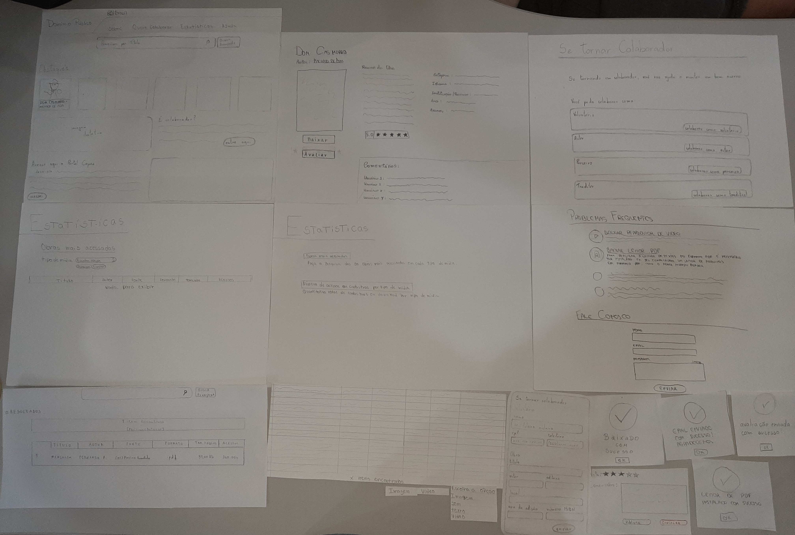
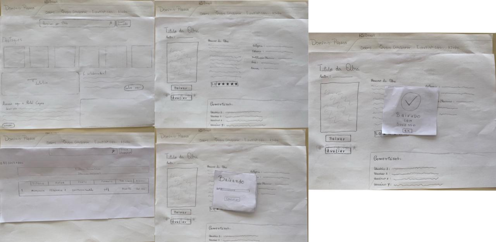
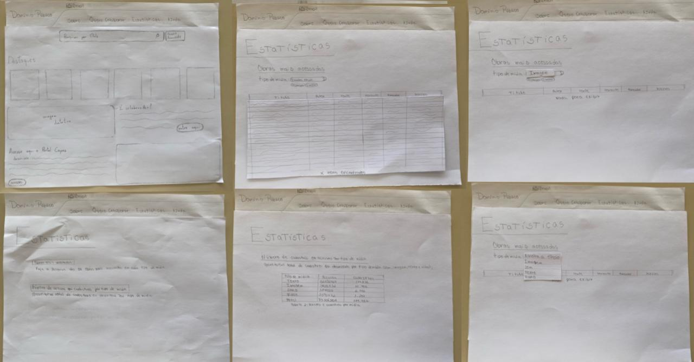
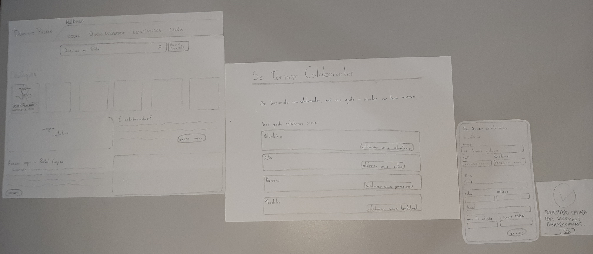
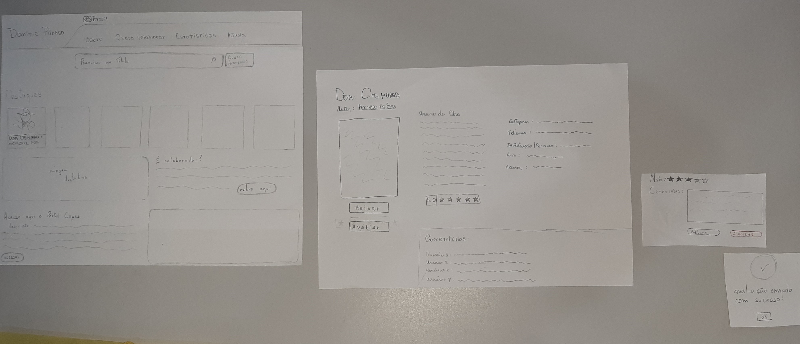

# Relato dos Resultados do Protótipo de Papel

## Introdução

Esse artefato tem o objetivo de documentar o relato dos resultados obtidos pela avaliação do protótipo de papel. Com isso, serão abordados os tópicos referidos no Planejamento do Relato dos Resultados do Protótipo de Papel.
Durante essa etapa, o grupo desenvolveu o protótipo de papel, o qual pode ser verificado na imagem 1.

Figura 1: Visão Geral do Protótipo de papel

Fonte: [Maria Alice](https://github.com/Maliz30)

### Tarefa: Pesquisar por mídia

##### Objetivo e âmbito da avaliação

A finalidade da avaliação foi verificar a concordância entre a Prototipo de Papel de "Pesquisar por mídia" e o fluxo de interações dos utilizadores do Domínio Público, ao mesmo tempo em que identificamos oportunidades de aprimoramento visando proporcionar um suporte mais eficiente e satisfatório aos usuários.

##### Método de avaliação

Conforme sugerido pelo [planejamento da avaliação](planejamento_avaliacao.md), o método de avaliação escolhido foi o de investigação, com uso de questiónario em uma entrevista aplicada.

A Tabela 1 exibe as datas da realização da avaliação.

Tabela 1: Cronograma executado

| Entrevistador                                        | Entrevistado   | Horário de Início | Horário de Fim | Data       | Local/Plataforma |
| ---------------------------------------------------- | -------------- | ----------------- | -------------- | ---------- | ---------------- |
| [Harryson Martins](https://github.com/harry-cmartin) | Kelven Cunha   | 12:00             | 12:10          | 22/11/2023 | FGA              |
| [Harryson Martins](https://github.com/harry-cmartin) | Flávio Augusto | 12:10             | 12:20          | 22/11/2023 | FGA              |

Fonte:[Harryson Martins](https://github.com/harry-cmartin).

##### Seleção dos participantes

Cada tarefa possui seu respectivo reponsável e com base nisso foi selecionado o entrevistador. O usuário entrevistado selecionado possui entre 18 e 34 anos; é experiente com tecnologia e lê com frequencia media, conforme estabelecido no [Perfil de Usuário](../../../analise_de_requisitos/perfil_de_usuario.md).

##### Registro da avaliação

No Video 1 e Tabela 2 é possível verificar os registros feitos durante a avaliação.

Video 1: Gravação da avaliação

<iframe width="560" height="315" src="https://www.youtube.com/embed/gGSSgCB2GnI?si=9dlZig7B9Q_M-lVI" title="YouTube video player" frameborder="1" allow="accelerometer; autoplay; clipboard-write; encrypted-media; gyroscope; picture-in-picture; web-share" allowfullscreen></iframe>

Fonte: [Harryson Martins](https://github.com/harry-cmartin)

Tabela 2: Sumario de perguntas

| Pergunta                                                                                                                            | Resposta |
| ----------------------------------------------------------------------------------------------------------------------------------- | :------- |
| Houve algum momento durante a interação no site Domínio Público em que você encontrou dificuldades devido a problemas na interface? | Não      |
| A disposição dos elementos de interação no site Domínio Público auxiliaram na rapidez da execução da sua tarefa?                    | Sim      |
| Em termos de layout e design do site Domínio Público, achou alguma parte que não faça sentido com o objetivo do site?               | Não      |
| Você imagina alguma forma de melhorar esta tarefa no site Domínio Público?                                                          | Não      |

Fonte: [Harryson Martins](https://github.com/harry-cmartin)

No Video 2 e Tabela 3 é possível verificar os registros feitos durante a avaliação.

Video 2: Gravação da avaliação

<iframe width="560" height="315" src="https://www.youtube.com/embed/ojqceB62QOY?si=RHOhVRCHF7sB8EEF" title="YouTube video player" frameborder="1" allow="accelerometer; autoplay; clipboard-write; encrypted-media; gyroscope; picture-in-picture; web-share" allowfullscreen></iframe>

Fonte: [Harryson Martins](https://github.com/harry-cmartin)

Tabela 3: Sumario de perguntas

|                                                              Pergunta                                                               | Resposta |
| :---------------------------------------------------------------------------------------------------------------------------------: | :------: |
| Houve algum momento durante a interação no site Domínio Público em que você encontrou dificuldades devido a problemas na interface? |   Não    |
|          A disposição dos elementos de interação no site Domínio Público auxiliaram na rapidez da execução da sua tarefa?           |   Sim    |
|        Em termos de layout e design do site Domínio Público, achou alguma parte que não faça sentido com o objetivo do site?        |   Não    |
|                             Você imagina alguma forma de melhorar esta tarefa no site Domínio Público?                              |   Não    |

Fonte: [Harryson Martins](https://github.com/harry-cmartin)

##### Listagem de problemas encontrados

Após a entrevista não foram identificados problemas no protótipo desenvolvido.

##### Sugestões de melhoria

Os participantes não forneceram propostas de melhoria para o protótipo.

### Tarefa: Fazer download da mídia

##### Objetivo e âmbito da avaliação

A finalidade da avaliação foi verificar a concordância entre a Protótipo de Papel de "Fazer download da mídia" e o fluxo de interações dos utilizadores do Domínio Público, ao mesmo tempo em que identificamos oportunidades de aprimoramento visando proporcionar um suporte mais eficiente e satisfatório aos usuários.

##### Método de avaliação

Conforme sugerido pelo [planejamento da avaliação](planejamento_avaliacao.md), o método de avaliação escolhido foi o de investigação, com uso de questiónario em uma entrevista aplicada.

A Tabela 4 exibe as informações da avaliação executada.

Tabela 4: Cronograma executado

| Entrevistador                                                                                          | Entrevistado     | Horário de Início | Horário de Fim | Data  | Local/Plataforma                                    |
| ------------------------------------------------------------------------------------------------------ | ---------------- | ----------------- | -------------- | ----- | --------------------------------------------------- |
| [Pedro Henrique](https://github.com/pedro-hsf) e [Ana Catarina Santos](https://github.com/an4catarina) | Gustavo Linhares | 11:00             | 11:00          | 21/11 | Universidade de Brasília - Campus Gama (Presencial) |

Fonte: [Ana Catarina Santos](https://github.com/an4catarina) e [Pedro Henrique](https://github.com/pedro-hsf)

##### Seleção dos participantes

Cada tarefa possui seu respectivo reponsável e com base nisso foi selecionado o entrevistador. O usuário entrevistado selecionado possui entre 18 e 34 anos e seguia os requisitos conforme estabelecido no [Perfil de Usuário](../../../analise_de_requisitos/perfil_de_usuario.md).

##### Protótipo de papel

Na figura 2 é possível visualizar o protótipo de papel utilizado para a avaliação da intervenção da tarefa "Fazer download da mídia".

Figura 2: Protótipo de papel de "Fazer download da mídia"

Fonte: [Pedro Henrique](https://github.com/pedro-hsf)

##### Registro da avaliação

A avaliação foi dividida em duas etapas, sendo elas a funcionalidade Download de Mídia e logo em seguida Acessar Estátisticas, todo o processo foi previamente explicado para o entrevistado, falando como tudo iria funcionar, após isso foi lido o termo de consentimento para o mesmo. No Video 4 e na Tabela 5 é possível verificar os registros feitos durante a avaliação.

Video 4: Gravação da avaliação 

<iframe width="560" height="315" src="https://www.youtube.com/embed/Cw4PdpM7A5w?si=oMc72vSnV6Y9k9cF" title="YouTube video player" frameborder="0" allow="accelerometer; autoplay; clipboard-write; encrypted-media; gyroscope; picture-in-picture; web-share" allowfullscreen></iframe>

Fonte: [Ana Catarina Santos](https://github.com/an4catarina) e[Pedro Henrique](https://github.com/pedro-hsf)

Tabela 5: Sumario de perguntas

|                                                                                           Pergunta                                                                                           | Resposta |
| :------------------------------------------------------------------------------------------------------------------------------------------------------------------------------------------: | :------: |
|                             Houve algum momento durante a interação no site Domínio Público em que você encontrou dificuldades devido a problemas na interface?                              |   Não    |
|                                       A disposição dos elementos de interação no site Domínio Público auxiliaram na rapidez da execução da sua tarefa?                                       |   Sim    |
|                                    Em termos de layout e design do site Domínio Público, achou alguma parte que não faça sentido com o objetivo do site?                                     |   Não    |
|                                                          Você imagina alguma forma de melhorar esta tarefa no site Domínio Público?                                                          |   Não    |
| Durante a interação com a opção de "fazer download", você percebeu algum feedback claro do sistema indicando o progresso ou conclusão do download? Esse feedback foi satisfatório para você? |   Sim    |
|                              Ao baixar algo no site de domínio público, você achou fácil entender o que estava prestes a ser baixado e todo processo envolvido?                              |   Sim    |

Fonte: [Pedro Henrique](https://github.com/pedro-hsf)

##### Listagem de problemas encontrados

O usuário teve uma experiência sem complicações ao utilizar a funcionalidade de download, destacando a eficiência e confiabilidade do processo.

##### Sugestões de melhoria

O usuário não encontrou problemas ao utilizar a funcionalidade de download e não apresentou sugestões de melhoria, indicando que a funcionalidade atendeu plenamente às suas expectativas.

### Tarefa: Acessar estatísticas

##### Objetivo e âmbito da avaliação

A finalidade da avaliação foi verificar a concordância entre a Protótipo de Papel de "Acessar estatísticas" e o fluxo de interações dos utilizadores do Domínio Público, ao mesmo tempo em que identificamos oportunidades de aprimoramento visando proporcionar um suporte mais eficiente e satisfatório aos usuários.

##### Método de avaliação

Conforme sugerido pelo [planejamento da avaliação](planejamento_avaliacao.md), o método de avaliação escolhido foi o de investigação, com uso de questiónario em uma entrevista aplicada.

A Tabela 6 exibe as datas da realização da avaliação.

Tabela 6: Cronograma executado

| Entrevistador                                                                                          | Entrevistado     | Horário de Início | Horário de Fim | Data  | Local/Plataforma                                    |
| ------------------------------------------------------------------------------------------------------ | ---------------- | ----------------- | -------------- | ----- | --------------------------------------------------- |
| [Ana Catarina Santos](https://github.com/an4catarina) e [Pedro Henrique](https://github.com/pedro-hsf) | Gustavo Linhares | 11:00             | 11:10          | 21/11 | Universidade de Brasília - Campus Gama (Presencial) |

Fonte: [Ana Catarina Santos](https://github.com/an4catarina) e [Pedro Henrique](https://github.com/pedro-hsf)

##### Seleção dos participantes

Cada tarefa possui seu respectivo reponsável e com base nisso foi selecionado o entrevistador. O usuário entrevistado selecionado possui entre 18 e 34 anos e seguia os requisitos conforme estabelecido no [Perfil de Usuário](../../../analise_de_requisitos/perfil_de_usuario.md).

##### Protótipo de papel

Na figura 3 é possível visualizar o protótipo de papel utilizado para a avaliação da intervenção da tarefa "Acessar estatísticas"

Figura 3: Protótipo de papel de "Acessar estatísticas"

Fonte: [Ana Catarina Santos](https://github.com/an4catarina)

##### Registro da avaliação

A avaliação foi feita logo após a Avaliação do Download de Mídia, sendo que, previamente, foi explicado para o entrevistado como a entrevista iria funcionar e foi lido o termo de consentimento para o mesmo. No Vídeo 5 e na Tabela 7 é possível verificar os registros feitos durante a avaliação.

Video 5: Gravação da avaliação

<iframe width="560" height="315" src="https://www.youtube.com/embed/1QsF89zGuNk?si=KJ0PASi6lsBszBwN" title="YouTube video player" frameborder="0" allow="accelerometer; autoplay; clipboard-write; encrypted-media; gyroscope; picture-in-picture; web-share" allowfullscreen></iframe>

Fonte: [Ana Catarina Santos](https://github.com/an4catarina)

Tabela 7: Sumario de perguntas

|                                                                    Pergunta                                                                    | Resposta |
| :--------------------------------------------------------------------------------------------------------------------------------------------: | :------: |
|      Houve algum momento durante a interação no site Domínio Público em que você encontrou dificuldades devido a problemas na interface?       |   Não    |
|                A disposição dos elementos de interação no site Domínio Público auxiliaram na rapidez da execução da sua tarefa?                |   Sim    |
|             Em termos de layout e design do site Domínio Público, achou alguma parte que não faça sentido com o objetivo do site?              |   Não    |
|                                   Você imagina alguma forma de melhorar esta tarefa no site Domínio Público?                                   |   Não    |
| Ao acessar as estatísticas, você achou que os dados foram disponibilizados de uma forma clara? Houve alguma dificuldade ao assimilar os dados? | Sim, Não |

Fonte: [Ana Catarina Santos](https://github.com/an4catarina)

##### Listagem de problemas encontrados

O usuário não encontrou dificuldades ao utilizar a funcionalidade de acessar estatísticas, evidenciando a eficácia e a confiabilidade desse procedimento.

##### Sugestões de melhoria

O usuário não apenas teve uma experiência livre de problemas ao utilizar a funcionalidade de acessar estatísticas, mas também não apresentou quaisquer sugestões para aprimoramentos. Isso reflete positivamente na eficiência e na qualidade percebida dessa funcionalidade.

### Tarefas: Acessar ajuda

##### Objetivo e âmbito da avaliação

A avaliação tem como objetivo identificar problemas no Protótipo de papel para que não sejam repetidos no protótipo de alta e verificar se o Protótipo de papel atende as necessidades do usuário de forma eficaz e sem abiguidades, de forma não haja problemas na interação com a interface.

##### Método de avaliação

Durante a entrevista foi usado o método investigativo conforme descrito no [Planejamento da Avaliação do Protótipo de Papel](planejamento_avaliacao.md). Além disso foi utilizado um questionário de 4 questões para guiar a entrevista. A Tabela 8 apresenta as perguntas feitas durante a entrevista com suas respectivas respostas.

A Tabela 8 exibe as datas da realização da avaliação.

Tabela 8: Cronograma executado

| Entrevistador                               | Entrevistado  | Horário de Início | Horário de Fim | Data  | Local/Plataforma      |
| ------------------------------------------- | ------------- | ----------------- | -------------- | ----- | --------------------- |
| Luciando Ricardo, Maria Alice e Victor Hugo | Bruno         | 15:44             | 15:57          | 21/11 | Presencialmente - FGA |
| Luciando Ricardo, Maria Alice e Victor Hugo | Maria Abritta | 16:01             | 16:10          | 21/11 | Presencialmente - FGA |

Fonte: [Luciano Ricardo](https://github.com/l-ricardo)

##### Seleção dos participantes

Cada tarefa possui seu respectivo reponsável e com base nisso foi selecionado o entrevistador. O usuário entrevistado selecionado possui entre 18 e 34 anos; é experiente com tecnologia (tecnófilo); e lê com frequencia media, conforme estabelecido no [Perfil de Usuário](../../../analise_de_requisitos/perfil_de_usuario.md).

##### Registro da avaliação

Nos Videos 6 e 7, e na Tabela 9 é possível verificar os registros feitos durante a avaliação.

Video 6: Gravação da avaliação com Bruno

<iframe width="560" height="315" src="https://www.youtube.com/embed/fSARhlI9ygc?si=eNzUcaNxOHALAEzK" title="YouTube video player" frameborder="0" allow="accelerometer; autoplay; clipboard-write; encrypted-media; gyroscope; picture-in-picture; web-share" allowfullscreen></iframe>

Fonte: [Luciano Ricardo](https://github.com/l-ricardo), [Maria Alice](https://github.com/Maliz30) e [Victor Hugo](https://github.com/ViictorHugoo)

Video 7: Gravação da avaliação com Maria Abritta

<iframe width="560" height="315" src="https://www.youtube.com/embed/BcIXcSJNe5A?si=ArC_m1XU0IVvUV8k" title="YouTube video player" frameborder="0" allow="accelerometer; autoplay; clipboard-write; encrypted-media; gyroscope; picture-in-picture; web-share" allowfullscreen></iframe>

Fonte: [Luciano Ricardo](https://github.com/l-ricardo), [Maria Alice](https://github.com/Maliz30) e [Victor Hugo](https://github.com/ViictorHugoo)

Tabela 9: Sumario de perguntas

| Perguntas                                                                                                           | Tipo de pergunta | Respostas                                                 |
| ------------------------------------------------------------------------------------------------------------------- | ---------------- | --------------------------------------------------------- |
| A disposição dos elementos de interação no Protótipo de papel auxiliaram na rapidez da execução da sua tarefa?      | Fechada          | Sim                                                       |
| Em termos de layout e design do Protótipo de papel, achou alguma parte que não faça sentido com o objetivo do site? | Fechada          | Não                                                       |
| Você imagina alguma forma de melhorar a forma de executar esta tarefa no protótipo de papel?                        | Aberta           | Não, acreditam que está eficaz e não necessita alterações |

Fonte: [Luciano Ricardo](https://github.com/l-ricardo)

##### Listagem de problemas encontrados

Não houveram momentos durante a interação com o propotótipo de papel em que os usuários encontraram dificuldades devido a problemas na interface. Porem, vale notar que o entrevistado Bruno teve dificuldades em realizar essa tarefa, mas ele justificou dizendo que achava que o header não fazia parte da interface do prototipo, podemos assumir isso devido ao header estar em outra folha.

##### Sugestões de melhoria

Relacionado a tarefa não houveram sugestões de melhoria. Porem devido a dificuldade atribuida ao prototipo de papel em entender o header como parte da interface isso ja foi deixado claro nas entrevistas que ocorreram apos a do Bruno.

### Tarefa: Se tornar colaborador

##### Objetivo e âmbito da avaliação

A finalidade da avaliação foi verificar a concordância entre o Protótipo de Papel de "Se tornar colaborador" e o fluxo de interações dos utilizadores do Domínio Público, ao mesmo tempo em que identificamos oportunidades de aprimoramento visando proporcionar um suporte mais eficiente e satisfatório aos usuários.

##### Método de avaliação

Conforme sugerido pelo [planejamento da avaliação](planejamento_avaliacao.md), o método de avaliação escolhido foi o de investigação, com uso de questiónario em uma entrevista aplicada.

A Tabela 7 exibe as datas da realização da avaliação.

Tabela 10: Cronograma executado

| Entrevistadores                             | Entrevistado  | Horário de Início | Horário de Fim | Data  | Local/Plataforma                                    |
| ------------------------------------------- | ------------- | ----------------- | -------------- | ----- | --------------------------------------------------- |
| Luciando Ricardo, Maria Alice e Victor Hugo | Bruno         | 15:44             | 15:57          | 21/11 | Universidade de Brasília - Campus Gama (Presencial) |
| Luciando Ricardo, Maria Alice e Victor Hugo | Maria Abritta | 16:01             | 16:10          | 21/11 | Universidade de Brasília - Campus Gama (Presencial) |

Fonte: [Maria Alice](https://github.com/Maliz30)

##### Seleção dos participantes

Os entrevistares foram agrupados com base em compatibilidade de horários. Já os entrevistados foram selecionados com base no perfil de usuário estabelecido no [Perfil de Usuário](../../../analise_de_requisitos/perfil_de_usuario.md), de forma que ambos possuem idade entre 18 e 34 anos, além de serem experientes com tecnologia (tecnófilos) e lerem com frequencia média.

##### Protótipo de papel

Na figura 4 é possível visualizar o protótipo de papel utilizado para a avaliação da intervenção da tarefa "Se tornar colaborador".

Figura 4: Protótipo de papel de "Se tornar colaborador"

Fonte: [Maria Alice](https://github.com/Maliz30)

##### Registro da avaliação

Foram realizado 2 entrevistas com 2 usuários diferentes, Bruno e Maria Abritta, visando realizar uma avaliação mais precisa. A partir disso, é possível encontrar no Video 8 e Tabela 11 os registros da primeira entrevista.

Video 8: Gravação da avaliação 1 - Bruno Medeiros

<iframe width="560" height="315" src="https://www.youtube.com/embed/fSARhlI9ygc?si=eNzUcaNxOHALAEzK" title="YouTube video player" frameborder="0" allow="accelerometer; autoplay; clipboard-write; encrypted-media; gyroscope; picture-in-picture; web-share" allowfullscreen></iframe>

Fonte: [Maria Alice](https://github.com/Maliz30)

Tabela 11: Respostas entrevista 1 - Bruno Medeiros

| Pergunta                                                                                                            | Resposta                                                                                                                                                                                           |
| :------------------------------------------------------------------------------------------------------------------ | :------------------------------------------------------------------------------------------------------------------------------------------------------------------------------------------------- |
| A disposição dos elementos de interação no Protótipo de papel auxiliaram na rapidez da execução da sua tarefa?      | Sim                                                                                                                                                                                                |
| Em termos de layout e design do Protótipo de papel, achou alguma parte que não faça sentido com o objetivo do site? | Não                                                                                                                                                                                                |
| Você imagina alguma forma de melhorar a forma de executar esta tarefa no protótipo de papel?                        | Sim, adicionar botões que levem o usuário para a tela de "se tornar colaborador" e "associar obras ao perfil de colaborador", para que em caso de confusão a transição seja feita de forma rápida. |

Fonte: [Maria Alice](https://github.com/Maliz30)

E no Video 9 e Tabela 12 os registros da segunda entrevista feitos durante a avaliação.

Video 9: Gravação da avaliação 2 - Maria Abritta

<iframe width="560" height="315" src="https://www.youtube.com/embed/BcIXcSJNe5A?si=ArC_m1XU0IVvUV8k" title="YouTube video player" frameborder="0" allow="accelerometer; autoplay; clipboard-write; encrypted-media; gyroscope; picture-in-picture; web-share" allowfullscreen></iframe>

Fonte: [Maria Alice](https://github.com/Maliz30)

Tabela 12: Respostas entrevista 2 - Maria Abritta

| Pergunta                                                                                                            | Resposta                                                                                                             |
| :------------------------------------------------------------------------------------------------------------------ | :------------------------------------------------------------------------------------------------------------------- |
| A disposição dos elementos de interação no Protótipo de papel auxiliaram na rapidez da execução da sua tarefa?      | Sim                                                                                                                  |
| Em termos de layout e design do Protótipo de papel, achou alguma parte que não faça sentido com o objetivo do site? | Sim, não entendeu o que significa o local pedido no input de envio da obra e não encontrou a área de envio da mídia. |
| Você imagina alguma forma de melhorar a forma de executar esta tarefa no protótipo de papel?                        | Sim, adicionando uma área pra envio de mídica e deixando os inputs mais autoexplicativos.                            |

Fonte: [Maria Alice](https://github.com/Maliz30)

##### Listagem de problemas encontrados

Após a entrevista, analisamos o vídeo, as respostas e as reações dos participantes e chegamos aos seguintes problemas:

- Dificuldade em entender o significado de um dos campos de input;
- Dificuldade em encontrar a área de envio da mídia;
- Confusão entre se tornar um colaborador e associar obras ao seu perfil de colaborador.

##### Sugestões de melhoria

A partir dos problemas encontrados, chegamos as seguintes sugestões de melhoria:

- Adicionar uma área que explica o que é cada informação pedida no formulário;
- Dar mais destaque a área de envio de mídia, para torna-la mais visível;
- Deixar clara a diferença entre os campos de associar obras ao seu perfil e se tornar um colaborador, trazendo textos explicativos e imagens que ilustrem o que é cada um deles. Além disso, adicionar em ambas as áreas botões que levem o usuário para a outra área, para que ele possa se tornar um colaborador ou associar obras ao seu perfil de colaborador.

### Tarefa: Avaliar Midia

##### Objetivo e âmbito da avaliação

A avaliação tem como objetivo identificar problemas no Protótipo de papel para que não sejam repetidos no protótipo de alta e verificar se o Protótipo de papel atende as necessidades do usuário de forma eficaz e sem abiguidades, de forma não haja problemas na interação com a interface.

##### Método de avaliação

Durante a entrevista foi usado o método investigativo conforme descrito no [Planejamento da Avaliação do Protótipo de Papel](planejamento_avaliacao.md). Além disso foi utilizado um questionário de 4 questões para guiar a entrevista. A Tabela 13 representa o cronograma de avaliação.

Tabela 13: Cronograma executado

| Entrevistadores                             | Entrevistado  | Horário de Início | Horário de Fim | Data  | Local/Plataforma      |
| ------------------------------------------- | ------------- | ----------------- | -------------- | ----- | --------------------- |
| Luciando Ricardo, Maria Alice e Victor Hugo | Bruno         | 15:44             | 15:57          | 21/11 | Presencialmente - FGA |
| Luciando Ricardo, Maria Alice e Victor Hugo | Maria Abritta | 16:01             | 16:10          | 21/11 | Presencialmente - FGA |

Fonte: [Victor Hugo](https://github.com/ViictorHugoo)

##### Seleção dos participantes

Cada tarefa possui seu respectivo reponsável e com base nisso foi selecionado o entrevistador. O usuário entrevistado selecionado possui entre 18 e 34 anos; é experiente com tecnologia (tecnófilo); e lê com frequencia media, conforme estabelecido no [Perfil de Usuário](../../../analise_de_requisitos/perfil_de_usuario.md).

##### Protótipo de papel

Na figura 5 é possível visualizar o protótipo de papel utilizado para a avaliação da intervenção da tarefa "avaliar midia".

Figura 5: Protótipo de papel de "avaliar midia"

Fonte: [Victor Hugo](https://github.com/ViictorHugoo)

##### Registro da avaliação

Nos Videos 10 e 11, e na Tabela 14 é possível verificar os registros feitos durante a avaliação.

Video 10: Gravação da avaliação com Bruno

<iframe width="560" height="315" src="https://www.youtube.com/embed/fSARhlI9ygc?si=eNzUcaNxOHALAEzK" title="YouTube video player" frameborder="0" allow="accelerometer; autoplay; clipboard-write; encrypted-media; gyroscope; picture-in-picture; web-share" allowfullscreen></iframe>

Fonte: [Luciano Ricardo](https://github.com/l-ricardo), [Maria Alice](https://github.com/Maliz30) e [Victor Hugo](https://github.com/ViictorHugoo)

Video 11: Gravação da avaliação com Maria Abritta

<iframe width="560" height="315" src="https://www.youtube.com/embed/BcIXcSJNe5A?si=ArC_m1XU0IVvUV8k" title="YouTube video player" frameborder="0" allow="accelerometer; autoplay; clipboard-write; encrypted-media; gyroscope; picture-in-picture; web-share" allowfullscreen></iframe>

Fonte: [Luciano Ricardo](https://github.com/l-ricardo), [Maria Alice](https://github.com/Maliz30) e [Victor Hugo](https://github.com/ViictorHugoo)

Tabela 14: Sumario de perguntas

| Perguntas                                                                                                           | Tipo de pergunta | Respostas                                                 |
| ------------------------------------------------------------------------------------------------------------------- | ---------------- | --------------------------------------------------------- |
| A disposição dos elementos de interação no Protótipo de papel auxiliaram na rapidez da execução da sua tarefa?      | Fechada          | Sim                                                       |
| Em termos de layout e design do Protótipo de papel, achou alguma parte que não faça sentido com o objetivo do site? | Fechada          | Sim                                                       |
| Você imagina alguma forma de melhorar a forma de executar esta tarefa no protótipo de papel?                        | Aberta           | Não, acreditam que está eficaz e não necessita alterações |

Fonte: [Victor Hugo](https://github.com/ViictorHugoo)

- Observações: Não houveram momentos durante a interação com o propotótipo de papel em que os usuários encontraram dificuldades devido a problemas na interface.

##### Listagem de problemas encontrados

Durante a entrevista e durante a análise dos resultados após a entrevista, não houveram problemas

##### Sugestões de melhoria

Durante a entrevista e durante a análise dos resultados após a entrevista, não houveram sugestões de melhoria

### Tarefa: Contatar administradores

##### Objetivo e âmbito da avaliação

A finalidade da avaliação foi verificar a concordância entre a Protoripo de Papel de "Contatar administradores" e o fluxo de interações dos utilizadores do Domínio Público, ao mesmo tempo em que identificamos oportunidades de aprimoramento visando proporcionar um suporte mais eficiente e satisfatório aos usuários.

##### Método de avaliação

Durante a entrevista foi usado o método investigativo conforme descrito no [Planejamento da Avaliação do Protótipo de Papel](planejamento_avaliacao.md). Além disso foi utilizado um questionário de 4 questões para guiar a entrevista.

A Tabela 15 exibe as datas da realização da avaliação.

Tabela 15: Cronograma executado

| Entrevistador  | Entrevistado   | Horário de Início | Horário de Fim | Data  | Local/Plataforma      |
| -------------- | -------------- | ----------------- | -------------- | ----- | --------------------- |
| Gustavo França | Flávio Gustavo | 12:25             | 12:27          | 22/11 | Presencialmente - FGA |
| Gustavo França | Kelven         | 12:30             | 12:32          | 22/11 | Presencialmente - FGA |

Fonte: [Gustavo França](https://github.com/gustavofbs)

##### Seleção dos participantes

Os usuários entrevistados possuem entre 18 e 34 anos; é experiente com tecnologia (tecnófilo); e lê com frequencia media, conforme estabelecido no [Perfil de Usuário](../../../analise_de_requisitos/perfil_de_usuario.md).

##### Registro da avaliação

No Video 12 e Tabela 16 é possível verificar os registros feitos durante a avaliação.

Video 12: Gravação da avaliação

<iframe width="560" height="315" src="https://www.youtube.com/embed/xOvv3SnBEe4?si=5MWSNbccC3wPehtp" title="YouTube video player" frameborder="1" allow="accelerometer; autoplay; clipboard-write; encrypted-media; gyroscope; picture-in-picture; web-share" allowfullscreen></iframe>

Fonte: [Gustavo França](https://github.com/gustavofbs)

Tabela 16: Sumario de perguntas

| Pergunta                                                                                                                            | Resposta |
| ----------------------------------------------------------------------------------------------------------------------------------- | :------- |
| Houve algum momento durante a interação no site Domínio Público em que você encontrou dificuldades devido a problemas na interface? | Não      |
| A disposição dos elementos de interação no site Domínio Público auxiliaram na rapidez da execução da sua tarefa?                    | Sim      |
| Em termos de layout e design do site Domínio Público, achou alguma parte que não faça sentido com o objetivo do site?               | Não      |
| Você imagina alguma forma de melhorar esta tarefa no site Domínio Público?                                                          | Não      |

Fonte: [Gustavo França](https://github.com/gustavofbs)

No Video 13 e Tabela 17 é possível verificar os registros feitos durante a avaliação.

Video 13: Gravação da avaliação

<iframe width="560" height="315" src="https://www.youtube.com/embed/XSwB3Ov9KdQ?si=yMW2OXNrFQuQ6tba" title="YouTube video player" frameborder="1" allow="accelerometer; autoplay; clipboard-write; encrypted-media; gyroscope; picture-in-picture; web-share" allowfullscreen></iframe>

Fonte: [Gustavo França](https://github.com/gustavofbs)

Tabela 17: Sumario de perguntas

|                                                              Pergunta                                                               | Resposta |
| :---------------------------------------------------------------------------------------------------------------------------------: | :------: |
| Houve algum momento durante a interação no site Domínio Público em que você encontrou dificuldades devido a problemas na interface? |   Não    |
|          A disposição dos elementos de interação no site Domínio Público auxiliaram na rapidez da execução da sua tarefa?           |   Sim    |
|        Em termos de layout e design do site Domínio Público, achou alguma parte que não faça sentido com o objetivo do site?        |   Não    |
|                             Você imagina alguma forma de melhorar esta tarefa no site Domínio Público?                              |   Não    |

Fonte: [Gustavo França](https://github.com/gustavofbs)

##### Listagem de problemas encontrados

Durante a entrevista e durante a análise dos resultados após a entrevista, não houveram problemas

##### Sugestões de melhoria

Durante a entrevista e durante a análise dos resultados após a entrevista, não houveram sugestões de melhoria

## Bibliografia

> BARBOSA, Simone; DINIZ, Bruno. Interação Humano-Computador, Editora Elsevier, Rio de Janeiro, 2010.

## Histórico de Versões

| Versão | Data       | Descrição                          | Autor(es)                                             | Revisor(es)                                           |
| ------ | ---------- | ---------------------------------- | ----------------------------------------------------- | ----------------------------------------------------- |
| 1.0    | 07/11/2023 | Criação do documento               | [Luciano Ricardo](https://github.com/l-ricardo)       | [Victor Hugo](https://github.com/ViictorHugoo)        |
| 1.1    | 21/11/2023 | Avaliar midia - Preliminar         | [Victor Hugo](https://github.com/ViictorHugoo)        | [Luciano Ricardo](https://github.com/l-ricardo)       |
| 1.2    | 21/11/2023 | Avaliar midia - Final              | [Victor Hugo](https://github.com/ViictorHugoo)        | [Luciano Ricardo](https://github.com/l-ricardo)       |
| 1.3    | 21/11/2023 | Pedir ajuda                        | [Luciano Ricardo](https://github.com/l-ricardo)       | [Gustavo França](https://github.com/gustavofbs)       |
| 1.4    | 22/11/2023 | Se tornar colaborador              | [Maria Alice](https://github.com/Maliz30)             | [Victor Hugo](https://github.com/ViictorHugoo)        |
| 1.5    | 22/11/2023 | Contatar Administradores           | [Gustavo França](https://github.com/gustavofbs)       | [Victor Hugo](https://github.com/ViictorHugoo)        |
| 1.6    | 22/11/2023 | Fazer Download                     | [Pedro Henrique](https://github.com/pedro-hsf)        | [Ana Catarina Santos](https://github.com/an4catarina) |
| 1.7    | 22/11/2023 | Acessar estatísticas               | [Ana Catarina Santos](https://github.com/an4catarina) | [Pedro Henrique](https://github.com/pedro-hsf)        |
| 1.8    | 06/12/2023 | Verificação e correção do artefato | [Ana Catarina Santos](https://github.com/an4catarina) | [Victor Hugo](https://github.com/ViictorHugoo)        |
