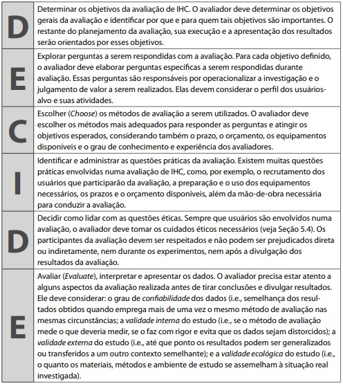

# Planejamento da Avaliação do Protótipo de Alta Fidelidade

## Introdução

As avaliações e verificações são uma parte essencial no processo de desenvolvimento e design. Assim esse documento visa planejar a avaliação do protótipo de alta fidelidade, que será desenvolvido a partir da ferramenta figma e apresentado aos usuáris em uma entrevista.

## Metodologia

Para a realização do planejamento da avaliação, utilizaremos o framework DECIDE, proposto por Sharp, Rogers e Preece, onde cada letra e uma etapa a ser seguida. Como pode ser visto na figura 1:

Figura 1: Framework DECIDE.

Fonte: Barbosa e Silva, 2011 <a id="anchor_1" href="#FRM1">¹</a>.

## D - Objetivos

Os objetivos da avaliação do protótipo de alta fidelidade é a verificação e depuração sobre a aparência visual, funcionalidades, usabilidade e conformidade com os padrões do protótipo de maior fidelidade ao produto final desenvolvido. Tal testagem busca problemas e possiveis omissões no teste, para que se possa haver uma refatoração e uma construção ideal do produto final.

## E - Exploração de perguntas

A seguir para se atingir os objetivos da avaliação, devem ser propostas alguma perguntas a serem respondidas com a avaliação em questão, tais perguntas podem ser desenvolvidas levando em conta os seguintes aspectos de interesse:

- ideias e alternativas de design
- problemas na interação e interface
- conformidade com um padrão

As perguntas propostas são:

- Os termos da interface seguem convenções pré-estabelecidas?
- O usuário consegue operar o sistema ?
- O usuário atinge todos os objetivos determinados? Com qual eficiencia e tempo ?
- O usuário entende as sequencias de ações que devem ser realizadas para realizar uma ação?
- Que problemas de IHC impedem ou dificultam o usuário de terminar sua tarefa?
- Foi possível identificar todos os problemas e feedbacks fornecidos pelo usuário sobre o protótipo?

## C - Métodos de avaliação

O método escolhido para a avaliação IHC do protótipo de alta fidelidade foi o de teste de usabilidade, o qual associado a entrevista e observação juntamente com o usuário, nos permite avaliar e testar a usabilidade de um certo sistema. O teste de usabilidade, seguindo as [Metas de usabilidade](https://interacao-humano-computador.github.io/2023.2-Dominio-Publico/analise_de_requisitos/metas_de_usabilidade/) , nos permite extrair informações e feedbacks dos usuários. A escolha do métoo se deve ao fato de possibilitar por uma maneira simples a coleta de muita informação dos usuários .

## I - Aspectos Práticos da Avaliação

### Recrutamento

O recrutamendo dos usuários entrevistados serão definidos a partir do Perfil de usuários. O local definido para entrevista será online ou presencial, de forma a acordar com o usuário. O número de participantes da pesquisa será equivalente ao número de de integrantes, ou seja, 7 usuários a serem entrevistados.

### Preparação

Para realizar as entrevistas e observação das ações dos usuários seram utilizadas para testagem as seguintes tarefas:

- Pesquisar por mídia
- Download de mídia
- Acessar ajuda
- Se tornar colaborador
- Acessar estatísticas
- Avaliar mídias
- Contatar administradores

Para realização da entrevista, será orientado para o entrevistado qual a ação desejada que ele faça no protótipo, além de que ele narre suas ações (Think aloud.)

A sequêcia das ações que serão propostas ao usuário, a ser realizadas podem ser conferidas a partir da Análise de tarefas, com o [Diagram HTA](https://interacao-humano-computador.github.io/2023.2-Dominio-Publico/analise_de_requisitos/analise_de_tarefas/hta/) ou [GOMS](https://interacao-humano-computador.github.io/2023.2-Dominio-Publico/analise_de_requisitos/analise_de_tarefas/goms/).

### Custos

Os custos planejados para realização da avaliação são mínimos, tendo em vista que somente será necessário a utilização do tempo, imagem e consentimento dos entrevistados, além da necessidade de um aparelho de gravação de imagem pessoal, por parte do entrevistador. Dessa forma serão utilizadas os seguintes artefatos:

- Perguntas exploradas
- Termo de consentimento
- Teste piloto
- Roteiro de perguntas
- Figma
- Protótipo de alta fidelidade desenvolvido

### Prazos

O cronograma das entrevistas com os usuários estão documentadas na Tabela 1 com os seguintes tópicos:

- Entrevistador;
- Entrevistado;
- Horário de início e fim;
- Local e data que ocorreu a entrevista;

Tabela 1: Cronograma da entrevista 

| Entrevistador(es)                                    | Entrevistado(s) | Horário de Início | Horário de Fim | Data Planejada | Data Executada | Tarefa(s)                    | Local                      |
| ---------------------------------------------------- | --------------- | ----------------- | -------------- | -------------- | -------------- | ---------------------------- | -------------------------- |
| [Ana Catarina](https://github.com/an4catarina)       | Gustavo         | 15:00             | 15:15          | 20/11          |                | Acessar as Estatísticas      | Plataforma Microsoft Teams |
| [Gustavo França](https://github.com/gustavofbs)      | Flávio Augusto  | 12:00             | 12:15          | 20/11          |                | Contatar Admin               | Plataforma Microsoft Teams |
| [Harryson Martins](https://github.com/harry-cmartin) | Kelven Cunha    |   14:30                |14:50                | 23/11   |                | Pesquisar por Mídia          | FGA                        |
| [Luciano Ricardo](https://github.com/l-ricardo)      | Bruno           | 16:00             | 16:15          | 17/11          |                | Pedir Ajuda                  | Plataforma Microsoft Teams |
| [Maria Alice](https://github.com/Maliz30)            | Maria Abritta   | 16:30             | 16:45          | 21/11          |                | Candidatura para Colaborador | Plataforma Microsoft Teams |
| [Pedro Henrique](https://github.com/pedro-hsf)       | Nicolas         | 14:00             | 14:15          | 21/11          |                | Download de Mídia            | Plataforma Microsoft Teams |
| [Victor Hugo](https://github.com/ViictorHugoo)       | Tales           | 13:00             | 13:15          | 21/11          |                | Avaliar Mídia                | Plataforma Microsoft Teams |

Fonte: [Harryson Martins](https://github.com/harry-cmartin).

### Perguntas desenvolvidas

A seguir, tabela 2, podem ser vistas as perguntas que serão propostas aos usuários após o término das entrevistas, para coletagem de informações. Na tabela 3, podem ser vistas as diretrizes a serem observadas pelos entrevistadores ao decorrer da avaliação. Ambos os artefatos foram baseados na Fase E - Perguntas a serem exploradas.

Tabela 2: Perguntas propostas

|                                                Pergunta                                                 | Resposta |
| :-----------------------------------------------------------------------------------------------------: | :------: |
|            Você acredita que as tarefas desenvolvidas foram de facil compreensão e execução?            |          |
|                      Você encontrou alguma dificuldade na realização das tarefas?                       |          |
| Você acredita que os elementos na tela oferecem uma disposição satisfatória e um design compreensivel ? |          |
|            Você encontrou algum erro ou omissão de elementos durante a execuação da tarefa?             |          |

Fonte: [Harryson Martins](https://github.com/harry-cmartin).

Tabela 3: Diretrizes

|                                         Pergunta                                          | Resposta |
| :---------------------------------------------------------------------------------------: | :------: |
|                           O usuário consegue operar o sistema ?                           |          |
|      O usuário atinge todos os objetivos determinados? Com qual eficiencia e tempo ?      |          |
| O usuário entende as sequencias de ações que devem ser realizadas para realizar uma ação? |          |
|                  O usuário encontrou barreiras para concluir as tarefas?                  |          |
|  Se encontradas, as barreiras foram determinates para o usuário não concluir as tarefas?  |          |

Fonte: [Harryson Martins](https://github.com/harry-cmartin).

## D - Questões Éticas

Como já apresentado, o termo de consentimento, garantirá uma interação respetuosa e profissional entre ambas as partes participantes.

## E - Avaliar, Interpretar e Apresentar os Dados

Após a finalização da entrevista, os dados coletados serão verificados e validados, a fim de se observar se foram coletados de forma correta todas as informações necessarias para evolução do produto final.

Além disso, os problemas coletados serão organizados e elencados por ordem de importancia e impacto na aplicação, com o intuito de aplicar um solução no reprojeto do site final. As novas sugestões elencadas pelo usuário serão as principais fontes de embasamento para a evolução do produto.

Por fim, os dados finais e lapidados obtidos serão dispostos a fim de proporcionar parametros para uma melhora na aplicação.

## Planejamento do Teste Piloto

## Teste Piloto

## Bibliografia

> SANTOS, Mizal. Planejamento da avaliação da Análise de tarefas. Repositório do Grupo Bnaco Central da disciplina de Interação Humano Computador da Universidade de Brasília, 2023. Disponível em: https://interacao-humano-computador.github.io/2023.1-BancoCentral/#/design_prototipo/prototipo_alta_fidelidade/planejamento_avaliacao. Acesso em: 21 de nov de 2023.

> Bilheteria Digital. Planejamento da Avaliação do Protótipo de Alta Fidelidade. Repositório do Grupo Bilheteria Digital da disciplina de Interação Humano Computador da Universidade de Brasília, 2023. Disponível em: https://interacao-humano-computador.github.io/2023.1-BilheteriaDigital/design-avaliacao-desenvolvimento/nivel-3/planejamento-avaliacao-paf/. Acesso em: 21 de nov de 2023.

## Referências Bibliográficas

<a id="REF1" href="#anchor_1">1.</a> BARBOSA, S. D. J.; SILVA, B. S. Interação Humano-Computador. Rio de Janeiro: Elsevier, 2011

## Histórico de Versões

| Versão | Data       | Descrição            | Autor(es)                                            | Revisor(es)                                    |
| ------ | ---------- | -------------------- | ---------------------------------------------------- | ---------------------------------------------- |
| 1.0    | 21/11/2023 | Criação do Documento | [Harryson Martins](https://github.com/harry-cmartin) | [Ana Catarina](https://github.com/an4catarina) |
