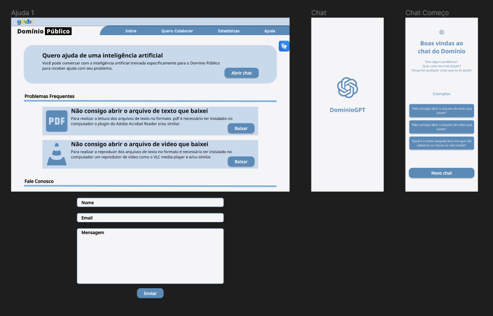

# Relato dos Resultados do Protótipo de Alta Fidelidade

## Introdução

Esse artefato tem o objetivo de documentar o relato dos resultados obtidos pela avaliação do protótipo de alta fidelidade. Com isso, serão abordados os tópicos referidos no Planejamento do Relato dos Resultados do Protótipo de alta fidelidade.
Durante essa etapa, o grupo desenvolveu o protótipo de papel, o qual pode ser verificado na figura 1.

Figura 1: Protótipo de papel 

<iframe style="border: 1px solid rgba(0, 0, 0, 0.1);" width="800" height="450" src="https://www.figma.com/embed?embed_host=share&url=https%3A%2F%2Fwww.figma.com%2Ffile%2FSl8uPWGWzVHmIsux7X2Fqz%2FDom%25C3%25ADnio-P%25C3%25BAblico%3Ftype%3Ddesign%26node-id%3D358%253A2%26mode%3Ddesign%26t%3DsJn4fl6D6XtVHRip-1" allowfullscreen></iframe>

Fonte: [Harryson Martins](https://github.com/harry-cmartin)

### Tarefa: Pesquisar por mídia

##### Objetivo e âmbito da avaliação

A finalidade da avaliação foi verificar a coerência da tarefa de "Pesquisar por mídia" e o fluxo de interações dos utilizadores do Domínio Público, ao mesmo tempo em que identificamos oportunidades de aprimoramento visando proporcionar um suporte mais eficiente e satisfatório aos usuários.

##### Método de avaliação

Conforme sugerido pelo [planejamento da avaliação](docs/design_avalaiacao_desenvolvimento/nivel3/prototipo_alta_fidelidade/planejamento_avaliacao.md), o método de avaliação escolhido foi o de investigação, com uso de questiónario em uma entrevista aplicada.

A Tabela 1 exibe as datas da realização da avaliação.

Tabela 1: Cronograma executado

| Entrevistador                                        | Entrevistado    | Horário de Início | Horário de Fim | Data       | Local/Plataforma |
| ---------------------------------------------------- | --------------- | ----------------- | -------------- | ---------- | ---------------- |
| [Harryson Martins](https://github.com/harry-cmartin) | Kelven Cunha    | 13:30             | 13:50          | 26/11/2023 | FGA              |
| [Harryson Martins](https://github.com/harry-cmartin) | Flávio Augusto  | 13:50             | 14:15          | 26/11/2023 | FGA              |
| [Harryson Martins](https://github.com/harry-cmartin) | Leandro Almeida | 14:20             | 14:50          | 26/11/2023 | FGA              |

Fonte:[Harryson Martins](https://github.com/harry-cmartin).

##### Seleção dos participantes

Cada tarefa possui seu respectivo reponsável e com base nisso foi selecionado o entrevistador. O usuário entrevistado selecionado possui entre 18 e 34 anos; é experiente com tecnologia e lê com frequencia media, conforme estabelecido no [Perfil de Usuário](../../../analise_de_requisitos/perfil_de_usuario.md).

##### Registro da avaliação

No Video 1 e Tabela 2 e 3 é possível verificar os registros feitos durante a avaliação.

Video 1: Gravação da avaliação

<iframe width="560" height="315" src="https://www.youtube.com/embed/RUAJqFavPwY?si=KcUJmmBRAa9JxibA" title="YouTube video player" frameborder="1" allow="accelerometer; autoplay; clipboard-write; encrypted-media; gyroscope; picture-in-picture; web-share" allowfullscreen></iframe>

Fonte: [Harryson Martins](https://github.com/harry-cmartin)

Tabela 2: Perguntas propostas

|                                                Pergunta                                                 | Resposta |
| :-----------------------------------------------------------------------------------------------------: | :------: |
|            Você acredita que as tarefas desenvolvidas foram de facil compreensão e execução?            |   Sim    |
|                      Você encontrou alguma dificuldade na realização das tarefas?                       |   Não    |
| Você acredita que os elementos na tela oferecem uma disposição satisfatória e um design compreensivel ? |   Sim    |
|            Você encontrou algum erro ou omissão de elementos durante a execuação da tarefa?             |   Não    |

Fonte: [Harryson Martins](https://github.com/harry-cmartin).

Tabela 3: Diretrizes

|                                         Pergunta                                          |                         Resposta                          |
| :---------------------------------------------------------------------------------------: | :-------------------------------------------------------: |
|                           O usuário consegue operar o sistema ?                           |                            Sim                            |
|      O usuário atinge todos os objetivos determinados? Com qual eficiencia e tempo ?      | Sim, consegue atingir todos com eficiencia e pouco tempo. |
| O usuário entende as sequencias de ações que devem ser realizadas para realizar uma ação? |                            Sim                            |
|                  O usuário encontrou barreiras para concluir as tarefas?                  |                            Não                            |
|  Se encontradas, as barreiras foram determinates para o usuário não concluir as tarefas?  |              Não foram encontradas barreiras              |

Fonte: [Harryson Martins](https://github.com/harry-cmartin).

No Video 2 e Tabela 4 e 5 é possível verificar os registros feitos durante a avaliação.

Video 2: Gravação da avaliação

<iframe width="560" height="315" src="https://www.youtube.com/embed/_gxJAVoHxLw?si=VeB0fZOY8S-VVM9Z" title="YouTube video player" frameborder="1" allow="accelerometer; autoplay; clipboard-write; encrypted-media; gyroscope; picture-in-picture; web-share" allowfullscreen></iframe>

Fonte: [Harryson Martins](https://github.com/harry-cmartin)

Tabela 3: Perguntas propostas

|                                                Pergunta                                                 | Resposta |
| :-----------------------------------------------------------------------------------------------------: | :------: |
|            Você acredita que as tarefas desenvolvidas foram de facil compreensão e execução?            |   Sim    |
|                      Você encontrou alguma dificuldade na realização das tarefas?                       |   Não    |
| Você acredita que os elementos na tela oferecem uma disposição satisfatória e um design compreensivel ? |   Sim    |
|            Você encontrou algum erro ou omissão de elementos durante a execuação da tarefa?             |   Não    |

Fonte: [Harryson Martins](https://github.com/harry-cmartin).

Tabela 4: Diretrizes

|                                         Pergunta                                          |                         Resposta                          |
| :---------------------------------------------------------------------------------------: | :-------------------------------------------------------: |
|                           O usuário consegue operar o sistema ?                           |                            Sim                            |
|      O usuário atinge todos os objetivos determinados? Com qual eficiencia e tempo ?      | Sim, consegue atingir todos com eficiência e pouco tempo. |
| O usuário entende as sequencias de ações que devem ser realizadas para realizar uma ação? |                            Sim                            |
|                  O usuário encontrou barreiras para concluir as tarefas?                  |                            Não                            |
|  Se encontradas, as barreiras foram determinates para o usuário não concluir as tarefas?  |              Não foram encontradas barreiras              |

Fonte: [Harryson Martins](https://github.com/harry-cmartin).

No Video 3 e Tabela 6 e 7 é possível verificar os registros feitos durante a avaliação.

Video 3: Gravação da avaliação

<iframe width="560" height="315" src="https://www.youtube.com/embed/lLkl2yymUgk?si=I9REKiHbF-tl87Ve" title="YouTube video player" frameborder="1" allow="accelerometer; autoplay; clipboard-write; encrypted-media; gyroscope; picture-in-picture; web-share" allowfullscreen></iframe>

Fonte: [Harryson Martins](https://github.com/harry-cmartin)

Tabela 6: Perguntas propostas

|                                                Pergunta                                                 | Resposta |
| :-----------------------------------------------------------------------------------------------------: | :------: |
|            Você acredita que as tarefas desenvolvidas foram de facil compreensão e execução?            |   Sim    |
|                      Você encontrou alguma dificuldade na realização das tarefas?                       |   Não    |
| Você acredita que os elementos na tela oferecem uma disposição satisfatória e um design compreensivel ? |   Sim    |
|            Você encontrou algum erro ou omissão de elementos durante a execuação da tarefa?             |   Não    |

Fonte: [Harryson Martins](https://github.com/harry-cmartin).

Tabela 7: Diretrizes

|                                         Pergunta                                          |                         Resposta                          |
| :---------------------------------------------------------------------------------------: | :-------------------------------------------------------: |
|                           O usuário consegue operar o sistema ?                           |                            Sim                            |
|      O usuário atinge todos os objetivos determinados? Com qual eficiencia e tempo ?      | Sim, consegue atingir todos com eficiência e pouco tempo. |
| O usuário entende as sequencias de ações que devem ser realizadas para realizar uma ação? |                            Sim                            |
|                  O usuário encontrou barreiras para concluir as tarefas?                  |                            Não                            |
|  Se encontradas, as barreiras foram determinates para o usuário não concluir as tarefas?  |              Não foram encontradas barreiras              |

Fonte: [Harryson Martins](https://github.com/harry-cmartin).

##### Listagem de problemas encontrados

Após a entrevista e com todas as perguntas e diretrizes analisadas e respondidas, não foi encontrado nenhum problema com as três entrevistas realizadas para a tarefa, atingindo-se,logo, o resultado esperado.

##### Sugestões de melhoria

Os participantes não forneceram propostas de melhoria para o protótipo.

### Tarefa: Fazer download da mídia

##### Objetivo e âmbito da avaliação

A avaliação teve como objetivo analisar a eficácia da função de "Fazer Download" e avaliar a consistência nas interações dos usuários no Domínio Público. Além disso, buscamos identificar áreas de aprimoramento para oferecer suporte mais eficiente e satisfatório aos usuários, garantindo uma experiência aprimorada.

##### Método de avaliação

Conforme sugerido pelo [planejamento da avaliação](docs/design_avalaiacao_desenvolvimento/nivel3/prototipo_alta_fidelidade/planejamento_avaliacao.md), o método de avaliação escolhido foi o de investigação, com uso de questiónario em uma entrevista aplicada.

A Tabela 8 exibe as datas da realização da avaliação.

Tabela 8: Cronograma executado

| Entrevistador                                  | Entrevistado    | Horário de Início | Horário de Fim | Data       | Local/Plataforma |
| ---------------------------------------------- | --------------- | ----------------- | -------------- | ---------- | ---------------- |
| [Pedro Henrique](https://github.com/pedro-hsf) | Richard Ribeiro | 17:17             | 15:24          | 29/11/2023 | Microsoft Teams  |
| [Pedro Henrique](https://github.com/pedro-hsf) | Milena Baruc    | 13:30             | 13:50          | 29/11/2023 | Microsoft Teams  |
| [Pedro Henrique](https://github.com/pedro-hsf) | Nicolas Bomfim  | 14:20             | 14:50          | 29/11/2023 | Microsoft Teams  |

Fonte:[Pedro Henrique](https://github.com/pedro-hsf).

##### Seleção dos participantes

A seleção dos participantes foi realizada de forma criteriosa, atribuindo a cada tarefa um responsável designado. O entrevistador foi escolhido com base nessa responsabilidade específica. O usuário selecionado para a entrevista está na faixa etária de 18 a 34 anos, demonstrando experiência significativa com tecnologia e uma frequência média de leitura, conforme detalhado no [Perfil de Usuário](../../../analise_de_requisitos/perfil_de_usuario.md). Essa abordagem visa garantir que os participantes se alinhem adequadamente com as características necessárias para fornecer insights valiosos durante o processo de avaliação. 

##### Registro da avaliação

Antes do início dos testes, os entrevistados receberam um roteiro que delineava as ações a serem realizadas no sistema. Estas incluíam acessar a área de Download, baixar uma mídia no formato desejado, completar o processo de Download e, em seguida, baixar outra mídia de escolha, com a instrução de cancelar o download antes da conclusão. Foi solicitado ao entrevistado que narrasse em voz alta as ações que estava executando.

No Video 4 e Tabela 8 e 9 é possível verificar os registros feitos durante a avaliação.

Video 4: Gravação da avaliação "Fazer Download"

<iframe width="560" height="315" src="https://www.youtube.com/embed/9AKlwUSpriw?si=TMQz2PKUL0T-TtUN" title="YouTube video player" frameborder="0" allow="accelerometer; autoplay; clipboard-write; encrypted-media; gyroscope; picture-in-picture; web-share" allowfullscreen></iframe>

Fonte: [Pedro Henrique](https://github.com/pedro-hsf)

Tabela 8: Perguntas propostas

|                                                Pergunta                                                 | Resposta |
| :-----------------------------------------------------------------------------------------------------: | :------: |
|            Você acredita que as tarefas desenvolvidas foram de facil compreensão e execução?            |   Sim    |
|                      Você encontrou alguma dificuldade na realização das tarefas?                       |   Não    |
| Você acredita que os elementos na tela oferecem uma disposição satisfatória e um design compreensivel ? |   Sim    |
|            Você encontrou algum erro ou omissão de elementos durante a execuação da tarefa?             |   Não    |

Fonte: [Pedro Henrique](https://github.com/pedro-hsf).

Tabela 9: Diretrizes

|                                         Pergunta                                          |            Resposta             |
| :---------------------------------------------------------------------------------------: | :-----------------------------: |
|                           O usuário consegue operar o sistema ?                           |               Sim               |
|      O usuário atinge todos os objetivos determinados? Com qual eficiencia e tempo ?      | Sim de forma rápida e eficiente |
| O usuário entende as sequencias de ações que devem ser realizadas para realizar uma ação? |               Sim               |
|                  O usuário encontrou barreiras para concluir as tarefas?                  |               Não               |
|  Se encontradas, as barreiras foram determinates para o usuário não concluir as tarefas?  |       Não houve barreiras       |

Fonte: [Pedro Henrique](https://github.com/pedro-hsf).

No Video 5 e Tabela 10 e 11 é possível verificar os registros feitos durante a avaliação.

Video 5: Gravação da avaliação "Fazer Download"

<iframe width="560" height="315" src="" title="YouTube video player" frameborder="1" allow="accelerometer; autoplay; clipboard-write; encrypted-media; gyroscope; picture-in-picture; web-share" allowfullscreen></iframe>

Fonte: [Pedro Henrique](https://github.com/pedro-hsf)

Tabela 10: Perguntas propostas

|                                                Pergunta                                                 | Resposta |
| :-----------------------------------------------------------------------------------------------------: | :------: |
|            Você acredita que as tarefas desenvolvidas foram de facil compreensão e execução?            |          |
|                      Você encontrou alguma dificuldade na realização das tarefas?                       |          |
| Você acredita que os elementos na tela oferecem uma disposição satisfatória e um design compreensivel ? |          |
|            Você encontrou algum erro ou omissão de elementos durante a execuação da tarefa?             |          |

Fonte: [Pedro Henrique](https://github.com/pedro-hsf).

Tabela 11: Diretrizes

|                                         Pergunta                                          | Resposta |
| :---------------------------------------------------------------------------------------: | :------: |
|                           O usuário consegue operar o sistema ?                           |          |
|      O usuário atinge todos os objetivos determinados? Com qual eficiencia e tempo ?      |          |
| O usuário entende as sequencias de ações que devem ser realizadas para realizar uma ação? |          |
|                  O usuário encontrou barreiras para concluir as tarefas?                  |          |
|  Se encontradas, as barreiras foram determinates para o usuário não concluir as tarefas?  |          |

Fonte: [Pedro Henrique](https://github.com/pedro-hsf).

No Video 6 e Tabela 12 e 13 é possível verificar os registros feitos durante a avaliação.

Video 6: Gravação da avaliação "Fazer Download"

<iframe width="560" height="315" src="" title="YouTube video player" frameborder="1" allow="accelerometer; autoplay; clipboard-write; encrypted-media; gyroscope; picture-in-picture; web-share" allowfullscreen></iframe>

Fonte: [Pedro Henrique](https://github.com/pedro-hsf)

Tabela 12: Perguntas propostas

|                                                Pergunta                                                 | Resposta |
| :-----------------------------------------------------------------------------------------------------: | :------: |
|            Você acredita que as tarefas desenvolvidas foram de facil compreensão e execução?            |          |
|                      Você encontrou alguma dificuldade na realização das tarefas?                       |          |
| Você acredita que os elementos na tela oferecem uma disposição satisfatória e um design compreensivel ? |          |
|            Você encontrou algum erro ou omissão de elementos durante a execuação da tarefa?             |          |

Fonte: [Pedro Henrique](https://github.com/pedro-hsf).

Tabela 13: Diretrizes

|                                         Pergunta                                          | Resposta |
| :---------------------------------------------------------------------------------------: | :------: |
|                           O usuário consegue operar o sistema ?                           |          |
|      O usuário atinge todos os objetivos determinados? Com qual eficiencia e tempo ?      |          |
| O usuário entende as sequencias de ações que devem ser realizadas para realizar uma ação? |          |
|                  O usuário encontrou barreiras para concluir as tarefas?                  |          |
|  Se encontradas, as barreiras foram determinates para o usuário não concluir as tarefas?  |          |

Fonte: [Pedro Henrique](https://github.com/pedro-hsf).

##### Listagem de problemas encontrados

Após a análise das perguntas e diretrizes durante as entrevistas, constatou-se que não houve identificação de problemas nas três entrevistas conduzidas para a tarefa. Alcançando assim o resultado esperado.

##### Sugestões de melhoria

Não foram apresentadas sugestões de aprimoramento para o protótipo pelos participantes.

### Tarefa: Avaliar Midia

##### Objetivo e âmbito da avaliação

A avaliação teve como objetivo analisar a eficácia da função de "Avaliar Midia" e avaliar a consistência nas interações dos usuários no Domínio Público. Além disso, buscamos identificar áreas de aprimoramento para oferecer suporte mais eficiente e satisfatório aos usuários, garantindo uma experiência aprimorada.

##### Método de avaliação

Conforme sugerido pelo [planejamento da avaliação](docs/design_avalaiacao_desenvolvimento/nivel3/prototipo_alta_fidelidade/planejamento_avaliacao.md), o método de avaliação escolhido foi o de investigação, com uso de questiónario em uma entrevista aplicada.

A Tabela 8 exibe as datas da realização da avaliação.

Tabela 8: Cronograma executado

| Entrevistador                                  | Entrevistado | Horário de Início | Horário de Fim | Data       | Local/Plataforma |
| ---------------------------------------------- | ------------ | ----------------- | -------------- | ---------- | ---------------- |
| [Victor Hugo](https://github.com/ViictorHugoo) | Clara Closs  | 18:52             | 18:58          | 29/11/2023 | Microsoft Teams  |
| [Victor Hugo](https://github.com/ViictorHugoo) | Maria Helena |                   |                | 29/11/2023 | Microsoft Teams  |
| [Victor Hugo](https://github.com/ViictorHugoo) | Júlia Takaki |                   |                | 29/11/2023 | Microsoft Teams  |

Fonte:[Victor Hugo](https://github.com/ViictorHugoo).

##### Seleção dos participantes

A seleção dos participantes foi realizada de forma criteriosa, atribuindo a cada tarefa um responsável designado. O entrevistador foi escolhido com base nessa responsabilidade específica. O usuário selecionado para a entrevista está na faixa etária de 18 a 34 anos, demonstrando experiência significativa com tecnologia e uma frequência média de leitura, conforme detalhado no [Perfil de Usuário](../../../analise_de_requisitos/perfil_de_usuario.md). Essa abordagem visa garantir que os participantes se alinhem adequadamente com as características necessárias para fornecer insights valiosos durante o processo de avaliação. 

##### Registro da avaliação

Antes do início dos testes, os entrevistados receberam um roteiro que delineava as ações a serem realizadas no sistema. Estas incluíam acessar a midia que deseja avaliar, avaliar uma midia, completar e publicar uma avaliação, iniciar uma segunda avaliação, porém cancelando-a antes de publicar e, em seguida, denunciar uma avaliação. Foi solicitado ao entrevistado que narrasse em voz alta as ações que estava executando.

No Video 7 e Tabela 14 e 15 é possível verificar os registros feitos durante a avaliação.

Video 7: Gravação da avaliação "Fazer Download"

<iframe width="560" height="315" src="https://www.youtube.com/embed/qr2p1_MsFGk?si=lOavbJKp5yiZyRZ-" title="YouTube video player" frameborder="0" allow="accelerometer; autoplay; clipboard-write; encrypted-media; gyroscope; picture-in-picture; web-share" allowfullscreen></iframe>

Fonte: [Victor Hugo](https://github.com/ViictorHugoo)

Tabela 14: Perguntas propostas

|                                                Pergunta                                                 | Resposta |
| :-----------------------------------------------------------------------------------------------------: | :------: |
|            Você acredita que as tarefas desenvolvidas foram de facil compreensão e execução?            |   sim    |
|                      Você encontrou alguma dificuldade na realização das tarefas?                       |   nao    |
| Você acredita que os elementos na tela oferecem uma disposição satisfatória e um design compreensivel ? |   sim    |
|            Você encontrou algum erro ou omissão de elementos durante a execuação da tarefa?             |   nao    |

Fonte: [Victor Hugo](https://github.com/ViictorHugoo).

Tabela 15: Diretrizes

|                                         Pergunta                                          |             Resposta             |
| :---------------------------------------------------------------------------------------: | :------------------------------: |
|                           O usuário consegue operar o sistema ?                           |               sim                |
|      O usuário atinge todos os objetivos determinados? Com qual eficiencia e tempo ?      | sim, rapidamente e sem problemas |
| O usuário entende as sequencias de ações que devem ser realizadas para realizar uma ação? |               sim                |
|                  O usuário encontrou barreiras para concluir as tarefas?                  |               nao                |
|  Se encontradas, as barreiras foram determinates para o usuário não concluir as tarefas?  |      não foram encontradas       |

Fonte: [Victor Hugo](https://github.com/ViictorHugoo).

No Video 7 e Tabela 16 e 17 é possível verificar os registros feitos durante a avaliação.

Video 7: Gravação da avaliação "Fazer Download"

<iframe width="560" height="315" src="https://www.youtube.com/embed/wOBaGx9GaO0?si=GUSuJIw1hIx47-iQ" title="YouTube video player" frameborder="0" allow="accelerometer; autoplay; clipboard-write; encrypted-media; gyroscope; picture-in-picture; web-share" allowfullscreen></iframe>

Fonte: [Victor Hugo](https://github.com/ViictorHugoo)

Tabela 16: Perguntas propostas

|                                                Pergunta                                                 |              Resposta              |
| :-----------------------------------------------------------------------------------------------------: | :--------------------------------: |
|            Você acredita que as tarefas desenvolvidas foram de facil compreensão e execução?            |                sim                 |
|                      Você encontrou alguma dificuldade na realização das tarefas?                       |                não                 |
| Você acredita que os elementos na tela oferecem uma disposição satisfatória e um design compreensivel ? |                sim                 |
|            Você encontrou algum erro ou omissão de elementos durante a execuação da tarefa?             | sim, na parte de pesquisa de midia |

Fonte: [Victor Hugo](https://github.com/ViictorHugoo).

Tabela 17: Diretrizes

|                                         Pergunta                                          |                                         Resposta                                         |
| :---------------------------------------------------------------------------------------: | :--------------------------------------------------------------------------------------: |
|                           O usuário consegue operar o sistema ?                           |                                           sim                                            |
|      O usuário atinge todos os objetivos determinados? Com qual eficiencia e tempo ?      |                          sim, menos eficiente do que o esperado                          |
| O usuário entende as sequencias de ações que devem ser realizadas para realizar uma ação? |                                           sim                                            |
|                  O usuário encontrou barreiras para concluir as tarefas?                  | sim, o resultado de pesquisa de midia não aparenta guiar para ver mais detalhes da midia |
|  Se encontradas, as barreiras foram determinates para o usuário não concluir as tarefas?  |                                           não                                            |

Fonte: [Victor Hugo](https://github.com/ViictorHugoo).

No Video 8 e Tabela 18 e 19 é possível verificar os registros feitos durante a avaliação.

Video 8: Gravação da avaliação "Fazer Download"

<iframe width="560" height="315" src="" title="YouTube video player" frameborder="1" allow="accelerometer; autoplay; clipboard-write; encrypted-media; gyroscope; picture-in-picture; web-share" allowfullscreen></iframe>

Fonte: [Victor Hugo](https://github.com/ViictorHugoo)

Tabela 18: Perguntas propostas

|                                                Pergunta                                                 | Resposta |
| :-----------------------------------------------------------------------------------------------------: | :------: |
|            Você acredita que as tarefas desenvolvidas foram de facil compreensão e execução?            |          |
|                      Você encontrou alguma dificuldade na realização das tarefas?                       |          |
| Você acredita que os elementos na tela oferecem uma disposição satisfatória e um design compreensivel ? |          |
|            Você encontrou algum erro ou omissão de elementos durante a execuação da tarefa?             |          |

Fonte: [Victor Hugo](https://github.com/ViictorHugoo).

Tabela 19: Diretrizes

|                                         Pergunta                                          | Resposta |
| :---------------------------------------------------------------------------------------: | :------: |
|                           O usuário consegue operar o sistema ?                           |          |
|      O usuário atinge todos os objetivos determinados? Com qual eficiencia e tempo ?      |          |
| O usuário entende as sequencias de ações que devem ser realizadas para realizar uma ação? |          |
|                  O usuário encontrou barreiras para concluir as tarefas?                  |          |
|  Se encontradas, as barreiras foram determinates para o usuário não concluir as tarefas?  |          |

Fonte: [Victor Hugo](https://github.com/ViictorHugoo).

##### Listagem de problemas encontrados

Problemas encontrados na avaliação:
1. Texto de resumo da obra é muito grande
2. Pop-up de denuncia é grande e o usuário sentiu que poderia assustar ao pegar desprevinido
3. Icone para denuncia parecia mais um icone de informações, o que deixou o usuário confuso

##### Sugestões de melhoria

Os participantes não forneceram propostas de melhoria para o protótipo.

### Tarefa Contatar Administradores

##### Objetivo e âmbito da avaliação

A finalidade da avaliação foi verificar a coerência da tarefa de "Contatar Administradores" e o fluxo de interações dos utilizadores do Domínio Público, ao mesmo tempo em que identificamos oportunidades de aprimoramento visando proporcionar um suporte mais eficiente e satisfatório aos usuários.

##### Método de avaliação

Conforme sugerido pelo [planejamento da avaliação](docs/design_avalaiacao_desenvolvimento/nivel3/prototipo_alta_fidelidade/planejamento_avaliacao.md), o método de avaliação escolhido foi o de investigação, com uso de questiónario em uma entrevista aplicada.

A Tabela 20 exibe as datas da realização da avaliação.

Tabela 20: Cronograma executado

| Entrevistador                                   | Entrevistado   | Horário de Início | Horário de Fim | Data       | Local/Plataforma           |
| ----------------------------------------------- | -------------- | ----------------- | -------------- | ---------- | -------------------------- |
| [Gustavo França](https://github.com/gustavofbs) | Douglas Wilson | 11:50             | 11:53          | 29/11/2023 | Plataforma Microsoft Teams |
| [Gustavo França](https://github.com/gustavofbs) | Daniel Diniz   | 18:34             | 18:37          | 29/11/2023 | Plataforma Microsoft Teams |
| [Gustavo França](https://github.com/gustavofbs) | Juan Pablo     | 12:00             | 12:03          | 28/11/2023 | FGA                        |

Fonte:[Gustavo França](https://github.com/gustavofbs).

##### Seleção dos participantes

Cada tarefa possui seu respectivo reponsável e com base nisso foi selecionado o entrevistador. O usuário entrevistado selecionado possui entre 18 e 34 anos; é experiente com tecnologia e lê com frequencia media, conforme estabelecido no [Perfil de Usuário](../../../analise_de_requisitos/perfil_de_usuario.md).

##### Registro da avaliação

No Video 9 e Tabela 21 e 22 é possível verificar os registros feitos durante a avaliação.

Video 9: Gravação da avaliação

<iframe width="560" height="315" src="https://www.youtube.com/embed/IpjQvZF6E-w?si=KoTHL5bpmRXN9AIf" title="YouTube video player" frameborder="1" allow="accelerometer; autoplay; clipboard-write; encrypted-media; gyroscope; picture-in-picture; web-share" allowfullscreen></iframe>

Fonte: [Gustavo França](https://github.com/gustavofbs)

Tabela 21: Perguntas propostas

|                                                Pergunta                                                 | Resposta |
| :-----------------------------------------------------------------------------------------------------: | :------: |
|            Você acredita que as tarefas desenvolvidas foram de facil compreensão e execução?            |   Sim    |
|                      Você encontrou alguma dificuldade na realização das tarefas?                       |   Não    |
| Você acredita que os elementos na tela oferecem uma disposição satisfatória e um design compreensivel ? |   Sim    |
|            Você encontrou algum erro ou omissão de elementos durante a execuação da tarefa?             |   Não    |

Fonte: [Gustavo França](https://github.com/gustavofbs).

Tabela 22: Diretrizes

|                                         Pergunta                                          |            Resposta             |
| :---------------------------------------------------------------------------------------: | :-----------------------------: |
|                           O usuário consegue operar o sistema ?                           |               Sim               |
|      O usuário atinge todos os objetivos determinados? Com qual eficiencia e tempo ?      |               Sim               |
| O usuário entende as sequencias de ações que devem ser realizadas para realizar uma ação? |               Sim               |
|                  O usuário encontrou barreiras para concluir as tarefas?                  |               Não               |
|  Se encontradas, as barreiras foram determinates para o usuário não concluir as tarefas?  | Não foram encontradas barreiras |

Fonte: [Gustavo França](https://github.com/gustavofbs).

No Video 10 e Tabela 23 e 24 é possível verificar os registros feitos durante a avaliação.

Video 10: Gravação da avaliação

<iframe width="560" height="315" src="https://www.youtube.com/embed/Uz3KX28TYNI?si=a8OZs95KeJqKxu0u" title="YouTube video player" frameborder="1" allow="accelerometer; autoplay; clipboard-write; encrypted-media; gyroscope; picture-in-picture; web-share" allowfullscreen></iframe>

Fonte: [Gustavo França](https://github.com/gustavofbs)

Tabela 23: Perguntas propostas

|                                                Pergunta                                                 | Resposta |
| :-----------------------------------------------------------------------------------------------------: | :------: |
|            Você acredita que as tarefas desenvolvidas foram de facil compreensão e execução?            |   Sim    |
|                      Você encontrou alguma dificuldade na realização das tarefas?                       |   Não    |
| Você acredita que os elementos na tela oferecem uma disposição satisfatória e um design compreensivel ? |   Sim    |
|            Você encontrou algum erro ou omissão de elementos durante a execuação da tarefa?             |   Não    |

Fonte: [Gustavo França](https://github.com/gustavofbs).

Tabela 24: Diretrizes

|                                         Pergunta                                          |            Resposta             |
| :---------------------------------------------------------------------------------------: | :-----------------------------: |
|                           O usuário consegue operar o sistema ?                           |               Sim               |
|      O usuário atinge todos os objetivos determinados? Com qual eficiencia e tempo ?      |               Sim               |
| O usuário entende as sequencias de ações que devem ser realizadas para realizar uma ação? |               Sim               |
|                  O usuário encontrou barreiras para concluir as tarefas?                  |               Não               |
|  Se encontradas, as barreiras foram determinates para o usuário não concluir as tarefas?  | Não foram encontradas barreiras |

Fonte: [Gustavo França](https://github.com/gustavofbs).

No Video 11 e Tabela 25 e 26 é possível verificar os registros feitos durante a avaliação.

Video 10: Gravação da avaliação

<iframe width="560" height="315" src="https://www.youtube.com/embed/YhdQshihi8g?si=RCyRGG-ppSMWKsD-" title="YouTube video player" frameborder="1" allow="accelerometer; autoplay; clipboard-write; encrypted-media; gyroscope; picture-in-picture; web-share" allowfullscreen></iframe>

Fonte: [Gustavo França](https://github.com/gustavofbs)

Tabela 25: Perguntas propostas

|                                                Pergunta                                                 | Resposta |
| :-----------------------------------------------------------------------------------------------------: | :------: |
|            Você acredita que as tarefas desenvolvidas foram de facil compreensão e execução?            |   Sim    |
|                      Você encontrou alguma dificuldade na realização das tarefas?                       |   Não    |
| Você acredita que os elementos na tela oferecem uma disposição satisfatória e um design compreensivel ? |   Sim    |
|            Você encontrou algum erro ou omissão de elementos durante a execuação da tarefa?             |   Não    |

Fonte: [Gustavo França](https://github.com/gustavofbs).

Tabela 26: Diretrizes

|                                         Pergunta                                          |            Resposta             |
| :---------------------------------------------------------------------------------------: | :-----------------------------: |
|                           O usuário consegue operar o sistema ?                           |               Sim               |
|      O usuário atinge todos os objetivos determinados? Com qual eficiencia e tempo ?      |               Sim               |
| O usuário entende as sequencias de ações que devem ser realizadas para realizar uma ação? |               Sim               |
|                  O usuário encontrou barreiras para concluir as tarefas?                  |               Não               |
|  Se encontradas, as barreiras foram determinates para o usuário não concluir as tarefas?  | Não foram encontradas barreiras |

Fonte: [Gustavo França](https://github.com/gustavofbs).

##### Listagem de problemas encontrados

Após a entrevista e com todas as perguntas e diretrizes analisadas e respondidas, não foi encontrado nenhum problema com as duas entrevistas realizadas para a tarefa, atingindo-se, logo, o resultado esperado.

##### Sugestões de melhoria

Os participantes não ofereceram propostas de melhorias para o protótipo.

### Tarefa: Receber Ajuda

##### Objetivo e âmbito da avaliação

A finalidade da avaliação foi verificar a coerência da tarefa de "Receber Ajuda" e o fluxo de interações dos utilizadores do Domínio Público, ao mesmo tempo em que identificamos oportunidades de aprimoramento visando proporcionar um suporte mais eficiente e satisfatório aos usuários.

##### Método de avaliação

Conforme sugerido pelo [planejamento da avaliação](docs/design_avalaiacao_desenvolvimento/nivel3/prototipo_alta_fidelidade/planejamento_avaliacao.md), o método de avaliação escolhido foi o de investigação, com uso de questiónario em uma entrevista aplicada.

A Tabela 14 exibe as datas da realização da avaliação.

Tabela 14: Cronograma executado

| Entrevistador                                                                               | Entrevistado    | Horário de Início | Horário de Fim | Data       | Local/Plataforma |
| ------------------------------------------------------------------------------------------- | --------------- | ----------------- | -------------- | ---------- | ---------------- |
| [Luciano Ricardo](https://github.com/l-ricardo) e [Maria Alice](https://github.com/Maliz30) | Pedro Cabeceira | 15:00             | 15:15          | 29/11/2023 | FGA              |
| [Luciano Ricardo](https://github.com/l-ricardo) e [Maria Alice](https://github.com/Maliz30) | Luciano Freitas | 15:20             | 15:32          | 29/11/2023 | FGA              |
| [Luciano Ricardo](https://github.com/l-ricardo) e [Maria Alice](https://github.com/Maliz30) | Davi Rodrigues  | 15:35             | 15:45          | 29/11/2023 | FGA              |

Fonte:[Luciano Ricardo](https://github.com/l-ricardo).

##### Protótipo de Alta Fidelidade

Nas Figuras 1 e 2 é possível visualizar o protótipo de alta fidelidade utilizado para a avaliação da intervenção da tarefa "Receber ajuda".

Figura 1: Protótipo de alta de "Receber ajuda"

Fonte: [Luciano Ricardo](https://github.com/l-ricardo).

Figura 2: Protótipo de alta de "Receber ajuda"

Fonte: [Luciano Ricardo](https://github.com/l-ricardo).

##### Seleção dos participantes

Cada tarefa possui seu respectivo reponsável e com base nisso foi selecionado o entrevistador. O usuário entrevistado selecionado possui entre 18 e 34 anos; é experiente com tecnologia e lê com frequencia media, conforme estabelecido no [Perfil de Usuário](../../../analise_de_requisitos/perfil_de_usuario.md).

##### Registro da avaliação

No Video 7 e Tabela 15 e 16 é possível verificar os registros feitos durante a avaliação.

Video 7: Gravação da avaliação

<iframe width="560" height="315" src="" title="YouTube video player" frameborder="1" allow="accelerometer; autoplay; clipboard-write; encrypted-media; gyroscope; picture-in-picture; web-share" allowfullscreen></iframe>

Fonte:[Luciano Ricardo](https://github.com/l-ricardo).

Tabela 15: Perguntas propostas

|                                                Pergunta                                                 | Resposta |
| :-----------------------------------------------------------------------------------------------------: | :------: |
|            Você acredita que as tarefas desenvolvidas foram de facil compreensão e execução?            |   Sim    |
|                      Você encontrou alguma dificuldade na realização das tarefas?                       |   Não    |
| Você acredita que os elementos na tela oferecem uma disposição satisfatória e um design compreensivel ? |   Sim    |
|            Você encontrou algum erro ou omissão de elementos durante a execuação da tarefa?             |   Não    |

Fonte:[Luciano Ricardo](https://github.com/l-ricardo).

Tabela 16: Diretrizes

|                                         Pergunta                                          |                         Resposta                          |
| :---------------------------------------------------------------------------------------: | :-------------------------------------------------------: |
|                           O usuário consegue operar o sistema ?                           |                            Sim                            |
|      O usuário atinge todos os objetivos determinados? Com qual eficiencia e tempo ?      | Sim, consegue atingir todos com eficiencia e pouco tempo. |
| O usuário entende as sequencias de ações que devem ser realizadas para realizar uma ação? |                            Sim                            |
|                  O usuário encontrou barreiras para concluir as tarefas?                  |                            Não                            |
|  Se encontradas, as barreiras foram determinates para o usuário não concluir as tarefas?  |              Não foram encontradas barreiras              |

Fonte:[Luciano Ricardo](https://github.com/l-ricardo).

No Video 8 e Tabela 17 e 18 é possível verificar os registros feitos durante a avaliação.

Video 8: Gravação da avaliação

<iframe width="560" height="315" src="" title="YouTube video player" frameborder="1" allow="accelerometer; autoplay; clipboard-write; encrypted-media; gyroscope; picture-in-picture; web-share" allowfullscreen></iframe>

Fonte:[Luciano Ricardo](https://github.com/l-ricardo).

Tabela 17: Perguntas propostas

|                                                Pergunta                                                 | Resposta |
| :-----------------------------------------------------------------------------------------------------: | :------: |
|            Você acredita que as tarefas desenvolvidas foram de facil compreensão e execução?            |   Sim    |
|                      Você encontrou alguma dificuldade na realização das tarefas?                       |   Não    |
| Você acredita que os elementos na tela oferecem uma disposição satisfatória e um design compreensivel ? |   Sim    |
|            Você encontrou algum erro ou omissão de elementos durante a execuação da tarefa?             |   Não    |

Fonte:[Luciano Ricardo](https://github.com/l-ricardo).

Tabela 18: Diretrizes

|                                         Pergunta                                          |                         Resposta                          |
| :---------------------------------------------------------------------------------------: | :-------------------------------------------------------: |
|                           O usuário consegue operar o sistema ?                           |                            Sim                            |
|      O usuário atinge todos os objetivos determinados? Com qual eficiencia e tempo ?      | Sim, consegue atingir todos com eficiência e pouco tempo. |
| O usuário entende as sequencias de ações que devem ser realizadas para realizar uma ação? |                            Sim                            |
|                  O usuário encontrou barreiras para concluir as tarefas?                  |                            Não                            |
|  Se encontradas, as barreiras foram determinates para o usuário não concluir as tarefas?  |              Não foram encontradas barreiras              |

Fonte:[Luciano Ricardo](https://github.com/l-ricardo).

No Video 9 e Tabela 19 e 20 é possível verificar os registros feitos durante a avaliação.

Video 9: Gravação da avaliação

<iframe width="560" height="315" src="" title="YouTube video player" frameborder="1" allow="accelerometer; autoplay; clipboard-write; encrypted-media; gyroscope; picture-in-picture; web-share" allowfullscreen></iframe>

Fonte:[Luciano Ricardo](https://github.com/l-ricardo).

Tabela 19: Perguntas propostas

|                                                Pergunta                                                 | Resposta |
| :-----------------------------------------------------------------------------------------------------: | :------: |
|            Você acredita que as tarefas desenvolvidas foram de facil compreensão e execução?            |   Sim    |
|                      Você encontrou alguma dificuldade na realização das tarefas?                       |   Não    |
| Você acredita que os elementos na tela oferecem uma disposição satisfatória e um design compreensivel ? |   Sim    |
|            Você encontrou algum erro ou omissão de elementos durante a execuação da tarefa?             |   Não    |

Fonte:[Luciano Ricardo](https://github.com/l-ricardo).

Tabela 20: Diretrizes

|                                         Pergunta                                          |                         Resposta                          |
| :---------------------------------------------------------------------------------------: | :-------------------------------------------------------: |
|                           O usuário consegue operar o sistema ?                           |                            Sim                            |
|      O usuário atinge todos os objetivos determinados? Com qual eficiencia e tempo ?      | Sim, consegue atingir todos com eficiência e pouco tempo. |
| O usuário entende as sequencias de ações que devem ser realizadas para realizar uma ação? |                            Sim                            |
|                  O usuário encontrou barreiras para concluir as tarefas?                  |                            Não                            |
|  Se encontradas, as barreiras foram determinates para o usuário não concluir as tarefas?  |              Não foram encontradas barreiras              |

Fonte:[Luciano Ricardo](https://github.com/l-ricardo).

##### Listagem de problemas encontrados

Após a entrevista e com todas as perguntas e diretrizes analisadas e respondidas, não foi encontrado nenhum problema com as três entrevistas realizadas para a tarefa, atingindo-se,logo, o resultado esperado.

##### Sugestões de melhoria

Os participantes não forneceram propostas de melhoria para o protótipo.

## Histórico de Versões

| Versão | Data       | Descrição   | Autor(es)                                       | Revisor(es)                                     |
| ------ | ---------- | ----------- | ----------------------------------------------- | ----------------------------------------------- |
| 1.0    | 29/11/2023 | Pedir ajuda | [Luciano Ricardo](https://github.com/l-ricardo) | [Gustavo França](https://github.com/gustavofbs) |

