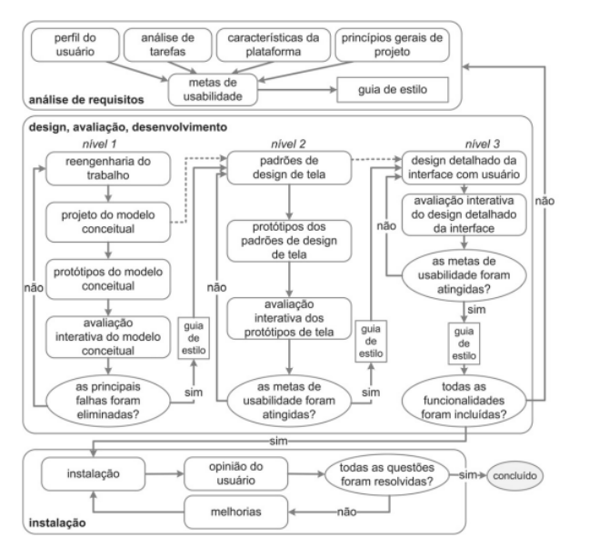

## Introdução 

A engenharia de usabilidade de Mayhew, reúne e organiza as atividades de Interação Humano Computado, orientando o ciclo de vida.

O modelo em questão foi proposto por Deborah Mayhew, onde a autora dividiu em três etapas, sendo elas a análise de requisitos, design/avaliação/desenvolvimento e a instalação.

Na análise de requisitos, estabelecemos metas de usabilidade com base no perfil dos usuários, nas tarefas que realizarão, nas limitações da plataforma e nos princípios de design. Essas metas geralmente são documentadas em guias de estilo para orientar as etapas subsequentes do processo.

A fase de design, avaliação e desenvolvimento visa criar uma solução que atenda às metas de usabilidade definidas anteriormente. Este processo envolve três níveis de detalhes: primeiro, reprojeta as tarefas e com isso criamos protótipos de baixa fidelidade; em seguida, se estabelece os padrões de design e desenvolve os protótipos de média fidelidade; por fim, realiza o projeto detalhado da interface em alta fidelidade para implementação. Durante o desenvolvimento, a interface é avaliada com a participação dos usuários.

Na fase de instalação, é crucial coletar feedback dos usuários após algum tempo de uso. Essas opiniões são valiosas para aprimorar o sistema em futuras versões ou até mesmo identificar a demanda pornovos sistemas interativos que ainda não foram considerados.

Podemos verificar tais atividade na Figura 1:

Figura 1: Ciclo de Mayhew.

Fonte: Barbosa e Silva, 2010.

## Motivo da escolha

Após a analise dos ciclos de vida discutidos foi decidido optar pelo ciclo de Mayhew, já que o mesmo possui fases muito detalhadas e autoexplicativas. O candidato deixa menos subjetividade nas ações a serem realizadas e seguidas, o que foi o motivo determinante de escolha já que a experiência da equipe em IHC, não é grande. Assim, aas atividade definidas nas etapas do cronograma seguiram os passos definidos pelo ciclo de Mayhew.

## Bibliografia 

> BARBOSA, Simone; DINIZ, Bruno. Interação Humano - Computador, Editora Elsevier, Rio de Janeiro, 2010.

## Histórico de versões

| Versão | Data       | Descrição                                                                      | Autor(es)                                                                                  | Revisor(es)                                                                                      |
| ------ | ---------- | ------------------------------------------------------------------------------ | ------------------------------------------------------------------------------------------ | ------------------------------------------------------------------------------------------------ |
| 1.0    | 06/12/2023 | Estrutura completa do documento                                                             | [Harryson Martins](https://github.com/harry-cmartin)| [Luciano Ricardo](https://github.com/l-ricardo)                                                  |
