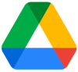

# Ferramentas

## Introdução

&emsp;&emsp;No decorrer deste projeto, adotamos um conjunto estratégico de ferramentas para otimizar a organização da equipe, facilitar o gerenciamento e impulsionar a produção dos artefatos necessários. A Tabela 1 apresenta as ferramentas selecionadas:

## Ferramentas Utilizadas

**Tabela 1** - Ferramentas Utilizadas no Projeto

|                                                                                                                               | Ferramenta         | Finalidade                                                                                                   |
| :---------------------------------------------------------------------------------------------------------------------------: | ------------------ | ------------------------------------------------------------------------------------------------------------ |
|                                                                              | Figma              | Produção de artefatos gráficos. <a id="anchor_1" href="#FRM1">1</a>                                        |
|  | GitHub             | Organizar, versionar e documentar artefatos produzidos para o projeto. <a id="anchor_2" href="#FRM2">2</a> |
|                                                                            | Google             | Site para buscas de informações. <a id="anchor_3" href="#FRM3">3</a>                                       |
|                                                                      | Google Drive       | Compartilhamento de arquivos. <a id="anchor_4" href="#FRM4">4</a>                                          |
|                                                                        | Google Docs        | Criação e edição de tabelas e arquivos. <a id="anchor_5" href="#FRM5">5</a>                                |
|                                                                 | Google Planilhas   | Criação de planilhas relacionadas ao cronograma e horários. <a id="anchor_6" href="#FRM6">6</a>            |
|                                                                    | Microsoft Teams    | Realizações de reuniões e gravações de apresentações. <a id="anchor_7" href="#FRM7">7</a>                  |
|                                                                                | Miro               | Realizar troca de ideias com usuários. <a id="anchor_8" href="#FRM8">8</a>                                 |
|                                                                            | MkDocs             | Criação das páginas de documentação. <a id="anchor_9" href="#FRM9">9</a>                                   |
|                                                                        | Telegram           | Utilizado como principal canal de comunicação. <a id="anchor_10" href="#FRM10">10</a>                      |
|                                                                | Visual Studio Code | Edição dos arquivos de documentação. <a id="anchor_11" href="#FRM11">11</a>                                |
|                                                                          | YouTube            | Hospedagem de vídeos produzidos. <a id="anchor_12" href="#FRM12">12</a>                                    |
  

_Fonte: Autores._

## Bibliografia

> <a id="FRM3" href="#anchor_1">1.</a> Figma. Disponível em: [https://www.figma.com/](). Acesso em: 27 de set. de 2023.
>
> <a id="FRM1" href="#anchor_2">2.</a> GitHub. Disponível em: [https://docs.github.com/pt](). Acesso em: 27 de set. de 2023.
>
> <a id="FRM8" href="#anchor_3">3.</a> Google. Disponível em: [https://www.google.com/](). Acesso em: 27 de set. de 2023.
>
> <a id="FRM10" href="#anchor_4">4.</a> Google Drive. Disponível em: [https://workspace.google.com/intl/pt-BR/products/drive/](). Acesso em: 27 de set. de 2023.
>
> <a id="FRM9" href="#anchor_5">5.</a> Google Docs. Disponível em: [https://www.google.com/intl/pt-BR/docs/about/](). Acesso em: 27 de set. de 2023.
>
> <a id="FRM8" href="#anchor_6">6.</a> Google Planilhas. Disponível em: [https://www.google.com/intl/pt-BR/sheets/about/](). Acesso em: 27 de set. de 2023.
>
> <a id="FRM2" href="#anchor_7">7.</a> Microsoft Teams. Disponível em: [https://www.microsoft.com/pt-br/microsoft-teams/](). Acesso em: 27 de set. de 2023.
>
> <a id="FRM13" href="#anchor_8">8.</a> Miro. Disponível em: [https://miro.com/pt/](). Acesso em: 27 de set. de 2023.
>
> <a id="FRM4" href="#anchor_9">9.</a> MkDocs. Disponível em: [https://www.mkdocs.org/](). Acesso em: 27 de set. de 2023.
>
> <a id="FRM11" href="#anchor_10">10.</a> Telegram. Disponível em: [https://web.telegram.org/](). Acesso em: 27 de set. de 2023.
>
> <a id="FRM5" href="#anchor 11">11.</a> Visual Studio Code. Disponível em: [https://code.visualstudio.com/](). Acesso em: 27 de set. de 2023.
>
> <a id="FRM7" href="#anchor_12">12.</a> YouTube. Disponível em: [https://www.youtube.com/](). Acesso em: 27 de set. de 2023.
>

## Histórico de Versões

| Versão | Data       | Descrição                         | Autor(es)                                       | Revisor(es) |
| ------ | ---------- | --------------------------------- | ----------------------------------------------- | ----------- |
| 1.0    | 27/09/2023 | Criação da página de ferramentas. | [Gustavo França](https://github.com/gustavofbs) | Todos       |
|        |