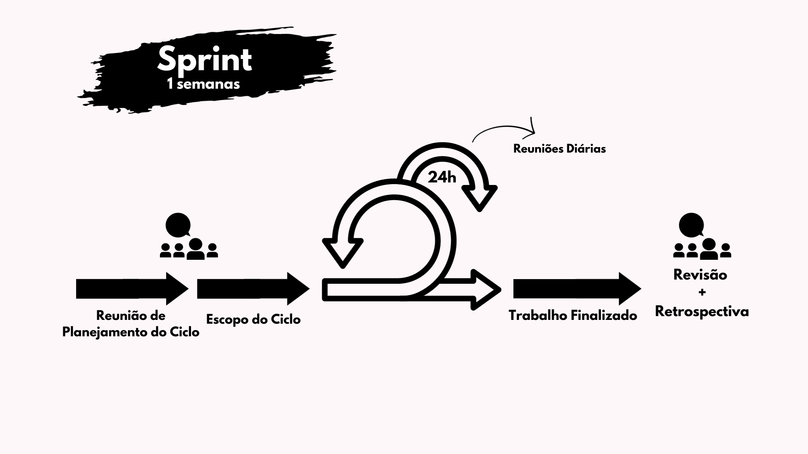

# Metodologia

## Introdução
   
&emsp;&emsp; A metodologia é o conjunto de processos, técnicas e práticas para organizar e guiar a execução do projeto de forma eficaz e eficiente. Refere-se ao todo, desde o planjemento até a conclusão, asseurando que metas sejam alcançadas de maneira consisa e controlada. Para o desenvolvimento desse projeto a equipe escolheu usar o SCRUM devido a familiaridade, KANBAN devido a facilidade de uso e a AVALIAÇÃO HEURÍSTICA pelo amplo conhecimento. Além de definir politicas de commit, branchs e criação de issues. 

## Scrum

    &emsp;&emsp; O Scrum é uma estrutura ágil de gestão de projetos amplamente utilizada. Ele é realizado em ciclos, denominados sprints, onde ocorrem reuniões de <b>planejamento</b>, para definir o que será realizado no ciclo, <b>análise</b>, para validar os produtos desenvolvidos, e <b> retrospectiva</b>, visando avaliar aspectos positivos e negativos que ocorreram ao longo da sprint. Além disso, ele é estruturado para que as equipes possam se adaptar as mudanças que ocorrem ao longo da execução de um projeto, permitindo a repriorização e mudanças de requisitos.

    &emsp;&emsp; O Scrum pode ser adaptado de acordo com a necessidade da equipe, mas sempre focando na comunicação clara e transparência. No desenvolvimento deste projeto o grupo realizou algumas adaptações no Scrum, para que ele se adequasse melhor às necessidades encontradas. Desta forma, optamos por não ter Product Owner(Dono do Produto) e Scrum Master(Mestre Scrum), distribuindo as tarefas de forma horizontal e fazendo com que todos os membros sejam igualmente importantes para a realização do projeto. Nossas <b>sprints</b>(Ciclos) serão de 07 dias, realizaremos <b>dailys</b>(Reuniões diárias) assíncronas por mensagens em horários em que todos os membros estão disponíveis e as outras cerimônias como planejamento (planning), análise (review) e retrospectiva (retrospective) em reuniões conforme ilustrado na Figura 1:.

Figura 1: Metodologia Scrum (Fonte: [GS1 Brasil](https://noticias.gs1br.org/scrum-veja-como-usar-abordagem-nos-negocios/), 2021)

- Daily: Diariamente, via telegram a partir das 18h
- Planning, Review e Retrospective: segunda, 19h

&emsp;&emsp;Vale ressaltar que a escolha do dia de reunião se baseou em uma planilha de disponibilidade de horários preenchida pela equipe ao início do desenvolvimento. Na figura 2, quanto mais verde uma área, maior a disponibilidade de membros.

Figura 2: Mapeamento de disponibilidade da equipe (Autores: [Maria Alice](https://github.com/Maliz30) e [Victor Hugo](https://github.com/ViictorHugoo), 2023)

## Quadros Kanban
&emsp;&emsp; Os quadros kanban são quadros de organização em formato de cartão, que permitem que a equipe tenha uma visualização clara do o fluxo de trabalho. Ele costuma ser dividir as tarefas de acordo com seu progresso, podendo se dividir em:

- A fazer
- Fazendo
- A revisar
- Em revisão
- Finalizado

&emsp;&emsp; Além disso, cada cartão possui as seguinte informações para descrever, organizar e priorizar as tarefas a serem realizadas:

- Nome e descrição
- Responsável
- Revisor
- Data inicial e final
- Nível de prioridade 

## Avaliação Heurística

&emsp;&emsp;O grupo adota a avaliação heurística como um método de avaliação em Interação Humano-Computador (IHC) desenvolvido com o propósito de identificar problemas de usabilidade durante o processo de design em iterações (Nielsen e Molich, 1990; Nielsen, 1993; Nielsen, 1994a). Este método orienta os avaliadores na inspeção, com o intuito de identificar problemas que possam afetar a usabilidade.

&emsp;&emsp;A avaliação se baseia em um conjunto de diretrizes de usabilidade que descrevem características desejáveis da interação e da interface, conhecidas como heurísticas, conforme definidas por Nielsen (1993). Na figura 3, seguem as 10 regras:

Figura 3: Heurísticas Propostas por Nielsen (Fonte: NIELSEN, 1994, p.30)

## Politica de Issues 

##### Quando abrir um issue?
- Identificação de Bugs ou defeitos
- Solicitação de Melhorias
- Tarefas ou Atividades
- Discussões e Decisões

##### Como participar de uma issue?
- Comunique ao criador da issue o desejo de participação

## Politica de Branchs

&emsp;&emsp; Cada membro realizará commits através de uma branch individual, de forma a evitar que ocorram conflitos e que alterações sejam sobrescritas devido a códigos desatualizados. Para a criação das branchs os membros deves escolher nomes significativos, visando expor seu objetivo na criação da branch, evitar o uso de caracteres especiais e acentos. Além disso, após a aprovação de um pull request, a branch deve ser excluída.

## Politica de Commit

&emsp;&emsp; Ao realizar um commit, os membros devem se certificar de estar com o código atualizado, funcionando, na branch correta e seguir o seguinte padrão de commit:

- `docs` - para commits onde foram realizadas alterações na documentação 
- `fix` - para commits que realizam a correção de problemas
- `feat` - para a inclusão de novos arquivos
- `del` - para a remoção de arquivos 

&emsp;&emsp; Já para a realizar pull request, devem colocar um membro para realizar a revisão do conteúdo e acompanhar quais alterações ou comentários foram feitos pelo revisor. O revisor por sua vez deve verificar a possibilidade de conflitos, quais alterações foram realizadas e deixar um comentário sobre o que foi avaliado. 
Vale destacar que a equipe realizará commits frequentes e pequenos, de forma a verificar o mais cedo possível a ocorrencia de conflitos e erros, além de facilitar a revisão de código.

## Bibliografia

> BARBOSA, Simone; DINIZ, Bruno. Interação Humano - Computador, Editora Elsevier, Rio de Janeiro, 2010.
>
> GS1 Brasil. Imagem ilustrativa sobre Scrum. 2023. Disponível em: https://noticias.gs1br.org/scrum-veja-como-usar-abordagem-nos-negocios/. Acesso em: 30/09/2023.
>
> <a id="FRM8" href="#anchor_6">6.</a> Google Planilhas. Disponível em: [https://www.google.com/intl/pt-BR/sheets/about/](). Acesso em: 28 de set. de 2023.
>

| Versão | Data       | Descrição         | Autor(es)                                       | Revisor(es) |
| ------ | ---------- | ----------------- | ----------------------------------------------- | ----------- |
| 1.0    | 28/09/2023 | Estrutura inicial | [Maria Alice](https://github.com/Maliz30)   [Victor Hugo](https://github.com/ViictorHugoo) | [Luciano Ricardo](https://github.com/l-ricardo)   |
| 1.1    | 29/09/2023 | Correções | [Victor Hugo](https://github.com/ViictorHugoo) | [Luciano Ricardo](https://github.com/l-ricardo)   |
| 1.2    | 30/09/2023     | Atualiza metodologias adicionando imagem do scrum e novo tópico de heurísticas | [Gustavo](https://github.com/gustavofbs) | [Luciano Ricardo](https://github.com/l-ricardo) e [Victor Hugo](https://github.com/ViictorHugoo) |
