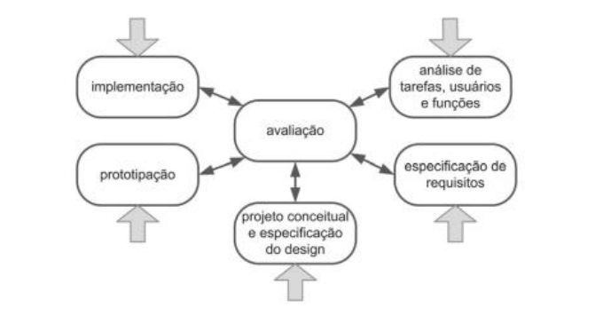
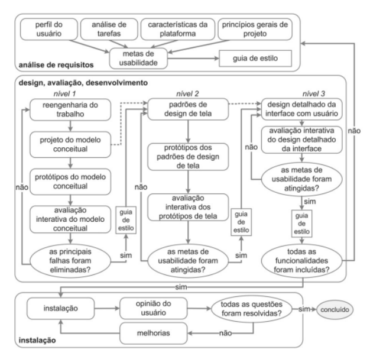

# Processo de Design

## Introdução

Em nosso cotidiano, com frequência lidamos com diversos artefatos, sejam eles copos,computadores, mesas etc. Eles são cuidadosamente projetados, construídos e inseridos em nossas vidas para cumprir um propósito, tudo isso faz parte do design de cada artefato.

De acordo com o cápitulo 4 do livro "Interação Humano Computador" (BARBOSA; SILVA, 2010), design é uma atividade que envolve três atividades básicas, sendo elas a análise da situação atual, a síntese de uma intervenção para melhorá-la e a avaliação dos resultados dessa.

## Modelos

Os processos de design são, portanto, abordagens que viabilizam a execução interativa e sistemática das atividades mencionadas anteriormente, com a intenção de criar soluções para às demandas dos usuários, tendo isso em mente, podemos agora citar alguns dos diversos modelos estudados e colocados em pauta na decisão de escolha para utilização em nosso projeto, são eles:

## Ciclo de vida em estrela

No modelo em questão o design tem total liberdade para escolher qual a primeira atividade a ser feita, porém sempre após terminar uma atividade o designer deve fazer uma avaliação, trazendo constantes feedbacks relacionados a última etapa realizada no ciclo, como podemos ver na Figura 1:

**Figura 1:** Ciclo em estrela.

## Engenharia de Usabilidade de Nielsen

Nielsen propõe o seguinte conjunto de atividades em seu ciclo de vida:

1. Conheça seu usuário.
2. Realize uma análise competitiva.
3. Defina as metas de usabilidade.
4. Faça designs paralelos.
5. Adote o design participativo.
6. Faça o design coordenado da interface como um todo.
7. Aplique diretrizes e análise heurística.
8. Faça protótiposç.
9. Realize testes empíricos.
10. Pratique design iterativo.

## Engenharia de Usabilidade de Mayhew

O modelo em questão foi proposto por Deborah Mayhew, onde a autora dividiu em três etapas, sendo elas a análise de requisitos, design/avaliação/desenvolvimento e a instalação.

Na análise de requisitos, estabelecemos metas de usabilidade com base no perfil dos usuários, nas tarefas que realizarão, nas limitações da plataforma e nos princípios de design. Essas metas geralmente são documentadas em guias de estilo para orientar as etapas subsequentes do processo.

A fase de design, avaliação e desenvolvimento visa criar uma solução que atenda às metas de usabilidade definidas anteriormente. Este processo envolve três níveis de detalhes: primeiro, reprojeta as tarefas e com isso criamos protótipos de baixa fidelidade; em seguida, se estabelece os padrões de design e desenvolve os protótipos de média fidelidade; por fim, realiza o projeto detalhado da interface em alta fidelidade para implementação. Durante o desenvolvimento, a interface é avaliada com a participação dos usuários.

Na fase de instalação, é crucial coletar feedback dos usuários após algum tempo de uso. Essas opiniões são valiosas para aprimorar o sistema em futuras versões ou até mesmo identificar a demanda pornovos sistemas interativos que ainda não foram considerados.

Podemos verificar tais atividade na Figura 2:

**Figura 2:** Ciclo de Mayhew.

## Modelo escolhido e motivações

Após a análise de todos os processos estudados em sala em equipe, foram separados os três processos citados acima como os mais plausíveis de uso de acordo com o contexto de nosso projeto.

Dessa maneira, foi decidido optar pelo ciclo de Mayhew, já que o mesmo possui fases muito detalhadas e autoexplicativas, o que o faz ser de certa maneira mais intuitivo e agradável de utilizar, sendo que para avaliadores inexperientes, como é o caso de nossa equipe, tais qualidades são de extrema ajuda e importância para o desenvolvimento.

## Referências 

>  BARBOSA, S. D. J.; SILVA, B. S. Interação Humano-Computador. Rio de Janeiro: Elsevier, 2011.

## Histórico de versões

| Versão | Data       | Descrição            | Autor(es)                                                                            | Revisor(es)                              |
| ------ | ---------- | -------------------- | ------------------------------------------------------------------------------------ | ---------------------------------------- |
| 1.0    | 28/09/2023 | Criação do Documento | [Harryson](https://github.com/harry-cmartin) e [Pedro](https://github.com/pedro-hsf) | [Gustavo](https://github.com/gustavofbs) |