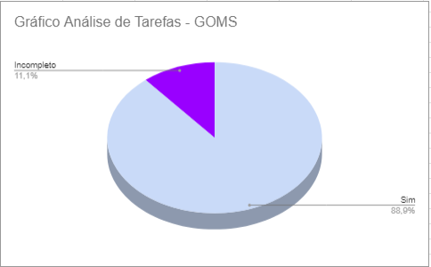

# Verificação da Análise de Tarefas

## Introdução

Depois de planejar o que verificar, é hora de fazer a inspeção. Este documento mostra os objetivos, a abordagem usada e os dados obtidos. Também resumimos e analisamos os principais problemas encontrados, usando essas informações para sugerir correções.

### Checklist de Verificação

As perguntas dos checklists específicos foram elaboradas com base no Capítulo 6, intitulado "Organização do Espaço Problema", do livro "Interação Humano-Computador" de Barbosa e Silva. Do referido capítulo, foram extraídas informações pertinentes ao funcionamento e à compreensão dos termos utilizados, conforme explicado no subcapítulo 6.4, intitulado "Análise de Tarefas".

Para a análise de tarefas, foram desenvolvidos dois checklists distintos, um destinado à Hierarchical Task Analysis (HTA) e outro ao Goals, Operators, Methods, and Selection rules (GOMS). Ambos os checklists foram estruturados com base nas orientações fornecidas pelo subcapítulo mencionado.

A Tabela 1 a seguir apresenta a checklist com os dados obtidos a partir da verificação do HTA. 

Tabela 1: Checklist com os dados obtidos da avaliação do HTA

| ID             | Critério                                                                  | Resultado  |
| -------------- | ------------------------------------------------------------------------- | ---------- |
| **Geral**      |                                                                           |            |
| 1              | Há um texto introdutório sobre o artefato?                                | Sim        |
| 2              | Há a referencia/bibliografia?                                             | Sim        |
| 3              | O artefato possui um histórico de versões padronizado?                    | Sim        |
| 4              | As imagens e tabelas são chamadas no texto?                               | Incompleto |
| 5              | As imagens e tabelas possuem titulo e fonte?                              | Sim        |
| **Específico** |                                                                           |            |
| 6              | As tarefas foram identificadas de maneira clara e abrangente?             | Sim        |
| 7              | Os diagramas HTA são claros e concisos?                                   | Sim        |
| 8              | Os subobjetivos do HTA são suficientes para alcançar o objetivo definido? | sim        |
| 9              | Os HTAs possuem tabelas para representar as tarefas descritas?            | Sim        |
| 10             | As tarefas presentes nos HTAs são decompostas?                            | Sim        |

Fonte: [Pedro Henrique](https://github.com/pedro-hsf) 

A Tabela 2 a seguir apresenta a checklist com os dados obtidos a partir da verificação do GOMS. 

Tabela 2: Checklist com os dados obtidos da avaliação do GOMS

| ID             | Critério                                                                                                            | Resultado  |
| -------------- | ------------------------------------------------------------------------------------------------------------------- | ---------- |
| **Geral**      |                                                                                                                     |            |
| 1              | Há um texto introdutório sobre o artefato?                                                                          | Sim        |
| 2              | Há a referencia/bibliografia?                                                                                       | Sim        |
| 3              | O artefato possui um histórico de versões padronizado?                                                              | Sim        |
| 4              | As imagens e tabelas são chamadas no texto?                                                                         | Sim        |
| 5              | As imagens e tabelas possuem titulo e fonte?                                                                        | Sim        |
| **Específico** |                                                                                                                     |            |
| 6              | Os métodos GOMS incluem os quatro elementos principais: objetivos, operadores, métodos e regras de seleção?         | Sim        |
| 7              | O modelo GOMS inclui regras e descrições claras sobre como o usuário decide entre diferentes métodos ou operadores? | Incompleto |
| 8              | Os métodos GOMS são descritos usando uma linguagem semelhante a uma linguagem de programação?                       | Sim        |
| 9              | As análises de tarefas GOMS foram todas baseadas nas tarefas identificadas no HTA?                                  | Sim        |

Fonte: [Pedro Henrique](https://github.com/pedro-hsf) 

## Conclusão

No gráfico 1 é possível verificar os resultados obtidos na avaliação do artefato "HTA"

Gráfico 1: Resultado da Verificação do artefato HTA

Fonte: [Pedro Henrique](https://github.com/pedro-hsf) 

No gráfico 2 é possível verificar os resultados obtidos na avaliação do artefato "GOMS"

Gráfico 2: Resultado da Verificação do artefato GOMS

Fonte: [Pedro Henrique](https://github.com/pedro-hsf) 

### HTA

### Problemas Encontrados e Análise dos Dados

**ID4**: Uma tabela e uma imagem não foram chamadas no texto, devido a isso foi considerado incompleto por se tratar apenas de um caso.

### Sugestões de Correção

**ID4**: É totalmente fácil corrigir essa parte pois se trata apenas de chamar a tabela e a imagem do último HTA presente no artefato.

### GOMS

### Problemas Encontrados e Análise dos Dados

**ID7**: A introdução dos GOMS foi bem realizada, devido a isso coloquei como incompleto; no entanto, para uma compreensão mais fácil, seria benéfico incluir regras e descrições mais claras. A existência dessas regras não apenas aprimora a aplicabilidade do modelo em uma variedade mais ampla de cenários, mas também torna todo o conceito mais acessível e compreensível.

### Sugestões de Correção

**ID7**: Descrever melhor e de forma mais clara sobre como o usuário decide entre diferentes metodos ou operadores, fazendo que fique de mais fácil acesso e compreensão para quem for olhar o artefato posteriormente.

## Gravação da Verificação

É possível ver a gravação da verificação do artefato  "Análise de Tarefas" no Vídeo 1.

Vídeo 1: Verificação Análise de Tarefas

<iframe width="560" height="315" src="https://www.youtube.com/embed/wpOZvQCsYog?si=kMA5F0RHsf3ZVMms" title="YouTube video player" frameborder="0" allow="accelerometer; autoplay; clipboard-write; encrypted-media; gyroscope; picture-in-picture; web-share" allowfullscreen></iframe>

Fonte: [Pedro Henrique](https://github.com/pedro-hsf) 

## Bibliografia

> <a id="REF1" href="#anchor_1">1.</a> BARBOSA, S. D. J.; SILVA, B. S. **Interação Humano-Computador.** Rio de Janeiro: Elsevier, 2011.

> Planejamento da Verificação da Etapa 4 do Grupo 2- Bilheteria Digital. Disponível em: <<https://interacao-humano-computador.github.io/2023.1-BilheteriaDigital/verificacao/grupo/etapa4/planejamento-verificacao-etapa4-grupo>>. Acesso em 03 de dezembro de 2023.

| Versão | Data       | Descrição                              | Autor(es)                                      | Revisor(es)                                    |
| ------ | ---------- | -------------------------------------- | ---------------------------------------------- | ---------------------------------------------- |
| 1.0    | 03/12/2023 | Criação da página e adição do conteúdo | [Pedro Henrique](https://github.com/pedro-hsf) | [Ana Catarina](https://github.com/an4catarina) |
| 1.1    | 04/12/2023 | Adicionando Vídeos e Gráficos          | [Pedro Henrique](https://github.com/pedro-hsf) | [Ana Catarina](https://github.com/an4catarina) |

