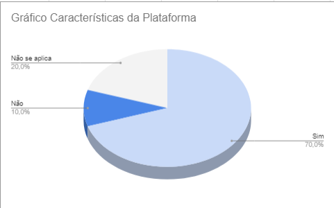

# Verificação das Características da plataforma

## Introdução

Depois de planejar o que verificar, é hora de fazer a inspeção. Este documento mostra os objetivos, a abordagem usada e os dados obtidos. Também resumimos e analisamos os principais problemas encontrados, usando essas informações para sugerir correções.

### Checklist de Verificação

As perguntas do checklist específico foram formuladas com base no Capítulo 4, intitulado "Processos de Design de IHC" do livro "Interação Humano-Computador" de Barbosa e Silva. Deste capítulo, foram extraídas informações cruciais relacionadas ao funcionamento das metas de usabilidade e aos princípios gerais. Essa abordagem visa possibilitar o desenvolvimento de perguntas direcionadas ao artefato, características da plataforma.

A tabela 1 a seguir apresenta a checklist com os dados obtidos a partir da verificação das Características da plataforma. 

Tabela 1: Checklist Verificação das Características da plataforma

| ID  | Critério                                                                                                   | Resultado |
| --- | ---------------------------------------------------------------------------------------------------------- | --------- |
|**Geral**        |                                                                                                |           |
| 1   | Há um texto introdutório sobre o artefato?                                                                 |Sim           |
| 2   | Há a referencia/bibliografia?                                                                              |Sim           |
| 3   | O artefato possui um histórico de versões padronizado?                                                     |Sim           |
| 4   | As imagens e tabelas são chamadas no texto?                                                                |Não se aplica           |
| 5   | As imagens e tabelas possuem titulo e fonte?                                                               |Não se aplica           |
|**Específico**  |                                                                                                 |           |
| 6   | Houve a identificação clara das tecnologias empregadas no desenvolvimento da plataforma?                                                                                                        | Sim          |
| 7   | As características específicas da plataforma foram devidamente reconhecidas para o desenvolvimento do projeto?                                                                                                           |  Não        |
| 8   | As características positivas da plataforma foram devidamente elencadas?                                                                                                         |   Sim     |
| 9   |  Foi identificada a gama de navegadores ou dispositivos capazes de acessar a plataforma?                                                                                                        |   Sim       |
| 10  |  Foram destacadas as restrições ou limitações inerentes à plataforma?                                                                                                        |   Sim        |

Fonte: [Pedro Henrique](https://github.com/pedro-hsf) 

## Conclusão

No gráfico 1 é possível verificar os resultados obtidos na avaliação do artefato "Características da Plataforma"

Gráfico 1: Resultado da Verificação do artefato

Fonte: [Pedro Henrique](https://github.com/pedro-hsf) 

### Problemas Encontrados e Análise dos Dados

**ID7**: A resposta "não" foi atribuída devido à ausência de detalhamento das características específicas da plataforma no artefato. O documento atual foca nas características positivas e negativas, sem incluir uma seção dedicada às especificidades do domínio público.

### Sugestões de Correção

**ID7**: Sugere-se adicionar uma seção ao documento para listar as características específicas que o site possui. Isso permitirá que as pessoas vejam detalhadamente as características específicas do site, de forma semelhante ao que foi feito com as características positivas e negativas.

## Gravação da Verificação

## Bibliografia

> <a id="REF1" href="#anchor_1">1.</a> BARBOSA, S. D. J.; SILVA, B. S. **Interação Humano-Computador.** Rio de Janeiro: Elsevier, 2011.

| Versão | Data       | Descrição              | Autor(es)                                        | Revisor(es)                                      |
| ------ | ---------- | ---------------------- | ------------------------------------------------ | ------------------------------------------------ |
| 1.0    | 03/12/2023 | Criação da página e adição de conteúdo     | [Pedro Henrique](https://github.com/pedro-hsf) | [Maria Alice](https://github.com/Maliz30) |
