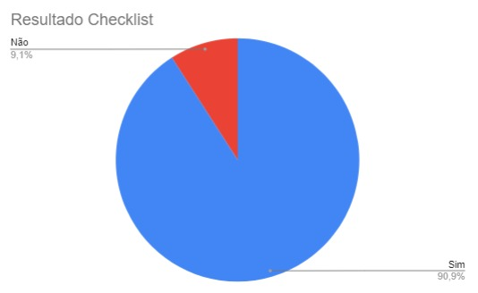

# Introdução 

A verificação do Cenários é uma forma de validar o que foi feito pelo Grupo 4, Domínio Público, na construção do artefato de Metodologia.

## Objetivo

O objetivo desse artefato é verificar a qualidade do [Cenários](docs/analise_de_requisitos/cenarios.md) realizado pelo grupo 4, com o Domínio Público.

## Metodologia

A metodologia a ser utilizada será a Inspeção por meio do uso de Checklists, baseadas nas perguntas presentes no plano de ensino da matéria e nos padrões desejados para se haver num artefato desse tipo. A checklist criada pode ser visualizada na Tabela 1:

Tabela 1: Verificação do Cenários

| ID  | Critério                                                                                                                                                       | Resultado |
| --- | -------------------------------------------------------------------------------------------------------------------------------------------------------------- | --------- |
| 1   | Há um texto introdutório sobre o artefato?                                                                                                                     |           |
| 2   | Há a referencia/bibliografia?                                                                                                                                  |           |
| 3   | O artefato possui um histórico de versões padronizado?                                                                                                         |           |
| 4   | As imagens e tabelas são chamadas no texto?                                                                                                                    |           |
| 5   | As imagens e tabelas possuem titulo e fonte?                                                                                                                   |           |
| 6   | Os cenarios possuem contexto definido?                                                                                                                         |           |
| 7   | Os cenarios possuem o(s) ator(es) envolvidos definidos?                                                                                                        |           |
| 8   | Os cenarios possuem objetivos definidos?                                                                                                                       |           |
| 9   | Os cenarios possuem ações definidas?                                                                                                                           |           |
| 10  | Os cenarios possuem avaliação definida?                                                                                                                        |           |
| 11  | Os cenários desenvolvidos estão de acordo ao recomendado pelos autores (Rosson e Carroll,2002) em  BARBOSA, S. D. J.; SILVA, B. S. Interação Humano-Computador |

Fonte: [Gustavo França](https://github.com/gustavofbs)  

## Checklist executado

O checklist feito após a verificação pode ser visualizado a seguir na Tabela 2:

Tabela 2: Execução da verificação do Cenários

| ID  | Critério                                                                                                                                                       | Resultado |
| --- | -------------------------------------------------------------------------------------------------------------------------------------------------------------- | --------- |
| 1   | Há um texto introdutório sobre o artefato?                                                                                                                     | Sim       |
| 2   | Há a referencia/bibliografia?                                                                                                                                  | Sim       |
| 3   | O artefato possui um histórico de versões padronizado?                                                                                                         | Sim       |
| 4   | As imagens e tabelas são chamadas no texto?                                                                                                                    | Sim       |
| 5   | As imagens e tabelas possuem titulo e fonte?                                                                                                                   | Sim       |
| 6   | Os cenarios possuem contexto definido?                                                                                                                         | Sim       |
| 7   | Os cenarios possuem o(s) ator(es) envolvidos definidos?                                                                                                        | Sim       |
| 8   | Os cenarios possuem objetivos definidos?                                                                                                                       | Sim       |
| 9   | Os cenarios possuem ações definidas?                                                                                                                           | Sim       |
| 10  | Os cenarios possuem avaliação definida?                                                                                                                        | Sim       |
| 11  | Os cenários desenvolvidos estão de acordo ao recomendado pelos autores (Rosson e Carroll,2002) em  BARBOSA, S. D. J.; SILVA, B. S. Interação Humano-Computador | Não       |

Fonte: [Gustavo França](https://github.com/gustavofbs)  

## Problemas Encontrados

A partir do checklist foi identificado que é necessário alterar os cenários construídos para se encaixar nas recomendações dos autores utilizados como Bibliografia.

## Verificação

Nos videos 1 e 2 abaixo podem ser vistos a fase de verificação e correção dos erros encontrados:

Video 1: Gravação da verificação Cronograma Executado

<iframe width="560" height="315" src="https://www.youtube.com/embed/Z_H7IrNpm2E?si=RW-Q0TRv2uUAG_FL" title="YouTube video player" frameborder="0" allow="accelerometer; autoplay; clipboard-write; encrypted-media; gyroscope; picture-in-picture; web-share" allowfullscreen></iframe>

Fonte:  [Harryson Martins](https://github.com/harry-cmartin)

Video 2: Correção

<iframe width="560" height="315" src="https://www.youtube.com/embed/5kkqMkJC624?si=3XwxG7mQOlB9oAV5" title="YouTube video player" frameborder="0" allow="accelerometer; autoplay; clipboard-write; encrypted-media; gyroscope; picture-in-picture; web-share" allowfullscreen></iframe>

Fonte:  [Harryson Martins](https://github.com/harry-cmartin)

## Resultados 

Aqui serão expostos os resultados obtidos a partir dos checklists, em forma gráfica sobre o artefato Cenário, verificado, com as opções "Sim", "Não" e "Não se aplica". No Gráfico 1 é possível ver os resultados:

Gráfico 1: Resultados da verificação dos Cenários

Fonte: [Harryson Martins](https://github.com/harry-cmartin)

## Bibliografia 

> Verificação. Repositório do Grupo Domínio Público da disciplina de Interação Humano Computador da Universidade de Brasília, 2023. Disponível em: <<https://interacao-humano-computador.github.io/2023.2-Dominio-Publico/verficacao/verificacao_grupo_5/etapa_planejamento/cronograma_planejado/>>. Acesso em: 2 de nov de 2023.

## Referencias Bibliograficas

<a id="FRM3" href="#anchor_1">1.</a> BARBOSA, S. D. J.; SILVA, B. S. Interação Humano-Computador. Rio de Janeiro: Elsevier, 2011.

## Histórico de Versões

| Versão | Data  | Descrição                            | Autor(es)                                       | Revisor(es)                                     |
| ------ | ----- | ------------------------------------ | ----------------------------------------------- | ----------------------------------------------- |
| 1.0    | 02/21 | Construção e elaboração do documento | [Gustavo França](https://github.com/gustavofbs) | [Luciano Ricardo](https://github.com/l-ricardo) |