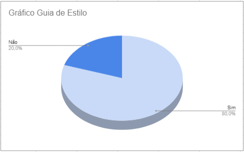

# Verificação do Guia de Estilo

## Introdução

Depois de planejar o que verificar, é hora de fazer a inspeção. Este documento mostra os objetivos, a abordagem usada e os dados obtidos. Também resumimos e analisamos os principais problemas encontrados, usando essas informações para sugerir correções.

### Checklist de Verificação

As perguntas do checklist específico foram desenvolvidas com base no Capítulo 8, intitulado "Princípios e Diretrizes para o Design de IHC", presente no livro "Interação Humano-Computador" de Barbosa e Silva. Neste cenário, informações cruciais foram extraídas, especialmente aquelas relacionadas ao funcionamento dos guias de estilos, conforme detalhado no subtítulo correspondente, "Guias de Estilo". A intenção foi formular perguntas específicas que se fundamentassem nesse artefato, considerando tanto o capítulo quanto o subcapítulo mencionados.

A Tabela 1 a seguir apresenta a checklist com os dados obtidos a partir da verificação do Guia de Estilo. 

Tabela 1: Checklist Verificação do Guia de Estilo

| ID             | Critério                                                                                    | Resultado |
| -------------- | ------------------------------------------------------------------------------------------- | --------- |
| **Geral**      |                                                                                             |           |
| 1              | Há um texto introdutório sobre o artefato?                                                  | Sim       |
| 2              | Há a referencia/bibliografia?                                                               | Sim       |
| 3              | O artefato possui um histórico de versões padronizado?                                      | Sim       |
| 4              | As imagens e tabelas são chamadas no texto?                                                 | Sim       |
| 5              | As imagens e tabelas possuem titulo e fonte?                                                | Sim       |
| **Específico** |                                                                                             |           |
| 6              | O guia de estilo está organizado de acordo com uma estrutura comum?                         | Sim       |
| 7              | O guia de estilo inclui os principais elementos e considerações de design de interface?     | Sim       |
| 8              | O guia de estilo fornece recomendações específicas sobre como alcançar as metas do projeto? | Não       |
| 9              | O guia de estilo inclui exemplos de como as recomendações podem ser aplicadas?              | Não       |
| 10             | O guia de estilo é escrito de forma clara e concisa?                                        | Sim       |

Fonte: [Pedro Henrique](https://github.com/pedro-hsf) 

## Conclusão

No gráfico 1 é possível verificar os resultados obtidos na avaliação do artefato "Guia de Estilo"

Gráfico 1: Resultado da Verificação do artefato

Fonte: [Pedro Henrique](https://github.com/pedro-hsf) 

### Problemas Encontrados e Análise dos Dados

**ID8**: A resposta "não" foi atribuída devido à constatação de que o guia de estilo não oferece as recomendações necessárias para atingir as metas do projeto. 

**ID9**: A resposta "não" foi atribuida devido a constatação de que o guia de estilo não inclui exemplos de como as recomendações podem ser aplicadas 

### Sugestões de Correção

**ID8**: A ausência de uma recomendação específica sobre como atingir as metas do projeto não é necessariamente uma desvantagem completa. Embora sfosse uma boa ideia incluir diretrizes claras no guia de estilo sobre como empregar métodos para aprimorar e implementar, visando alcançar as metas. Essa adição proporcionaria um benefício significativo ao facilitar a compreensão e aplicação prática das metas delineadas no projeto.

**ID9**: Sugere-se, portanto, que no guia de estilo sejam incorporados exemplos que detalhe de maneira prática como aplicar as recomendações para alcançar as metas do projeto. Essa adição contribuiria significativamente para tornar o artefato mais completo, bem escrito e prontamente aplicável no contexto do projeto.

## Gravação da Verificação

É possível ver a gravação da verificação do artefato "Guia de Estilo" no vídeo 1 e a "Validação com os autores do artefato" no vídeo 2.

Vídeo 1: Verificação Guia de Estilo

<iframe width="560" height="315" src="https://www.youtube.com/embed/dJ70KWVrnXQ?si=imLQCpxQdwekyg5y" title="YouTube video player" frameborder="0" allow="accelerometer; autoplay; clipboard-write; encrypted-media; gyroscope; picture-in-picture; web-share" allowfullscreen></iframe>

Fonte: [Pedro Henrique](https://github.com/pedro-hsf) 

Vídeo 2: Validação com os autores do artefato

<iframe width="560" height="315" src="https://www.youtube.com/embed/Bi8qrVL8MRI?si=D2SYJlT3cbAK708R" title="YouTube video player" frameborder="0" allow="accelerometer; autoplay; clipboard-write; encrypted-media; gyroscope; picture-in-picture; web-share" allowfullscreen></iframe>

Fonte: [Pedro Henrique](https://github.com/pedro-hsf) 

## Bibliografia

> <a id="REF1" href="#anchor_1">1.</a> BARBOSA, S. D. J.; SILVA, B. S. **Interação Humano-Computador.** Rio de Janeiro: Elsevier, 2011.

> Planejamento da Verificação da Etapa 4 do Grupo 2- Bilheteria Digital. Disponível em: <<https://interacao-humano-computador.github.io/2023.1-BilheteriaDigital/verificacao/grupo/etapa4/planejamento-verificacao-etapa4-grupo>>. Acesso em 03 de dezembro de 2023.

| Versão | Data       | Descrição                              | Autor(es)                                      | Revisor(es)                                    |
| ------ | ---------- | -------------------------------------- | ---------------------------------------------- | ---------------------------------------------- |
| 1.0    | 03/12/2023 | Criação da página e adição de conteúdo | [Pedro Henrique](https://github.com/pedro-hsf) | [Ana Catarina](https://github.com/an4catarina) |
| 1.1    | 04/12/2023 | Adicionando Vídeos e Gráficos          | [Pedro Henrique](https://github.com/pedro-hsf) | [Ana Catarina](https://github.com/an4catarina) |
