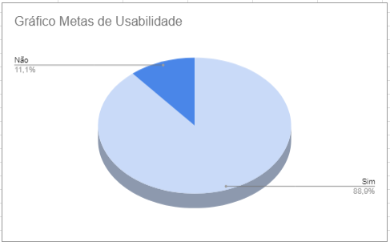

# Verificação das Metas de Usabilidade

## Introdução

Depois de planejar o que verificar, é hora de fazer a inspeção. Este documento mostra os objetivos, a abordagem usada e os dados obtidos. Também resumimos e analisamos os principais problemas encontrados, usando essas informações para sugerir correções.

### Checklist de Verificação

As questões do checklist específico foram elaboradas com base no Capítulo 4, intitulado "Processos de Design de IHC", presente no livro "Interação Humano-Computador" de Barbosa e Silva. Nesse contexto, foram extraídas informações essenciais relacionadas ao funcionamento das metas de usabilidade, visando a formulação de perguntas específicas baseadas neste artefato, conforme abordado no referido capítulo.

A Tabela 1 a seguir apresenta a checklist com os dados obtidos a partir da verificação das Metas de Usabilidade.

Tabela 1: Checklist Verificação das Metas de Usabilidade

| ID             | Critério                                                                                  | Resultado |
| -------------- | ----------------------------------------------------------------------------------------- | --------- |
| **Geral**      |                                                                                           |           |
| 1              | Há um texto introdutório sobre o artefato?                                                | Sim       |
| 2              | Há a referencia/bibliografia?                                                             | Sim       |
| 3              | O artefato possui um histórico de versões padronizado?                                    | Sim       |
| 4              | As imagens e tabelas são chamadas no texto?                                               | Sim       |
| 5              | As imagens e tabelas possuem titulo e fonte?                                              | Sim       |
| **Específico** |                                                                                           |           |
| 6              | As metas de usabilidade são baseadas nas necessidades dos usuários?                       | Sim       |
| 7              | As metas de usabilidade são relevantes para o contexto de uso do sistema?                 | Sim       |
| 8              | As metas de usabilidade são comunicadas de forma clara e concisa?                         | Sim       |
| 9              | É descrito de forma abrangente como as metas de usabilidade serão instauradas no projeto? | Não       |

Fonte: [Pedro Henrique](https://github.com/pedro-hsf) 

## Conclusão

No gráfico 1 é possível verificar os resultados obtidos na avaliação do artefato "Metas de Usabilidade"

Gráfico 1: Resultado da Verificação do artefato

Fonte: [Pedro Henrique](https://github.com/pedro-hsf) 

### Problemas Encontrados e Análise dos Dados

**ID9**: A escolha pela opção "não" se deu pelo fato de que, embora os seis tópicos fundamentais sejam descritos na introdução, a apresentação no site não oferece uma análise mais aprofundada sobre como serão efetivamente integrados ao projeto. 

### Sugestões de Correção

**ID9**: Poderia ser adicionado em cada um dos tópicos uma parte mesmo que breve falando como isso será direcionado para o projeto final, desse modo ficaria visualmente descritivo e enriqueceria ainda mais o artefato "Metas de Usabilidade".

## Gravação da Verificação

É possível ver a gravação da verificação do artefato "Metas de Usabilidade" no vídeo 1.

Vídeo 1: Verificação Metas de Usabilidade

<iframe width="560" height="315" src="https://www.youtube.com/embed/qNTVxYYAcWM?si=k6QuQaTNR_-QoVxe" title="YouTube video player" frameborder="0" allow="accelerometer; autoplay; clipboard-write; encrypted-media; gyroscope; picture-in-picture; web-share" allowfullscreen></iframe>

Fonte: [Pedro Henrique](https://github.com/pedro-hsf) 

## Bibliografia

> <a id="REF1" href="#anchor_1">1.</a> BARBOSA, S. D. J.; SILVA, B. S. **Interação Humano-Computador.** Rio de Janeiro: Elsevier, 2011.

>  Planejamento da Verificação da Etapa 4 do Grupo 2- Bilheteria Digital. Disponível em: <<https://interacao-humano-computador.github.io/2023.1-BilheteriaDigital/verificacao/grupo/etapa4/planejamento-verificacao-etapa4-grupo>>. Acesso em 03 de dezembro de 2023.

| Versão | Data       | Descrição                              | Autor(es)                                      | Revisor(es)                                    |
| ------ | ---------- | -------------------------------------- | ---------------------------------------------- | ---------------------------------------------- |
| 1.0    | 03/12/2023 | Criação da página e adição de conteúdo | [Pedro Henrique](https://github.com/pedro-hsf) | [Victor Hugo](https://github.com/ViictorHugoo) |
| 1.1    | 04/12/2023 | Adicionando Vídeos e Gráficos          | [Pedro Henrique](https://github.com/pedro-hsf) | [Ana Catarina](https://github.com/an4catarina) |
