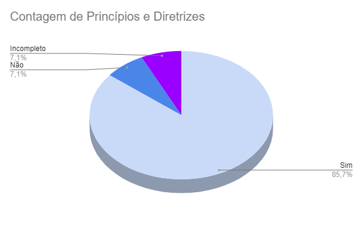

# Introdução 

Este documento visa verificar se o artefato de [Princípios Gerais do Projeto](../../../analise_de_requisitos/principios_gerais.md) segue os critérios da Disciplina de Interação Humano-Computador e ajudar os integrantes a identificar possíveis erros e correções. Esta etapa está dividida entre Checklist de Verificação e Conclusão.

## Checklist de Verificação

As perguntas do checklist específico foram elaboradas a partir do capítulo 8, Princípios e Diretrizes para o Design de IHC,  do livro "Interação Humano-Computador" de Barbosa e Silva. Foram utilizados 2 checklists, um geral, utilizados em todos os artefatos verificados, e outro específico, utilizado somente neste artefato. Os checklists elaborados para a verificação pode ser visualizado na Tabela 1.

Tabela 1: Execução da verificação dos Princípios Gerais do Projeto

| ID             | Critério                                                                                                                                                       | Resultado  |
| -------------- | -------------------------------------------------------------------------------------------------------------------------------------------------------------- | ---------- |
| **Geral**      |                                                                                                                                                                |            |
| 1              | Há um texto introdutório sobre o artefato?                                                                                                                     | Sim        |
| 2              | Há a referencia/bibliografia?                                                                                                                                  | Sim        |
| 3              | O artefato possui um histórico de versões padronizado?                                                                                                         | Sim        |
| 4              | As imagens e tabelas são chamadas no texto?                                                                                                                    | Sim        |
| 5              | As imagens e tabelas possuem titulo e fonte?                                                                                                                   | Sim        |
| **Específico** |                                                                                                                                                                |            |
| 6              | É apresentado como o Princípios Gerais do Projeto será utilizado no projeto ?                                                                                  | Não        |
| 7              | O documento demonstra como aplicar os princípios na prática ?                                                                                                  | Sim        |
| 8              | Os princípios gerais do projeto apresentam embasamento teórico? Por exemplo: Norman, 1988; Tognazzini, online; Nielsen, 1993; Shneiderman, 1998; Cooper, 1999; | Incompleto |
| 9              | O topico "Correspondência com as expectativas dos usuários" foi abordado nos princípios e diretrizes?                                                          | Sim        |
| 10             | O tópico "Simplicidade nas estruturas das tarefas" foi abordado nos princípios e diretrizes?                                                                   | Sim        |
| 11             | O tópico "Equilíbrio entre controle e liberdade do usuário" foi abordado nos princípios e diretrizes?                                                          | Sim        |
| 12             | O tópico "Consistência e padronização" foi abordado nos princípios e diretrizes?                                                                               | Sim        |
| 13             | O tópico "Promoção da eficiência do usuário" foi abordado nos princípios e diretrizes?                                                                         | Sim        |
| 14             | O tópico "Antecipação das necessidades do usuário" foi abordado nos princípios e diretrizes?                                                                   | Sim        |
| 15             | O tópico "Visibilidade e reconhecimento" foi abordado nos princípios e diretrizes?                                                                             | Sim        |
| 16             | O tópico "Conteúdo relevante e expressão adequada" foi abordado nos princípios e diretrizes?                                                                   | Sim        |
| 17             | O tópico "Projeto para erros" foi abordado nos princípios e diretrizes?                                                                                        | Sim        |
| 18             | Há descrição para cada um dos princípios?                                                                                                                      | Sim        |
| 19             | Foram identificadas violações dos princípios gerais definidos no projeto? Caso sim, essas violações foram explicitadas?                                        | Sim        |

Fonte: [Maria Alice](https://github.com/Maliz30)  

## Gravação de Verificação

A gravação da verificação está presente no Vídeo 1. 

**Errata:** No minuto 13 do Vídeo, é afirmado que não foram identificadas violações dos princípios gerais do projeto e que elas não foram explicitadas, porém é possivel encontrar estes itens nos tópicos de análise de cada item, onde são aprensentadas as violações encontradas no site "Domínio Público", assim como uma Figura que específica onde esta violação pode ser encontrada.

Vídeo 1: Gravação da verificação

<iframe width="560" height="315" src="https://www.youtube.com/embed/XymvjbwQK5U?si=ckcPZqq_mtxVTnXE" title="YouTube video player" frameborder="0" allow="accelerometer; autoplay; clipboard-write; encrypted-media; gyroscope; picture-in-picture; web-share" allowfullscreen></iframe>

Fonte: [Maria Alice](https://github.com/Maliz30)

## Conclusão

Após a avaliação, foi feita uma análise geral sobre os artefatos que tiveram a sua avaliação como "não" ou "incompleto" para haja uma melhor descrição do respectivo ID.

- **ID 06:** Foi definido como **Não** pois são apresentadas descrições dos princípios e diretrizes, mas a forma com que essas definições serão utilizadas no projeto não está presente no artefato.
- **ID 08:** Foi definido como **Incompleto** pois o livro é citado na bibliografia, mas somente um dos princípios explicita o autor que ofereceu o embasamento teórico.

Com base nessa análise, foi possível gerar o Gráfico 1, que apresenta de forma visual os resultados obtidos utilizando o checklist fornecido na Tabela 1.

Gráfico 1: Resultado da verificação do artefato "Princípios e Diretrizes"

Fonte: [Maria Alice](https://github.com/Maliz30)

## Bibliografia 

> BARBOSA, S. D. J.; SILVA, B. S. Interação Humano-Computador. Rio de Janeiro: Elsevier, 2011.

> Verificação. Repositório do Grupo Domínio Público da disciplina de Interação Humano Computador da Universidade de Brasília, 2023. Disponível em: <<https://interacao-humano-computador.github.io/2023.2-Dominio-Publico/verficacao/verificacao_grupo_5/etapa_planejamento/cronograma_planejado/>>. Acesso em: 2 de dez de 2023.

> Verificação de Artefatos relativos à Ponto de controle 3. Repositório do Grupo Lichess da disciplina de Interação Humano Computador da Universidade de Brasília, 2023. Disponível em: <<https://interacao-humano-computador.github.io/2022.2-Lichess/verificacao_validacao/pc3-planejamento/#principios-gerais-do-projeto>>. Acesso em: 2 de dez de 2023.

## Histórico de Versões

| Versão | Data       | Descrição                               | Autor(es)                                    | Revisor(es)                                    |
| ------ | ---------- | --------------------------------------- | -------------------------------------------- | ---------------------------------------------- |
| 1.0    | 03/12/2023 | Elaboração das perguntas da verificação | [Maria Alice](https://github.com/gustavofbs) | [Ana Catarina](https://github.com/an4catarina) |