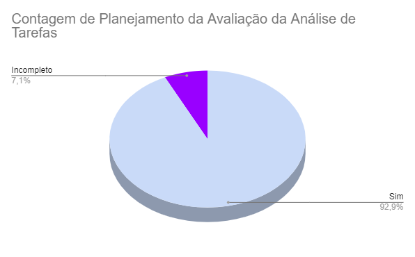

# Verificação do artefato "Planejamento da Avaliação da Análise de Tarefas"

# Introdução

Este documento visa verificar se o artefato de [Planejamento da Avaliação da Análise de Tarefas](../../../../design_avalaiacao_desenvolvimento/nivel1/analise_de_tarefas/planejamento_avaliacao.md) segue os critérios da Disciplina de Interação Humano-Computador e ajudar os integrantes a identificar possíveis erros e correções. Esta etapa está dividida entre Checklist de Verificação e Conclusão.

## Checklist de Verificação

As perguntas do checklist específico foram elaboradas a partir do capítulo 9, Planejamento da Avaliação de IHC, do livro "Interação Humano-Computador" de Barbosa e Silva. Foram utilizados 2 checklists, um geral, utilizados em todos os artefatos verificados, e outro específico, utilizado somente neste artefato. Na Tabela 1, estão listados os critérios que devem ser verificados no artefato Planejamento da Avaliação de Tarefas do Grupo 4.

<b>Tabela 1</b> - Checklist do artefato "Planejamento da Avaliação de Tarefas" . 

| ID             | Critério                                                                                                         | Resultado  |
| -------------- | ---------------------------------------------------------------------------------------------------------------- | ---------- |
| **Geral**      |                                                                                                                  |            |
| 01             | O artefato conta com um registro padronizado de suas versões?                                                    | Sim        |
| 02             | O artefato inclui uma seção de introdução?                                                                       | Sim        |
| 03             | As referências bibliográficas e a bibliografia estão corretamente utilizadas no artefato, seguindo a norma ABNT? | Sim        |
| 04             | Todas as chamadas para tabelas e figuras estão incorporadas ao texto?                                            | Incompleto |
| 05             | Há uma consistência na apresentação de tabelas e figuras?                                                        | Sim        |
| 06             | A estrutura do documento está claramente definida e se mantem consistente durante todo artefato?                 | Sim        |
| **Específico** |                                                                                                                  |            |
| 07             | O planejamento da avaliação segue o Framework DECIDE?                                                            | Sim        |
| 08             | São delineados no artefato os objetivos da avaliação?                                                            | Sim        |
| 09             | O artefato explica os métodos que serão empregados na avaliação?                                                 | Sim        |
| 10             | O artefato detalha os aspectos práticos envolvidos na avaliação?                                                 | Sim        |
| 11             | O artefato aborda os aspectos éticos relacionados à avaliação?                                                   | Sim        |
| 12             | O artefato identifica as perguntas que serão feitas durante a avaliação?                                         | Sim        |
| 13             | Existe um cronograma planejado para a execução da avaliação no artefato?                                         | Sim        |
| 14             | O artefato inclui o teste piloto do planejamento da avaliação?                                                   | Sim        |

Fonte: [Maria Alice](https://github.com/Maliz30), 2023

## Gravação de Verificação

A gravação da verificação está presente no Vídeo 1.

Vídeo 1: Gravação da verificação

<iframe width="560" height="315" src="https://www.youtube.com/embed/JjO1KRc8oBs?si=lzptXMEbCE80DFQ8" title="YouTube video player" frameborder="0" allow="accelerometer; autoplay; clipboard-write; encrypted-media; gyroscope; picture-in-picture; web-share" allowfullscreen></iframe>

Fonte: [Maria Alice](https://github.com/Maliz30)

## Conclusão

Após a avaliação, foi feita uma análise geral sobre os artefatos que tiveram a sua avaliação como "não" ou "incompleto" para haja uma melhor descrição do respectivo ID.

- **ID 04:** Foi definido como **Incompleto** pois a Tabela 2 é chamada erroneamente como Tabela 1, no artefato verificado.

Observação: No **ID 07** é perguntado se o planejamento segue o framework DECIDE, o que ocorre de fato, porém não é explicitado na introdução que o teste piloto, presente no fim do planejamento, não faz parte desse Framework, sendo um artefato externo a este. 

Com base nessa análise, foi possível gerar o Gráfico 1, que apresenta de forma visual os resultados obtidos utilizando o checklist fornecido na Tabela 1.

Gráfico 1: Resultado da verificação do artefato "Planejamento da Avaliação da Análise de Tarefas"

Fonte: [Maria Alice](https://github.com/Maliz30)

## Bibliografia 

> BARBOSA, S. D. J.; SILVA, B. S. Interação Humano-Computador. Rio de Janeiro: Elsevier, 2011.

> Verificação. Repositório do Grupo Domínio Público da disciplina de Interação Humano Computador da Universidade de Brasília, 2023. Disponível em: <<https://interacao-humano-computador.github.io/2023.2-Dominio-Publico/verficacao/verificacao_grupo_5/etapa_planejamento/cronograma_planejado/>>. Acesso em: 2 de dez de 2023.

> Verificação de Artefatos relativos à Ponto de controle 3. Repositório do Grupo Lichess da disciplina de Interação Humano Computador da Universidade de Brasília, 2023. Disponível em: <<https://interacao-humano-computador.github.io/2022.2-Lichess/verificacao_validacao/pc3-planejamento/#principios-gerais-do-projeto>>. Acesso em: 2 de dez de 2023.

## Histórico de Versões

| Versão | Data       | Descrição                               | Autor(es)                                    | Revisor(es)                                    |
| ------ | ---------- | --------------------------------------- | -------------------------------------------- | ---------------------------------------------- |
| 1.0    | 03/12/2023 | Elaboração das perguntas da verificação | [Maria Alice](https://github.com/gustavofbs) | [Pedro Henrique](https://github.com/pedro-hsf) |