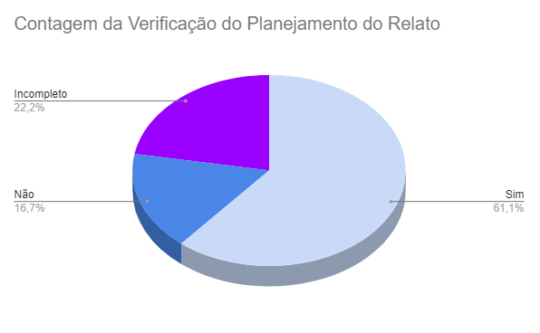

# Verificação do artefato "Planejamento Relato dos Resultados da Análise de Tarefas"

# Introdução

Este documento visa verificar se o artefato de [Planejamento Relato dos Resultados da Análise de Tarefas](../../../../design_avalaiacao_desenvolvimento/nivel1/analise_de_tarefas/planejamento_relato.md) segue os critérios da Disciplina de Interação Humano-Computador e ajudar os integrantes a identificar possíveis erros e correções. Esta etapa está dividida entre Checklist de Verificação e Conclusão.

## Checklist de Verificação

As perguntas do checklist específico foram elaboradas a partir dos capítulo 9, Planejamento da Avaliação de IHC, do livro "Interação Humano-Computador" de Barbosa e Silva. Foram utilizados 2 checklists, um geral, utilizados em todos os artefatos verificados, e outro específico, utilizado somente neste artefato. Na Tabela 1, estão listados os critérios que devem ser verificados no artefato Planejamento Relato dos Resultados da Análise de Tarefas do Grupo 4.

<b>Tabela 1</b> - Checklist do artefato "Planejamento Relato dos Resultados da Análise de Tarefas" . 

| ID             | Critério                                                                                                             | Avaliação  |
| -------------- | -------------------------------------------------------------------------------------------------------------------- | ---------- |
| **Geral**      |                                                                                                                      |            |
| 01             | O artefato conta com um registro padronizado de suas versões?                                                        | Sim        |
| 02             | O artefato inclui uma seção de introdução?                                                                           | Sim        |
| 03             | As referências bibliográficas e a bibliografia estão corretamente utilizadas no artefato, seguindo a norma ABNT?     | Sim        |
| 04             | Todas as chamadas para tabelas e figuras estão incorporadas ao texto?                                                | Sim        |
| 05             | Há uma consistência na apresentação de tabelas e figuras?                                                            | Sim        |
| 06             | A estrutura do documento está claramente definida e se mantem consistente durante todo artefato?                     | Sim        |
| **Específico** |                                                                                                                      |            |
| 07             | O artefato delineia os objetivos para o relato dos resultados da avaliação?                                          | Não        |
| 08             | O artefato inclui o modelo do cronograma executado durante a avaliação?                                              | Sim        |
| 09             | Os métodos utilizados são descritos no artefato?                                                                     | Sim        |
| 10             | O artefato aborda os aspectos éticos envolvidos no relato dos resultados da avaliação?                               | Não        |
| 11             | O planejamento apresenta os participantes selecionados?                                                              | Sim        |
| 12             | O artefato menciona a apresentação da quantidade de entrevistados e sua justificativa ?                              | Incompleto |
| 13             | O perfil de usuário dos participantes selecionados se enquadram no perfil de usuário?                                | Incompleto |
| 14             | O artefato menciona a apresentação da quantidade de avaliadores e sua justificativa ?                                | Incompleto |
| 15             | O artefato menciona a apresentação das perguntas e/ou tarefas exploradas durante a Avaliação da Análise de tarefas ? | Sim        |
| 16             | O artefato menciona a apresentação do termo de consentimento utilizado na Avaliação da Análise de tarefas ?          | Não        |
| 17             | O artefato apresenta uma descrição dos resultados obtidos na avaliação?                                              | Sim        |
| 18             | O artefato fornece uma explicação das conclusões alcançadas na avaliação?                                            | Incompleto |

Fonte: [Maria Alice](https://github.com/Maliz30), 2023

## Conclusão

Após a avaliação, foi feita uma análise geral sobre os artefatos que tiveram a sua avaliação como "não" ou "incompleto" para haja uma melhor descrição do respectivo ID.

- **ID 07:** Foi definido como "Não" pois o planejamento do relato dos resultados apresenta somente a área onde deve ser escrito o objetivo da avaliação da análise de tarefas, não apresentando de fato o objetivo.
- **ID 10:** Foi definido como "Não" pois o artefato não contém uma área onde os aspectos éticos são abordados.
- **ID 12:** Foi definido como "Incompleto" pois o artefato cita a justificativa da quantidade de entrevistados, porém não apresenta nenhum embasamento teórico para fundamentá-la.
- **ID 13:** Foi definido como "Incompleto" pois o artefato apenas relembra o perfil do usuário definido para o projeto, mas não afirma que os usuários presentes no cronograma planejado se enquadram nesse perfil.
- **ID 14:** Foi definido como "Incompleto" pois o artefato menciona a quantidade de entrevistadores, porém não apresenta nenhum embasamento teórico para justificá-la.
- **ID 16:** Foi definido como "Não" pois o artefato não apresenta o termo de consentimento a ser utilizado nesta avaliação.
- **ID 18:** Foi definido como "Incompleto" pois apresenta textos similares a conclusão, como sugestão de melhoria e planejamento de reprojeto, porém não há um texto expecífico para conclusão, condensando essas informações. 

Com base nessa análise, foi possível gerar o Gráfico 1, que apresenta de forma visual os resultados obtidos utilizando o checklist fornecido na Tabela 1.

Gráfico 1: Resultado da verificação do artefato "Planejamento Relato dos Resultados da Análise de Tarefas"

Fonte: [Maria Alice](https://github.com/Maliz30)

## Gravação de Verificação

A gravação da verificação está presente no Vídeo 1.

Vídeo 1: Gravação da verificação

<iframe width="560" height="315" src="https://www.youtube.com/embed/U7XYK3Z6ecs?si=zH4qZxcepeGPXyMO" title="YouTube video player" frameborder="0" allow="accelerometer; autoplay; clipboard-write; encrypted-media; gyroscope; picture-in-picture; web-share" allowfullscreen></iframe>

Fonte: [Maria Alice](https://github.com/Maliz30)

## Bibliografia 

> BARBOSA, S. D. J.; SILVA, B. S. Interação Humano-Computador. Rio de Janeiro: Elsevier, 2011.

> Verificação. Repositório do Grupo Domínio Público da disciplina de Interação Humano Computador da Universidade de Brasília, 2023. Disponível em: <<https://interacao-humano-computador.github.io/2023.2-Dominio-Publico/verficacao/verificacao_grupo_5/etapa_planejamento/cronograma_planejado/>>. Acesso em: 2 de dez de 2023.

> Verificação de Artefatos relativos à Ponto de controle 3. Repositório do Grupo Lichess da disciplina de Interação Humano Computador da Universidade de Brasília, 2023. Disponível em: <<https://interacao-humano-computador.github.io/2022.2-Lichess/verificacao_validacao/pc3-planejamento/#principios-gerais-do-projeto>>. Acesso em: 2 de dez de 2023.

## Histórico de Versões

| Versão | Data       | Descrição                               | Autor(es)                                    | Revisor(es)                                    |
| ------ | ---------- | --------------------------------------- | -------------------------------------------- | ---------------------------------------------- |
| 1.0    | 03/12/2023 | Elaboração das perguntas da verificação | [Maria Alice](https://github.com/gustavofbs) | [Pedro Henrique](https://github.com/pedro-hsf) |
