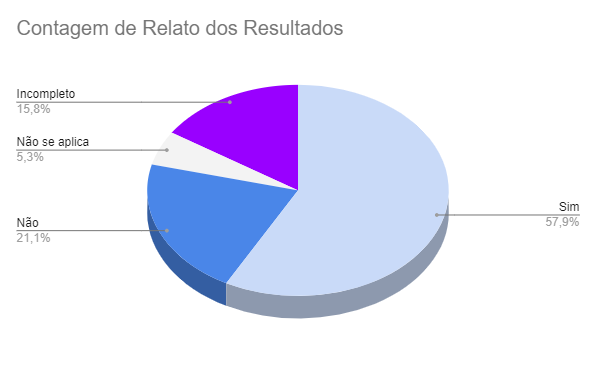

# Verificação do artefato "Relato dos Resultados da Análise de Tarefas"

# Introdução

Este documento visa verificar se o artefato de [Relato dos Resultados - Análise de Tarefas](../../../../design_avalaiacao_desenvolvimento/nivel1/analise_de_tarefas/relato_resultados.md) segue os critérios da Disciplina de Interação Humano-Computador e ajudar os integrantes a identificar possíveis erros e correções. Esta etapa está dividida entre Checklist de Verificação e Conclusão.

## Checklist de Verificação

As perguntas do checklist específico foram elaboradas a partir dos capítulos 9, Planejamento da Avaliação de IHC, e 10, Métodos de Avaliação de IHC, do livro "Interação Humano-Computador" de Barbosa e Silva. Foram utilizados 2 checklists, um geral, utilizados em todos os artefatos verificados, e outro específico, utilizado somente neste artefato. Na Tabela 1, estão listados os critérios que devem ser verificados no artefato Relato dos Resultados da Análise de Tarefas do Grupo 4.

<b>Tabela 1</b> - Checklist do artefato "Relato dos Resultados da Análise de Tarefas" . 

| ID             | Critério                                                                                                         | Avaliação     |
| -------------- | ---------------------------------------------------------------------------------------------------------------- | ------------- |
| **Geral**      |                                                                                                                  |               |
| 01             | O artefato conta com um registro padronizado de suas versões?                                                    | Sim           |
| 02             | O artefato inclui uma seção de introdução?                                                                       | Não           |
| 03             | As referências bibliográficas e a bibliografia estão corretamente utilizadas no artefato, seguindo a norma ABNT? | Não se aplica |
| 04             | Todas as chamadas para tabelas e figuras estão incorporadas ao texto?                                            | Sim           |
| 05             | Há uma consistência na apresentação de tabelas e figuras?                                                        | Incompleto    |
| 06             | A estrutura do documento está claramente definida e se mantem consistente durante todo artefato?                 | Não           |
| **Específico** |                                                                                                                  |               |
| 07             | O artefato segue o planejamento proposto?                                                                        | Incompleto    |
| 08             | Os objetivos do relato são apresentados?                                                                         | Sim           |
| 09             | A metodologia do relato é apresentada?                                                                           | Sim           |
| 10             | O artefato apresenta as perguntas a serem respondidas com a avaliação?                                           | Sim           |
| 11             | Os participantes estão documentados?                                                                             | Sim           |
| 12             | O artefato apresenta um teste piloto antes de ser feito a entrevista?                                            | Não           |
| 13             | O artefato possui uma definição de teste piloto?                                                                 | Não           |
| 14             | O artefato apresenta a entrevista da avaliação gravada?                                                          | Sim           |
| 15             | O participante da entrevista leu ou assinou e concordou com o termo de consentimento?                            | Incompleto    |
| 16             | As tarefas foram apresentados ao usuário?                                                                        | Sim           |
| 17             | Existe uma análise e interpretação dos dados?                                                                    | Sim           |
| 18             | Os problemas encontrados estão listados?                                                                         | Sim           |
| 19             | Existe sugestões e/ou planejamento de correção para os problemas?                                                | Sim           |

Fonte: [Maria Alice](https://github.com/Maliz30), 2023

## Conclusão

Após a avaliação, foi feita uma análise geral sobre os artefatos que tiveram a sua avaliação como "não" ou "incompleto" para haja uma melhor descrição do respectivo ID.

- **ID 02:** Foi definido como "Não" pois o artefato apresenta uma área separada para a introdução, porém ela não está preenchida.
- **ID 05:** Foi definido como "Incompleto" pois o artefato apresenta apresenta título e fonte na maioria de suas tabelas e figuras, porém das Figuras 01 a 04 não há o título e a fonte, além de um erro de chamada na Tabela 12, que se refere a outra tabela.
- **ID 06:** Foi definido como "Não" pois o artefato não apresenta a seção "Seleção dos participantes" preenchida na tarefa Receber ajuda; a seção ""Sugestões de melhorias" está duplicada nas tarefas: Receber ajuda e Se tornar um colaborador, e a tarefa Avaliar Midia apresenta imagens referentes a página analisada pelo entrevistado, o que não ocorre para as outras tarefas.
- **ID 07:** Foi definido como "Incompleto" pois o artefato não apresenta a seção "Planejamento do Reprojeto" preenchida para as tarefa Receber ajuda, Se tornar um colaborador, Contatar administradores e Fazer download da mídia.
- **ID 12:** Foi definido como "Não" pois o artefato não apresenta a seção um teste piloto.
- **ID 13:** Foi definido como "Não" pois o artefato não apresenta uma definição de teste piloto.
- **ID 15:** Foi definido como "Incompleto" pois o artefato não apresenta ou lê o termo de consentimento durante a gravação da tarefa Se tornar colaborador.

Com base nessa análise, foi possível gerar o Gráfico 1, que apresenta de forma visual os resultados obtidos utilizando o checklist fornecido na Tabela 1.

Gráfico 1: Resultado da verificação do artefato "Relato dos Resultados da Análise de Tarefas"

Fonte: [Maria Alice](https://github.com/Maliz30)

## Gravação de Verificação

A gravação da verificação está presente no vídeo 1. É importante mencionar que durante a gravação desta verificação ocorreu um erro, de forma que a tela da avaliadora não foi transmitida. Apesar disso, a verificação não foi completamente comprometida, uma vez que a avaliadora mecionou em todos os elementos no momento que estavam sendo verificados.

Vídeo 1: Gravação da verificação

<iframe width="560" height="315" src="https://www.youtube.com/embed/lDxbmOMwbhA?si=F2mGCv7BSKgqZ7Zy" title="YouTube video player" frameborder="0" allow="accelerometer; autoplay; clipboard-write; encrypted-media; gyroscope; picture-in-picture; web-share" allowfullscreen></iframe>

Fonte: [Maria Alice](https://github.com/Maliz30)

No vídeo 2 podemos conferir a avaliação junto dos autores do artefato.

<iframe width="560" height="315" src="https://www.youtube.com/embed/nsCF9ZhdS0Q?si=KA-iYj6_nvPRHk-s" title="YouTube video player" frameborder="0" allow="accelerometer; autoplay; clipboard-write; encrypted-media; gyroscope; picture-in-picture; web-share" allowfullscreen></iframe>

## Bibliografia

> BARBOSA, S. D. J.; SILVA, B. S. Interação Humano-Computador. Rio de Janeiro: Elsevier, 2011.

> Verificação. Repositório do Grupo Domínio Público da disciplina de Interação Humano Computador da Universidade de Brasília, 2023. Disponível em: <<https://interacao-humano-computador.github.io/2023.2-Dominio-Publico/verficacao/verificacao_grupo_5/etapa_planejamento/cronograma_planejado/>>. Acesso em: 2 de dez de 2023.

> Verificação de Artefatos relativos à Ponto de controle 3. Repositório do Grupo Lichess da disciplina de Interação Humano Computador da Universidade de Brasília, 2023. Disponível em: <<https://interacao-humano-computador.github.io/2022.2-Lichess/verificacao_validacao/pc3-planejamento/#principios-gerais-do-projeto>>. Acesso em: 2 de dez de 2023.

## Histórico de Versões

| Versão | Data       | Descrição                               | Autor(es)                                    | Revisor(es)                                    |
| ------ | ---------- | --------------------------------------- | -------------------------------------------- | ---------------------------------------------- |
| 1.0    | 03/12/2023 | Elaboração das perguntas da verificação | [Maria Alice](https://github.com/gustavofbs) | [Pedro Henrique](https://github.com/pedro-hsf) |
