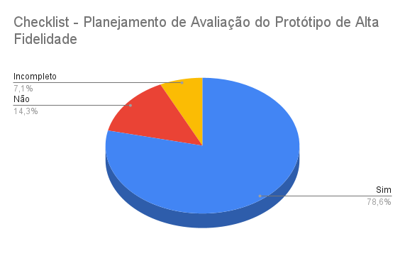

# Verificação do artefato "Planejamento de Avaliação dos Protótipos de Alta Fidelidade"

# Introdução

Este documento visa verificar se o artefato de [Planejamento da Avaliação do Protótipo de Alta Fidelidade](https://interacao-humano-computador.github.io/2023.2-Dominio-Publico/design_avalaiacao_desenvolvimento/nivel3/prototipo_alta_fidelidade/planejamento_avaliacao/) segue os critérios da Disciplina de Interação Humano-Computador e ajudar os integrantes a identificar possíveis erros e correções. Esta etapa está dividida entre Checklist de Verificação e Conclusão.

## Checklist de Verificação

Na Tabela 1, estão listados os critérios que devem ser verificados no artefato Planejamento da Avaliação do Protótipo de Alta Fidelidade do Grupo 4.

<b>Tabela 1</b> - Checklist do artefato "Planejamento de Avaliação do Protótipo de Alta Fidelidade". 

| ID  | Critério                                                                                                         | Avaliação  |
| --- | ---------------------------------------------------------------------------------------------------------------- | ---------- |
| 01  | O artefato conta com um registro padronizado de suas versões?                                                    | Sim        |
| 02  | O artefato inclui uma seção de introdução?                                                                       | Sim        |
| 03  | As referências bibliográficas e a bibliografia estão corretamente utilizadas no artefato, seguindo a norma ABNT? | Sim        |
| 04  | Todas as chamadas para tabelas e figuras estão incorporadas ao texto?                                            | Sim        |
| 05  | Há uma consistência na apresentação de tabelas e figuras?                                                        | Sim        |
| 06  | A estrutura do documento está claramente definida e se mantem consistente durante todo artefato?                 | Não        |
| 07  | O planejamento da avaliação segue o Framework DECIDE?                                                            | Sim        |
| 08  | São delineados no artefato os objetivos da avaliação?                                                            | Sim        |
| 09  | O artefato explica os métodos que serão empregados na avaliação?                                                 | Sim        |
| 10  | O artefato detalha os aspectos práticos envolvidos na avaliação?                                                 | Sim        |
| 11  | O artefato aborda os aspectos éticos relacionados à avaliação?                                                   | Incompleto |
| 12  | O artefato identifica as perguntas que serão feitas durante a avaliação?                                         | Sim        |
| 13  | Existe um cronograma planejado para a execução da avaliação no artefato?                                         | Sim        |
| 14  | O artefato inclui o teste piloto do planejamento da avaliação?                                                   | Não        |

Fonte:  [Luciano Ricardo](https://github.com/l-ricardo)

## Conclusão

No Gráfico 1 é possível verificar os resultados obtidos na avaliação do artefato "Planejamento de Avaliação do Protótipo de Alta Fidelidade".

 Gráfico 1: Resultados da verificação do artefato

Fonte:  [Luciano Ricardo](https://github.com/l-ricardo)

Após a avaliação, foi feita uma análise geral sobre os artefatos que tiveram a sua avaliação como "não" ou "incompleto" para haja uma melhor descrição do respectivo ID.

- **ID 05:** Foi definido como "sim" porem foi possivel identificar uma pequena inconsitência nas chamadas das tabelas e figuras, por exemplo, algumas se apresentam como "Figura 1" e outras como "figura 1"
- **ID 06:** Foi definido como "não" pois o tópico do Teste Piloto poderia estar dentro do framework DECIDE
- **ID 09:** Foi definido como "sim" porem foi encontrado um pequeno erro de digitação no topico "C - Métodos de avaliação"
- **ID 10:** Foi definido como "sim" porém ficaram algumas sugestões como colocar o link do Perfil de Usuario no Recrutamento e retirar do topico "Custos" os artefatos
- **ID 10:** Foi definido como "incompleto" pois não existe o termo de consentimento no artefato
- **ID 13:** Foi definido como "sim" porém ficara a sugestão de remover a coluna de "Data Executada" do cronograma 
- **ID 14:** Foi definido como "não" pois o Teste Piloto não foi colocado na pagina

## Registro da Verificação

Segue o Video 1 com a gravação da verificação.

Video 1: Gravação da verificação

<iframe width="560" height="315" src="https://www.youtube.com/embed/6KloZnkIDW4?si=01fscFgFBYuoG-C1" title="YouTube video player" frameborder="0" allow="accelerometer; autoplay; clipboard-write; encrypted-media; gyroscope; picture-in-picture; web-share" allowfullscreen></iframe>

Fonte:  [Luciano Ricardo](https://github.com/l-ricardo)

## Histórico de Versões

| Versão | Data       | Descrição                   | Autor(es)                                       | Revisor(es)                                     |
| ------ | ---------- | --------------------------- | ----------------------------------------------- | ----------------------------------------------- |
| 1.0    | 03/12/2023 | Criação do modelo do relato | [Luciano Ricardo](https://github.com/l-ricardo) | [Victor Hugo](https://github.com/ViictorHugoo)  |
| 1.1    | 04/12/2023 | Relato da Verificação       | [Luciano Ricardo](https://github.com/l-ricardo) | [Gustavo França](https://github.com/gustavofbs) |

