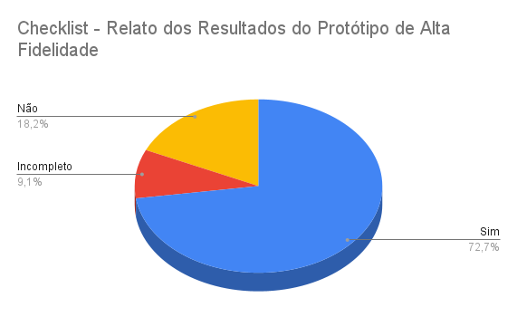

# Verificação do artefato "Relato dos Resultados do Protótipo de Alta Fidelidade"

# Introdução

Este documento visa verificar se o artefato de [Relato dos Resultados do Protótipo de Alta Fidelidade](https://interacao-humano-computador.github.io/2023.2-Dominio-Publico/design_avalaiacao_desenvolvimento/nivel3/prototipo_alta_fidelidade/relato_resultados/) segue os critérios da Disciplina de Interação Humano-Computador e ajudar os integrantes a identificar possíveis erros e correções. Esta etapa está dividida entre Checklist de Verificação e Conclusão.

## Checklist de Verificação

Na tabela 1, estão listados os critérios que devem ser verificados no artefato Relato dos Resultados do Protótipo de Alta Fidelidade do Grupo 4.

<b>Tabela 1</b> - Checklist do artefato "Relato dos Resultados do Protótipo de Alta Fidelidade". 

| ID  | Critério                                                                                                         | Avaliação     |
| --- | ---------------------------------------------------------------------------------------------------------------- | ------------- |
| 01  | O artefato conta com um registro padronizado de suas versões?                                                    | Sim           |
| 02  | O artefato inclui uma seção de introdução?                                                                       | Sim           |
| 03  | As referências bibliográficas e a bibliografia estão corretamente utilizadas no artefato, seguindo a norma ABNT? | Não se aplica |
| 04  | Todas as chamadas para tabelas e figuras estão incorporadas ao texto?                                            | Sim           |
| 05  | Há uma consistência na apresentação de tabelas e figuras?                                                        | Incompleto    |
| 06  | A estrutura do documento está claramente definida e se mantem consistente durante todo artefato?                 | Não           |
| 07  | Os objetivos do relato são apresentados?                                                                         | Sim           |
| 08  | A metodologia do relato é apresentada?                                                                           | Não           |
| 09  | Os participantes estão documentados?                                                                             | Sim           |
| 10  | Existe uma análise e interpretação dos dados?                                                                    | Sim           |
| 11  | Os problemas encontrados estão listados?                                                                         | Sim           |
| 12  | Existe sugestões e/ou planejamento de correção para os problemas?                                                | Sim           |

Fonte:  [Luciano Ricardo](https://github.com/l-ricardo)

## Conclusão

No Gráfico 1 é possível verificar os resultados obtidos na avaliação do artefato  "Relato dos Resultados do Protótipo de Alta Fidelidade".

 Gráfico 1: Resultados da verificação do artefato

Fonte: [Luciano Ricardo](https://github.com/l-ricardo)

Após a avaliação, foi feita uma análise geral sobre os artefatos que tiveram a sua avaliação como "não" ou "incompleto" para haja uma melhor descrição do respectivo ID.

- **ID 02:** Foi definido como "sim" porém foi encontrado no tópico de Introdução um erro de digitação onde ele se refere ao Protótipo de Papel ao inves de Protótipo de Alta Fidelidade
- **ID 05:** Foi definido como "incompleto" pois inumeras legendas apresentam problemas de numeração
- **ID 06:** Foi definido como "não" pois a tarefa Receber Ajuda possui figuras com as telas utilizadas porém as demais não possuem, fica a sugestão de adionar imagens em todas as tarefas
- **ID 08:** Foi definido como "não" pois não foi possivel encontrar nenhuma referencia a metodologia, fica a sugestão de adicionar uma referencia ao planejamento  
- **ID 11:** Foi definido como "sim" porem é sugerido a separação de todos os itens listados em formatos de listas para manter a consistencia 

## Registro da Verificação

É possível ver a gravação da verificação do artefato no Vídeo 1 e a gravação da validação com os autores do artefato no Vídeo 2.

Video 1: Gravação da verificação

<iframe width="560" height="315" src="https://www.youtube.com/embed/XstVu3tEnco?si=V2R7As_mHO8HJP_1" title="YouTube video player" frameborder="0" allow="accelerometer; autoplay; clipboard-write; encrypted-media; gyroscope; picture-in-picture; web-share" allowfullscreen></iframe>

Fonte: [Luciano Ricardo](https://github.com/l-ricardo)

Vídeo 2: Gravação da validação da verificação do artefato 

<iframe width="560" height="315" src="https://www.youtube.com/embed/5GZyEFowmQM?si=Rxo7pBdBzcMe16oC" title="YouTube video player" frameborder="0" allow="accelerometer; autoplay; clipboard-write; encrypted-media; gyroscope; picture-in-picture; web-share" allowfullscreen></iframe>

Fonte: [Luciano Ricardo](https://github.com/l-ricardo)

## Histórico de Versões

| Versão | Data       | Descrição                   | Autor(es)                                       | Revisor(es)                                     |
| ------ | ---------- | --------------------------- | ----------------------------------------------- | ----------------------------------------------- |
| 1.0    | 03/12/2023 | Criação do modelo do relato | [Luciano Ricardo](https://github.com/l-ricardo) | [Victor Hugo](https://github.com/ViictorHugoo)  |
| 1.1    | 04/12/2023 | Relato da Verificação       | [Luciano Ricardo](https://github.com/l-ricardo) | [Gustavo França](https://github.com/gustavofbs) |
