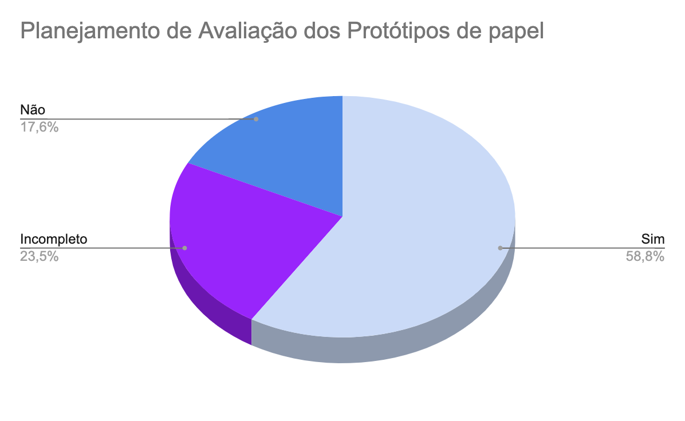

# Verificação do artefato "Planejamento de Avaliação dos Protótipos de papel"

# Introdução

Este documento visa verificar se o artefato [Planejamento de avaliação dos protótipos de papel](https://interacao-humano-computador.github.io/2023.2-Dominio-Publico/design_avalaiacao_desenvolvimento/nivel1/analise_de_tarefas/planejamento_avaliacao/) segue os critérios da Disciplina de Interação Humano-Computador e ajudar os integrantes a identificar possíveis erros e correções.

## Checklist de Verificação

Na Tabela 1, estão listados os critérios que devem ser verificados no artefato Planejamento de Avaliação dos Protótipos de papel do Grupo 4.

<b>Tabela 1</b> - Checklist do artefato "Planejamento de Avaliação dos Protótipos de papel". 

| ID  | Critério                                                                                                         | Avaliação  |
| --- | ---------------------------------------------------------------------------------------------------------------- | ---------- |
| 01  | O artefato conta com um registro padronizado de suas versões?                                                    | Sim        |
| 02  | O artefato inclui uma seção de introdução?                                                                       | Incompleto |
| 03  | As referências bibliográficas e a bibliografia estão corretamente utilizadas no artefato, seguindo a norma ABNT? | Sim        |
| 04  | Todas as chamadas para tabelas e figuras estão incorporadas ao texto?                                            | Incompleto |
| 05  | Há uma consistência na apresentação de tabelas e figuras?                                                        | Não        |
| 06  | A estrutura do documento está claramente definida e se mantem consistente durante todo artefato?                 | Sim        |
| 07  | O planejamento da avaliação segue o Framework DECIDE?                                                            | Sim        |
| 08  | Os objetivos da avaliação estão bem definidos e apresentam os motivos de sua escolha?                            | Não        |
| 09  | O artefato apresenta o escopo da avaliação?                                                                      | Incompleto |
| 10  | Os métodos a serem utilizados na avaliação são detalhadamente descritos no artefato?                             | Sim        |
| 11  | O artefato apresenta o motivo de escolha dos participantes?                                                      | Não        |
| 12  | O artefato apresenta o motivo da escolha da quantidade de participantes?                                         | Sim        |
| 13  | O artefato descreve os aspectos práticos da execução da avaliação?                                               | Sim        |
| 14  | O artefato apresenta os aspectos éticos da execução da avaliação?                                                | Incompleto |
| 15  | O artefato fornece uma descrição das perguntas a serem feitas durante a avaliação?                               | Sim        |
| 16  | Existe um cronograma planejado para a execução da avaliação no artefato?                                         | Sim        |
| 17  | O artefato inclui um teste piloto do planejamento da avaliação?                                                  | Sim        |

Fonte: [Ana Catarina Santos](https://github.com/an4catarina), 2023

## Conclusão

Após a avaliação, foi feita uma análise geral sobre os artefatos que tiveram a sua avaliação como "não" ou "incompleto" para haja uma melhor descrição do respectivo ID.

- **ID 02:** Foi definido como "Incompleto" pois a introdução está muito abrangente e pode ser melhorada, além de ter erros de gramática.
- **ID 04:** Foi definido como "Incompleto" pois as tabelas não estão numeradas corretamente assim como as figuras, nas quais inclusive estão quebradas, é necessário padronizar.
- **ID 05:** Foi definido como "não" pois assim como dito no item anterior, é necessário padronizar as tabelas e figuras.
- **ID 08**: Foi definido como "não" pois os objetivos da avaliação não estão sendo explicados, a seção de objetivos explica apenas a função do documento -no qual deveria ter sido explicado na introdução- e não fala sobre a avaliação em si.
- **ID 09**: Foi definido como "Incompleto" pois a explicação na área de exploração de perguntas pode ser melhorada, além de estar precisando de uma melhor divisão.
- **ID 11**: Foi definido como "Não" pois o artefato não explica quais foram os critérios de escolha dos entrevistados.
- **ID 14:** Foi definido como "Incompleto" pois o artefato não apresenta o termo de consentimento ético utilizado na avaliação.

Na Figura 1, encontra-se um gráfico com o resultado da checklist da verificação do artefato.

Figura 1: Resultado da verificação do artefato

Fonte: [Ana Catarina Santos](https://github.com/an4catarina)

## Gravação de Verificação

O vídeo 1 contém a gravação da verificação individual.

Vídeo 1: Verificação individual

<iframe width="560" height="315" src="https://www.youtube.com/embed/BQAfJbpsxSo?si=B2mJ7OqNuaCE8LjN" title="YouTube video player" frameborder="0" allow="accelerometer; autoplay; clipboard-write; encrypted-media; gyroscope; picture-in-picture; web-share" allowfullscreen></iframe>

Fonte: [Ana Catarina Santos](https://github.com/an4catarina)

## Bibliografia

> 1. BARROS, André. Plano de ensino da disciplina Interação Humano Computador no semestre 02/2023, FGA, Gama, 2023. Acesso em: 03 de dezembro de 2023.
> 2. BARBOSA, S. D. J.; SILVA, B. S. Interação Humano-Computador. Rio de Janeiro: Elsevier, 2011.
> 3. Planejamento da Verificação da Etapa 4 do Grupo 2- Bilheteria Digital. Disponível em: <<https://interacao-humano-computador.github.io/2023.1-BilheteriaDigital/verificacao/grupo/etapa4/planejamento-verificacao-etapa4-grupo>>. Acesso em 03 de dezembro de 2023.
> 4. FAGAN, Michael E. Design and Code Inspections to Reduce Errors in Program Development. 1976. Acesso em: 03 de dezembro de 2023
> 5. Planejamento da Verificação das Etapas do Grupo + 1 - Plataforma Lattes. Disponível em: <<https://interacao-humano-computador.github.io/2023.2-PlataformaLattes/Verificação/Grupo%20%2B%201/01%20-%20planejamento-verificacao-grupo-04/>>. Acesso em 02 de dezembro de 2023.

## Histórico de Versões

| Versão | Data  | Descrição                  | Autor(es)                                             | Revisor(es)                                    |
| ------ | ----- | -------------------------- | ----------------------------------------------------- | ---------------------------------------------- |
| 1.0    | 03/12 | Criação da avaliação       | [Ana Catarina Santos](https://github.com/an4catarina) | [Pedro Henrique](https://github.com/pedro-hsf) |
| 1.1    | 04/12 | Preenchimento da avaliação | [Ana Catarina Santos](https://github.com/an4catarina) | [Pedro Henrique](https://github.com/pedro-hsf) |
