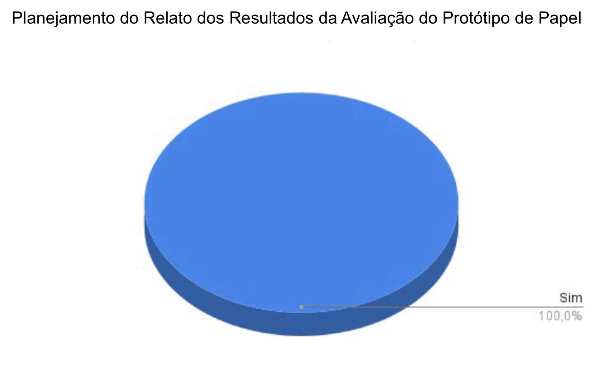

# Verificação do artefato "Planejamento do Relato dos Resultados da Avaliação do Protótipo de Papel"

# Introdução

Este documento visa verificar se o artefato [Planejamento do Relato dos Resultados da Avaliação do Protótipo de Papel](https://interacao-humano-computador.github.io/2023.2-Dominio-Publico/design_avalaiacao_desenvolvimento/nivel2/prototipo_de_papel/planejamento_relato/) segue os critérios da Disciplina de Interação Humano-Computador e ajudar os integrantes a identificar possíveis erros e correções.

## Checklist de Verificação

Na tabela 1, estão listados os critérios que devem ser verificados no Planejamento do Relato dos Resultados da Avaliação do Protótipo de Papeldo Grupo 4.

<b>Tabela 1</b> - Checklist do artefato "Planejamento do Relato dos Resultados da Avaliação do Protótipo de Papel" . 

| ID  | Critério                                                                                                         | Avaliação |
| --- | ---------------------------------------------------------------------------------------------------------------- | --------- |
| 01  | O artefato conta com um registro padronizado de suas versões?                                                    | Sim       |
| 02  | O artefato inclui uma seção de introdução?                                                                       | Sim       |
| 03  | As referências bibliográficas e a bibliografia estão corretamente utilizadas no artefato, seguindo a norma ABNT? | Sim       |
| 04  | Todas as chamadas para tabelas e figuras estão incorporadas ao texto?                                            | Sim       |
| 05  | Há uma consistência na apresentação de tabelas e figuras?                                                        | Sim       |
| 06  | A estrutura do documento está claramente definida e se mantem consistente durante todo artefato?                 | Sim       |
| 07  | Os métodos utilizados são detalhadamente descritos no artefato?                                                  | Sim       |
| 08  | O artefato apresenta uma descrição dos resultados obtidos na avaliação?                                          | Sim       |
| 09  | O artefato fornece uma explicação das conclusões alcançadas na avaliação?                                        | Sim       |
| 10  | O artefato inclui o modelo do cronograma executado durante a avaliação?                                          | Sim       |
| 11  | O artefato fornece a estrutura do relatório a ser utilizada no relato dos resultados?                            | Sim       |

Fonte: [Ana Catarina Santos](https://github.com/an4catarina), 2023

## Conclusão

Após a avaliação, foi feita uma análise geral sobre os artefatos. Como todos foram classificados como "Sim", não terão explicações sobre a situação do critério.

Na Figura 1, encontra-se um gráfico com o resultado da checklist da verificação do artefato.

Figura 1: Resultado da verificação do artefato

Fonte: [Ana Catarina Santos](https://github.com/an4catarina)

## Gravação de Verificação

O vídeo 1 contém a gravação da verificação individual.

Vídeo 1: Verificação individual

<iframe width="560" height="315" src="https://www.youtube.com/embed/SUPm2dBX3ww?si=SYJd-dOyN7eSvIrI" title="YouTube video player" frameborder="0" allow="accelerometer; autoplay; clipboard-write; encrypted-media; gyroscope; picture-in-picture; web-share" allowfullscreen></iframe>

Fonte: [Ana Catarina Santos](https://github.com/an4catarina)

## Bibliografia

> 1. BARROS, André. Plano de ensino da disciplina Interação Humano Computador no semestre 02/2023, FGA, Gama, 2023. Acesso em: 03 de dezembro de 2023.
> 2. BARBOSA, S. D. J.; SILVA, B. S. Interação Humano-Computador. Rio de Janeiro: Elsevier, 2011.
> 3. Planejamento da Verificação da Etapa 4 do Grupo 2- Bilheteria Digital. Disponível em: <<https://interacao-humano-computador.github.io/2023.1-BilheteriaDigital/verificacao/grupo/etapa4/planejamento-verificacao-etapa4-grupo>>. Acesso em 03 de dezembro de 2023.
> 4. FAGAN, Michael E. Design and Code Inspections to Reduce Errors in Program Development. 1976. Acesso em: 03 de dezembro de 2023
> 5. Planejamento da Verificação das Etapas do Grupo + 1 - Plataforma Lattes. Disponível em: <<https://interacao-humano-computador.github.io/2023.2-PlataformaLattes/Verificação/Grupo%20%2B%201/01%20-%20planejamento-verificacao-grupo-04/>>. Acesso em 02 de dezembro de 2023.

## Histórico de Versões

| Versão | Data  | Descrição                  | Autor(es)                                             | Revisor(es)                                    |
| ------ | ----- | -------------------------- | ----------------------------------------------------- | ---------------------------------------------- |
| 1.0    | 03/12 | Criação da avaliação       | [Ana Catarina Santos](https://github.com/an4catarina) | [Pedro Henrique](https://github.com/pedro-hsf) |
| 1.1    | 04/12 | Preenchimento da avaliação | [Ana Catarina Santos](https://github.com/an4catarina) | [Pedro Henrique](https://github.com/pedro-hsf) |
