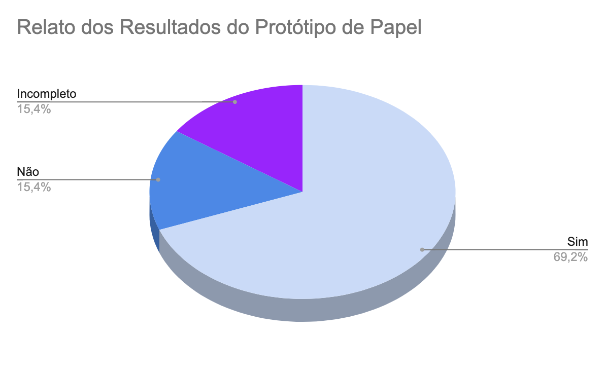

# Verificação do artefato "Relato dos Resultados do Protótipo de Papel"

# Introdução

Este documento visa verificar se o artefato de [Relato dos Resultados do Protótipo de Papel](https://interacao-humano-computador.github.io/2023.2-Dominio-Publico/design_avalaiacao_desenvolvimento/nivel2/prototipo_de_papel/relato_resultados/) segue os critérios da Disciplina de Interação Humano-Computador e ajudar os integrantes a identificar possíveis erros e correções. Esta etapa está dividida entre Checklist de Verificação e Conclusão.

## Checklist de Verificação

Na tabela 1, estão listados os critérios que devem ser verificados no artefato Relato dos Resultados da Análise de Tarefas do Grupo 4.

<b>Tabela 1</b> - Checklist do artefato "Relato dos Resultados da Análise de Tarefas" . 

| ID  | Critério                                                                                                         | Avaliação  |
| --- | ---------------------------------------------------------------------------------------------------------------- | ---------- |
| 01  | O artefato conta com um registro padronizado de suas versões?                                                    | Sim        |
| 02  | O artefato inclui uma seção de introdução?                                                                       | Sim        |
| 03  | As referências bibliográficas e a bibliografia estão corretamente utilizadas no artefato, seguindo a norma ABNT? | Sim        |
| 04  | Todas as chamadas para tabelas e figuras estão incorporadas ao texto?                                            | Não        |
| 05  | Há uma consistência na apresentação de tabelas e figuras?                                                        | Não        |
| 06  | A estrutura do documento está claramente definida e se mantem consistente durante todo artefato?                 | Incompleto |
| 07  | Os objetivos do relato são descritos no documento?                                                               | Sim        |
| 08  | A metodologia do relato é apresentada?                                                                           | Sim        |
| 09  | Os participantes estão documentados?                                                                             | Sim        |
| 10  | Existe uma análise e interpretação dos dados?                                                                    | Sim        |
| 11  | Os problemas encontrados estão listados?                                                                         | Sim        |
| 12  | As sugestões dadas pelos entrevistdos e/ou planejamento de replanejamento estão documentadas?                    | Sim        |
| 13  | O artefato segue o modelo pré definido no planejamento do relato dos resultados?                                 | Incompleto |

Fonte: [Ana Catarina Santos](https://github.com/an4catarina), 2023

## Conclusão

Após a avaliação, foi feita uma análise geral sobre os artefatos que tiveram a sua avaliação como "não" ou "incompleto" para haja uma melhor descrição do respectivo ID.

- **ID 04:** Foi definido como "Não" pois as tabelas e imagens estão numeradas em uma ordem errada além de algumas não serem chamadas no texto.
- **ID 04:** Foi definido como "Incompleto" pois como dito anteriormente, as tabelas e figuras estão inconsistentes em sua ordenação e apresentação.
- **ID 06:** Foi definido como "não" pois alguns tópicos apresentam uma foto geral do protótipo referido, enquanto outros não.
- **ID 13**: Foi definido como "incompleto" pois os tópicos não seguem a ordem proposta no Planejamento do Relato do Protótipo de Papel.

Na Figura 1, encontra-se um gráfico com o resultado da checklist da verificação do artefato.

Figura 1: Resultado da verificação do artefato

Fonte: [Ana Catarina Santos](https://github.com/an4catarina)

## Gravação de Verificação

O vídeo 1 contém a gravação da verificação individual.

Vídeo 1: Verificação individual

<iframe width="560" height="315" src="https://www.youtube.com/embed/ly8Lrl7pXZ8?si=VEVAzNrpDIWP8V46" title="YouTube video player" frameborder="0" allow="accelerometer; autoplay; clipboard-write; encrypted-media; gyroscope; picture-in-picture; web-share" allowfullscreen></iframe>

Fonte: [Ana Catarina Santos](https://github.com/an4catarina)

## Bibliografia

> 1. BARROS, André. Plano de ensino da disciplina Interação Humano Computador no semestre 02/2023, FGA, Gama, 2023. Acesso em: 03 de dezembro de 2023.
> 2. BARBOSA, S. D. J.; SILVA, B. S. Interação Humano-Computador. Rio de Janeiro: Elsevier, 2011.
> 3. Planejamento da Verificação da Etapa 4 do Grupo 2- Bilheteria Digital. Disponível em: <<https://interacao-humano-computador.github.io/2023.1-BilheteriaDigital/verificacao/grupo/etapa4/planejamento-verificacao-etapa4-grupo>>. Acesso em 03 de dezembro de 2023.
> 4. FAGAN, Michael E. Design and Code Inspections to Reduce Errors in Program Development. 1976. Acesso em: 03 de dezembro de 2023
> 5. Planejamento da Verificação das Etapas do Grupo + 1 - Plataforma Lattes. Disponível em: <<https://interacao-humano-computador.github.io/2023.2-PlataformaLattes/Verificação/Grupo%20%2B%201/01%20-%20planejamento-verificacao-grupo-04/>>. Acesso em 02 de dezembro de 2023.

## Histórico de Versões

| Versão | Data  | Descrição                  | Autor(es)                                             | Revisor(es)                                    |
| ------ | ----- | -------------------------- | ----------------------------------------------------- | ---------------------------------------------- |
| 1.0    | 03/12 | Criação da avaliação       | [Ana Catarina Santos](https://github.com/an4catarina) | [Pedro Henrique](https://github.com/pedro-hsf) |
| 1.1    | 04/12 | Preenchimento da avaliação | [Ana Catarina Santos](https://github.com/an4catarina) | [Pedro Henrique](https://github.com/pedro-hsf) |
