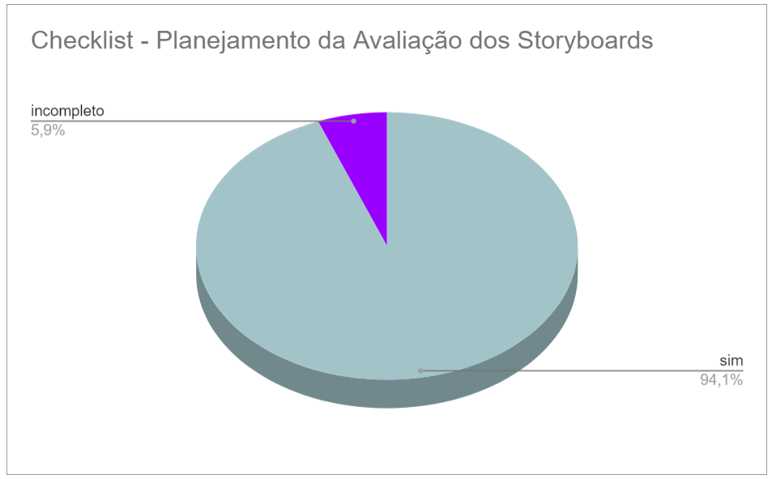

## Verificação do artefato "Planejamento da Avaliação dos Storyboards"

# Introdução

Este documento visa verificar se o artefato de [Planejamento da Avaliação dos Storyboards](../../../../design_avalaiacao_desenvolvimento/nivel1/storyboard/planejamento_avaliacao.md) segue os critérios da Disciplina de Interação Humano-Computador e ajudar os integrantes a identificar possíveis erros e correções. Esta etapa está dividida entre Checklist de Verificação e Conclusão.

## Checklist de Verificação

Na tabela 1, estão listados os critérios específicos para a avaliação do artefato de Planejamento da Avaliação dos Storyboards criado pelo Grupo 4.

<b>Tabela 1</b> Checklist do artefato "Planejamento da Avaliação dos Storyboards" 

| ID  | Critério                                                                                                         | Avaliação |
| --- | ---------------------------------------------------------------------------------------------------------------- | --------- |
| 01  | O artefato conta com um registro padronizado de suas versões?                                                    | sim |
| 02  | O artefato inclui uma seção de introdução?                                                                       | sim |
| 03  | As referências bibliográficas e a bibliografia estão corretamente utilizadas no artefato, seguindo a norma ABNT? | sim |
| 04  | Todas as chamadas para tabelas e figuras estão incorporadas ao texto?                                            | sim |
| 05  | Há uma consistência na apresentação de tabelas e figuras?                                                        | sim |
| 06  | A estrutura do documento está claramente definida e se mantem consistente durante todo artefato?                 | sim |
| 07  | O planejamento da avaliação segue o Framework DECIDE?                                                            | sim |
| 08  | Os objetivos da avaliação estão bem definidos e apresentam os motivos de sua escolha?                            | incompleto |
| 09  | O artefato apresenta o escopo da avaliação?                                                                      | sim |
| 10  | Os métodos a serem utilizados na avaliação são detalhadamente descritos no artefato?                             | sim |
| 11  | O artefato apresenta o motivo de escolha dos participantes?                                                      | sim |
| 12  | O artefato apresenta o motivo da escolha da quantidade de participantes?                                         | sim |
| 13  | O artefato descreve os aspectos práticos da execução da avaliação?                                               | sim |
| 14  | O artefato apresenta os aspectos éticos da execução da avaliação?                                                | sim |
| 15  | O artefato fornece uma descrição das perguntas a serem formuladas durante a avaliação?                           | sim |
| 16  | Existe um cronograma planejado para a execução da avaliação no artefato?                                         | sim |
| 17  | O artefato inclui um teste piloto do planejamento da avaliação?                                                  | sim |

Fonte: [Victor Hugo](https://github.com/ViictorHugoo), 2023

## Conclusão
No gráfico 1 é possível verificar os resultados obtidos na avaliação do artefato "Planejamento da Avaliação dos Storyboards".

 Gráfico 1: Resultados da verificação do artefato

Fonte: [Victor Hugo](https://github.com/ViictorHugoo), 2023

Após a avaliação, realizou-se uma análise geral dos artefatos que receberam avaliação 'não' ou 'incompleto', visando uma melhor descrição do respectivo ID. Esta análise inclui a listagem dos problemas identificados durante a inspeção, sua localização, gravidade, justificativa e/ou recomendações de solução, quando aplicáveis.

- **ID 08:** Foi definido como "incompleto".
    - Problema: Não é de fácil compreensão o motivo da escolha dos objetivos da avaliação;
    - Local: "D - Objetivos da avaliação";
    - Gravidade: Problema pequeno;
    - Solução: Definir de forma mais clara os motivos de cada objetivo e sua importância para a avaliação;
    - Oberservação: Parte do objetivo se encontra em outra parte do artefato, na seção "E - Exploração de perguntas".

## Gravação da Verificação

É possível ver a gravação da verificação do artefato "Planejamento da Avaliação dos Storyboards" no vídeo 1.

Vídeo 1: Verificação do artefato Planejamento da Avaliação dos Storyboards 

<iframe width="560" height="315" src="https://www.youtube.com/embed/5KQUkSyoQds?si=ak8ZP62nAUSUwyju" title="YouTube video player" frameborder="0" allow="accelerometer; autoplay; clipboard-write; encrypted-media; gyroscope; picture-in-picture; web-share" allowfullscreen></iframe>

Autor: [Victor Hugo](https://github.com/ViictorHugoo)

## Bibliografia 

> 1. BARROS, André. Plano de ensino da disciplina Interação Humano Computador no semestre 02/2023, FGA, Gama, 2023. Acesso em: 03 de dezembro de 2023.
> 2. BARBOSA, S. D. J.; SILVA, B. S. Interação Humano-Computador. Rio de Janeiro: Elsevier, 2011.
> 3. Planejamento da Verificação da Etapa 4 do Grupo 2- Bilheteria Digital. Disponível em: <<https://interacao-humano-computador.github.io/2023.1-BilheteriaDigital/verificacao/grupo/etapa4/planejamento-verificacao-etapa4-grupo>>. Acesso em 03 de dezembro de 2023.
> 4. FAGAN, Michael E. Design and Code Inspections to Reduce Errors in Program Development. 1976. Acesso em: 03 de dezembro de 2023
> 5. Planejamento da Verificação das Etapas do Grupo + 1 - Plataforma Lattes. Disponível em: <<https://interacao-humano-computador.github.io/2023.2-PlataformaLattes/Verificação/Grupo%20%2B%201/01%20-%20planejamento-verificacao-grupo-04/>>. Acesso em 02 de dezembro de 2023.

## Histórico de Versões

| Versão | Data       | Descrição                   | Autor(es)                                       | Revisor(es)                                    |
| ------ | ---------- | --------------------------- | ----------------------------------------------- | ---------------------------------------------- |
| 1.0    | 03/12/2023 | Relato da inspeção          | [Victor Hugo](https://github.com/ViictorHugoo) | [Maria Alice](https://github.com/Maliz30)     |
| 1.1    | 04/12/2023 | Incluindo Gráficos          | [Victor Hugo](https://github.com/ViictorHugoo)  | [Pedro Henrique](https://github.com/pedro-hsf) |

