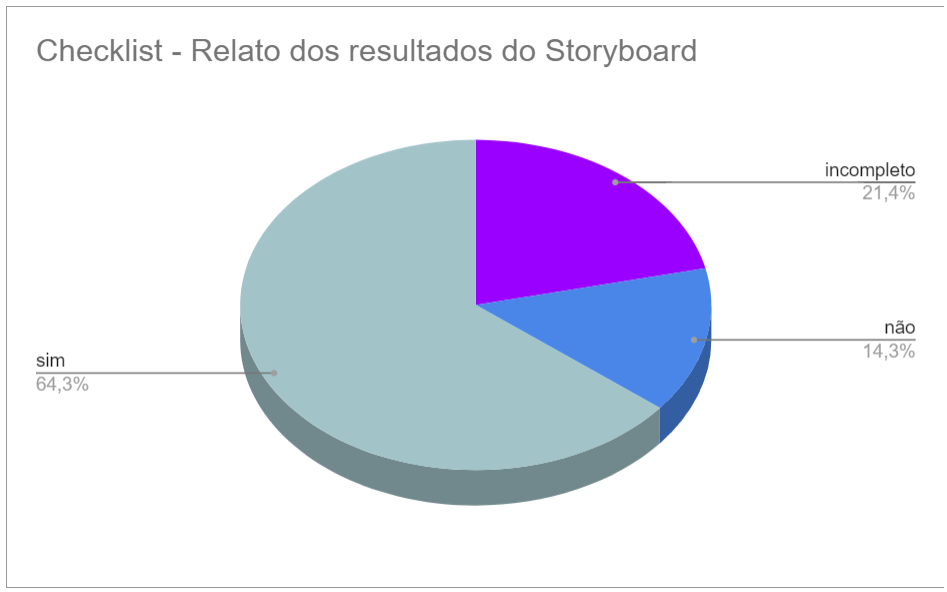

# Verificação do artefato "Relato dos resultados do Storyboard"

## Introdução

Este documento visa verificar se o artefato de [Relato dos resultados do Storyboard](../../../../design_avalaiacao_desenvolvimento/nivel1/storyboard/relato_resultados.md) segue os critérios da Disciplina de Interação Humano-Computador e ajudar os integrantes a identificar possíveis erros e correções. Esta etapa está dividida entre Checklist de Verificação e Conclusão.

## Checklist de Verificação

Na Tabela 1, estão listados os critérios específicos para a avaliação do artefato de Relato dos resultados do Storyboard criado pelo Grupo 4.

<b>Tabela 1</b> Checklist do artefato "Relato dos resultados do Storyboard" 

| ID  | Critério                                                                                                         | Avaliação  |
| --- | ---------------------------------------------------------------------------------------------------------------- | ---------- |
| 01  | O artefato conta com um registro padronizado de suas versões?                                                    | incompleto |
| 02  | O artefato inclui uma seção de introdução?                                                                       | não        |
| 03  | As referências bibliográficas e a bibliografia estão corretamente utilizadas no artefato, seguindo a norma ABNT? | não        |
| 04  | Todas as chamadas para tabelas e figuras estão incorporadas ao texto?                                            | incompleto |
| 05  | Há uma consistência na apresentação de tabelas e figuras?                                                        | sim        |
| 06  | A estrutura do documento está claramente definida e se mantem consistente durante todo artefato?                 | incompleto |
| 07  | Os objetivos do relato são apresentados?                                                                         | sim        |
| 08  | A metodologia do relato é apresentada?                                                                           | sim        |
| 09  | Os participantes estão documentados?                                                                             | sim        |
| 10  | Existe uma análise e interpretação dos dados?                                                                    | sim        |
| 11  | Os problemas encontrados estão listados?                                                                         | sim        |
| 12  | Existe sugestões e/ou planejamento de correção para os problemas?                                                | sim        |
| 13  | As entrevistas são gravadas?                                                                                     | sim        |
| 14  | As entrevistas duram no máximo 20 minutos?                                                                       | sim        |

Fonte: [Victor Hugo](https://github.com/ViictorHugoo), 2023

## Conclusão

No gráfico 1 é possível verificar os resultados obtidos na avaliação do artefato "Relato dos resultados do Storyboard".

 Gráfico 1: Resultados da verificação do artefato

Fonte: [Victor Hugo](https://github.com/ViictorHugoo), 2023

Após a avaliação, realizou-se uma análise geral dos artefatos que receberam avaliação 'não' ou 'incompleto', visando uma melhor descrição do respectivo ID. Esta análise inclui a listagem dos problemas identificados durante a inspeção, sua localização, gravidade, justificativa e/ou recomendações de solução, quando aplicáveis.

- **ID 01:** Foi definido como "incompleto".
    - Problema: Item com número de versão incorreto;
    - Local: Tabela de Histórico de Versões;
    - Gravidade: Problema cosmético;
    - Solução: Correção do número de versão para "1.7".
- **ID 02:** Foi definido como "não".
    - Problema: Não há texto na seção de introdução;
    - Local: "Introdução";
    - Gravidade: Problema pequeno;
    - Solução: Inclusão de um texto introdutório na seção de introdução.
- **ID 03:** Foi definido como "não".
    - Problema: Não há referências bibliográficas e nem bibliografia;
    - Local: "Referências Bibliográficas" e "Bibliografia";
    - Gravidade: Problema pequeno;
    - Solução: Inclusão de referências bibliográficas e bibliografia.
- **ID 04:** Foi definido como "incompleto".
    - Problema: Tabelas e Vídeos sem numeração;
    - Local: "Tarefa: Avaliar Mídia";
    - Gravidade: Problema pequeno;
    - Solução: Inclusão de numerção das tabelas e vídeos.
- **ID 06:** Foi definido como "incompleto".
    - Problema: Repetição desnecessária de "Sugestões de Melhoria";
    - Local: "Tarefa: Download de Midia" e "Tarefa: Acessar Ajuda";
    - Gravidade: Problema pequeno;
    - Solução: Exclusão do texto em excesso.

## Gravação da Verificação

É possível ver a gravação da verificação do artefato "Relato dos resultados do Storyboard" no vídeo 1 e a gravação da validação com os autores do artefato no vídeo 2.

Vídeo 1: Verificação do artefato Relato dos Resultados do Storyboard 

<iframe width="560" height="315" src="https://www.youtube.com/embed/TJmiMsMCv60?si=L4Sl1QqzRIgbyoih" title="YouTube video player" frameborder="0" allow="accelerometer; autoplay; clipboard-write; encrypted-media; gyroscope; picture-in-picture; web-share" allowfullscreen></iframe>

Autor: [Victor Hugo](https://github.com/ViictorHugoo)

Vídeo 2: Validação da verificação do artefato Relato dos Resultados do Storyboard 

<iframe width="560" height="315" src="https://www.youtube.com/embed/4kJY6S0PbmM?si=GJp9kDwBKCF-Qw1x" title="YouTube video player" frameborder="0" allow="accelerometer; autoplay; clipboard-write; encrypted-media; gyroscope; picture-in-picture; web-share" allowfullscreen></iframe>

Autor: [Victor Hugo](https://github.com/ViictorHugoo)

## Bibliografia 

> 1. BARROS, André. Plano de ensino da disciplina Interação Humano Computador no semestre 02/2023, FGA, Gama, 2023. Acesso em: 03 de dezembro de 2023.
> 2. BARBOSA, S. D. J.; SILVA, B. S. Interação Humano-Computador. Rio de Janeiro: Elsevier, 2011.
> 3. Planejamento da Verificação da Etapa 4 do Grupo 2- Bilheteria Digital. Disponível em: <<https://interacao-humano-computador.github.io/2023.1-BilheteriaDigital/verificacao/grupo/etapa4/planejamento-verificacao-etapa4-grupo>>. Acesso em 03 de dezembro de 2023.
> 4. FAGAN, Michael E. Design and Code Inspections to Reduce Errors in Program Development. 1976. Acesso em: 03 de dezembro de 2023
> 5. Planejamento da Verificação das Etapas do Grupo + 1 - Plataforma Lattes. Disponível em: <<https://interacao-humano-computador.github.io/2023.2-PlataformaLattes/Verificação/Grupo%20%2B%201/01%20-%20planejamento-verificacao-grupo-04/>>. Acesso em 02 de dezembro de 2023.

## Histórico de Versões

| Versão | Data       | Descrição          | Autor(es)                                      | Revisor(es)                                    |
| ------ | ---------- | ------------------ | ---------------------------------------------- | ---------------------------------------------- |
| 1.0    | 03/12/2023 | Relato da inspeção | [Victor Hugo](https://github.com/ViictorHugoo) | [Maria Alice](https://github.com/Maliz30)      |
| 1.1    | 04/12/2023 | Incluindo Gráficos | [Victor Hugo](https://github.com/ViictorHugoo) | [Pedro Henrique](https://github.com/pedro-hsf) |

