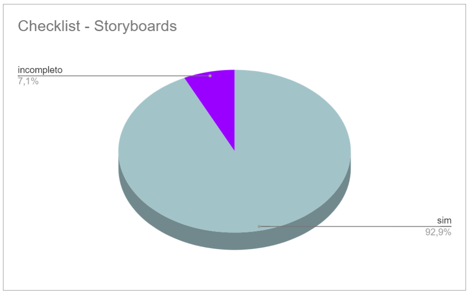

# Verificação do artefato "Storyboards"

# Introdução

Este documento visa verificar se o artefato de [Storyboards](../../../../design_avalaiacao_desenvolvimento/nivel1/storyboard/storyboards.md) segue os critérios da Disciplina de Interação Humano-Computador e ajudar os integrantes a identificar possíveis erros e correções. Esta etapa está dividida entre Checklist de Verificação e Conclusão.

## Checklist de Verificação

Na Tabela 1, estão listados os critérios que devem ser verificados nos Storyboards do Grupo 4.

<b>Tabela 1</b> - Checklist do artefato "Storyboards" . 

| ID  | Critério                                                                                                         | Avaliação  |
| --- | ---------------------------------------------------------------------------------------------------------------- | ---------- |
| 01  | O artefato conta com um registro padronizado de suas versões?                                                    | sim        |
| 02  | O artefato inclui uma seção de introdução?                                                                       | sim        |
| 03  | As referências bibliográficas e a bibliografia estão corretamente utilizadas no artefato, seguindo a norma ABNT? | sim        |
| 04  | Todas as chamadas para tabelas e figuras estão incorporadas ao texto?                                            | incompleto |
| 05  | Há uma consistência na apresentação de tabelas e figuras?                                                        | sim        |
| 06  | A estrutura do documento está claramente definida e se mantem consistente durante todo artefato?                 | sim        |
| 07  | Cada storyboard inclui um título no próprio papel ou no texto introdutório?                                      | sim        |
| 08  | Foi atribuída a autoria de cada storyboard a um membro específico do grupo?                                      | sim        |
| 03  | Existe um storyboard correspondente a cada tarefa apresentada pelo grupo?                                        | sim        |
| 09  | Cada storyboard incorpora atores em sua representação?                                                           | sim        |
| 10  | Cada storyboard contém cenários relevantes?                                                                      | sim        |
| 11  | A satisfação do usuário ao final da cena está representada em cada storyboard?                                   | sim        |
| 12  | Os storyboards incluem ações específicas do usuário?                                                             | sim        |
| 13  | Objetivos são claramente delineados em cada storyboard?                                                          | sim        |
| 14  | Os storyboards foram elaborados em formato físico, em papel?                                                     | sim        |

Fonte: [Victor Hugo](https://github.com/ViictorHugoo), 2023

## Conclusão

No gráfico 1 é possível verificar os resultados obtidos na avaliação do artefato "Storyboards".

 Gráfico 1: Resultados da verificação do artefato

Fonte: [Victor Hugo](https://github.com/ViictorHugoo), 2023

Após a avaliação, realizou-se uma análise geral dos artefatos que receberam avaliação 'não' ou 'incompleto', visando uma melhor descrição do respectivo ID. Esta análise inclui a listagem dos problemas identificados durante a inspeção, sua localização, gravidade, justificativa e/ou recomendações de solução, quando aplicáveis.

- **ID 04:** Foi definido como "incompleto".
  - Problema: Figura com numeração incorreta;
  - Local: "Tarefa 3: Pesquisar por mídia";
  - Gravidade: Problema cosmético;
  - Solução: Correção da numeração da figura para "Figura 3".

## Gravação da Verificação

É possível ver a gravação da verificação do artefato "Storyboards" no Vídeo 1.

Vídeo 1: Verificação do artefato Storyboards 

<iframe width="560" height="315" src="https://www.youtube.com/embed/Jl4TMNbliK8?si=iyyhHS0QNI0d0PXN" title="YouTube video player" frameborder="0" allow="accelerometer; autoplay; clipboard-write; encrypted-media; gyroscope; picture-in-picture; web-share" allowfullscreen></iframe>

Autor: [Victor Hugo](https://github.com/ViictorHugoo)

## Bibliografia 

> 1. BARROS, André. Plano de ensino da disciplina Interação Humano Computador no semestre 02/2023, FGA, Gama, 2023. Acesso em: 03 de dezembro de 2023.
> 2. BARBOSA, S. D. J.; SILVA, B. S. Interação Humano-Computador. Rio de Janeiro: Elsevier, 2011.
> 3. Planejamento da Verificação da Etapa 4 do Grupo 2- Bilheteria Digital. Disponível em: <<https://interacao-humano-computador.github.io/2023.1-BilheteriaDigital/verificacao/grupo/etapa4/planejamento-verificacao-etapa4-grupo>>. Acesso em 03 de dezembro de 2023.
> 4. FAGAN, Michael E. Design and Code Inspections to Reduce Errors in Program Development. 1976. Acesso em: 03 de dezembro de 2023
> 5. Planejamento da Verificação das Etapas do Grupo + 1 - Plataforma Lattes. Disponível em: <<https://interacao-humano-computador.github.io/2023.2-PlataformaLattes/Verificação/Grupo%20%2B%201/01%20-%20planejamento-verificacao-grupo-04/>>. Acesso em 02 de dezembro de 2023.

## Histórico de Versões

| Versão | Data       | Descrição          | Autor(es)                                      | Revisor(es)                                    |
| ------ | ---------- | ------------------ | ---------------------------------------------- | ---------------------------------------------- |
| 1.0    | 03/12/2023 | Relato da inspeção | [Victor Hugo](https://github.com/ViictorHugoo) | [Maria Alice](https://github.com/Maliz30)      |
| 1.1    | 04/12/2023 | Incluindo Gráficos | [Victor Hugo](https://github.com/ViictorHugoo) | [Pedro Henrique](https://github.com/pedro-hsf) |

