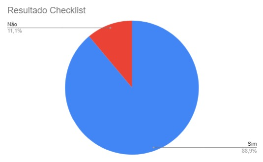

# Introdução 

A verificação do Cronograma Planejado é uma forma de validar o que foi feito pelo Grupo 4, Domínio Público, na construção do artefato Cronograma Planejado de horários.

## Objetivo

O objetivo desse artefato é verificar a qualidade do [Cronograma Planejado](docs/planejamento/cronograma.md) realizado pelo grupo 4, com o Domínio Público.

## Metodologia

A metodologia a ser utilizada será a Inspeção por meio do uso de Checklists, baseadas nas perguntas presentes no plano de ensino da matéria e nos padrões desejados para se haver num artefato desse tipo. A checklist criada pode ser visualizada na tabela 1:

Tabela 1: Verificação do cronograma planejado

| ID | Critério | Resultados |
|:--------:|:--------:|:--------:|
|1|O artefato possui introdução?|        |  
|2|O artefato possui histórico de versão atualizado?|       |
|3|Os textos estão em norma padrão e sem erros?|        | 
|4|O artefato possui Bibliografia?|       |  
|5|Todas as tarefas que serão realizadas estão no cronograma?|   |
|6|As tarefas estão bem subdivididas|  | 
|7|A tabela é chamada no texto?|      | 
|8|A tabela possui fonte e nome?|| 
|9|Todas as tarefas possuem revisor?|   | 

Fonte: [Harryson Martins](https://github.com/harry-cmartin) 

## Checklist executado

O checklist feito após a verificação pode ser visualizado a seguir na Tabela 2:

Tabela 2: Execução da verificação do cronograma planejado

| ID | Critério | Resultados |
|:--------:|:--------:|:--------:|
|1|O artefato possui introdução?|  Sim    |  
|2|O artefato possui histórico de versão atualizado?| Sim      |
|3|Os textos estão em norma padrão e sem erros?|  Sim      | 
|4|O artefato possui Bibliografia?|  Sim    |  
|5|Todas as tarefas que serão realizadas estão no cronograma?| Sim |
|6|As tarefas estão bem subdivididas| Sim| 
|7|A tabela é chamada no texto?| Sim  | 
|8|A tabela possui fonte e nome?|Não| 
|9|Todas as tarefas possuem revisor?|Sim | 

Fonte: [Harryson Martins](https://github.com/harry-cmartin)  

## Problemas Encontrados

A partir do checklist foi constatado que é necessario colocar fontes nas tabelas

## Verificação

Video 2: Gravação da verificação Cronograma Executado

<iframe width="560" height="315" src="https://www.youtube.com/embed/GgzY-nZj6AM?si=DE01s2KdmuooJ0C7" title="YouTube video player" frameborder="0" allow="accelerometer; autoplay; clipboard-write; encrypted-media; gyroscope; picture-in-picture; web-share" allowfullscreen></iframe>

Fonte:  [Harryson Martins](https://github.com/harry-cmartin)

## Resultados 

Aqui serão expostos os resultados obtidos a partir dos checklists, em forma gráfica sobre o artefato Cronograma, para aprte Planejada, verificado, com as opções "Sim", "Não" e "Não se aplica". No Gráfico 1 é possível ver os resultados:

Gráfico 1: Resultados da verificação dos Cronogramas Planejados

Fonte: [Harryson Martins](https://github.com/harry-cmartin)

## Bibliografia 

> Verificação. Repositório do Grupo Domínio Público da disciplina de Interação Humano Computador da Universidade de Brasília, 2023. Disponível em: <<https://interacao-humano-computador.github.io/2023.2-Dominio-Publico/verficacao/verificacao_grupo_5/etapa_planejamento/cronograma_planejado/>>. Acesso em: 2 de nov de 2023.

## Referencias Bibliograficas

<a id="FRM3" href="#anchor_1">1.</a> BARBOSA, S. D. J.; SILVA, B. S. Interação Humano-Computador. Rio de Janeiro: Elsevier, 2011.

## Histórico de Versões

| Versão | Data       | Descrição                        | Autor(es)                                                                                  | Revisor(es)                                    |
| ------ | ---------- | -------------------------------- | ------------------------------------------------------------------------------------------ | ---------------------------------------------- |
| 1.0 | 02/12 | Construção e elaboração do documento | [Harryson Martins](https://github.com/harry-cmartin) |[Gustavo França](https://github.com/gustavofbs)|