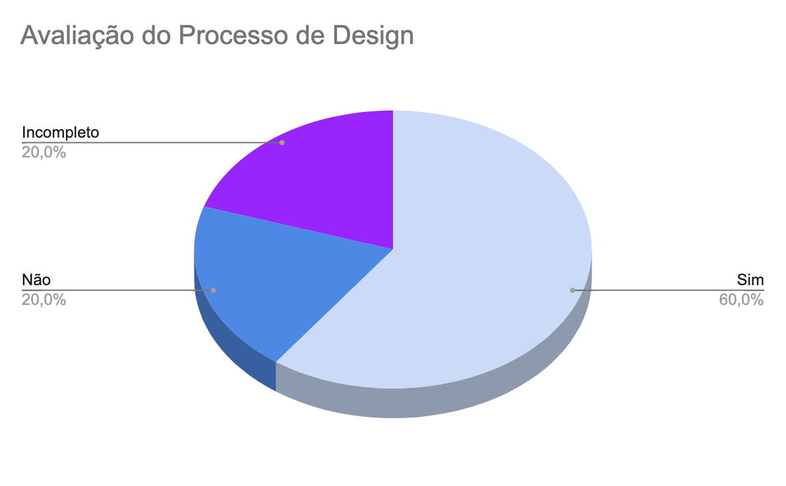

# Avaliação do Processo de Design

## Introdução

Este documento visa avaliar se o artefato [Processo de Design](https://interacao-humano-computador.github.io/2023.2-Dominio-Publico/planejamento/processo_design/) do grupo 4 na versão 1.1 produzido por [Maria Alice](https://github.com/Maliz30) e revisado por [Victor Hugo](https://github.com/ViictorHugoo) segue os critérios da Disciplina de Interação Humano-Computador e ajudar os integrantes a identificar possíveis erros e correções. .

## Checklist de Verificação

Na tabela 1, estão listados os critérios que devem ser verificados no artefato Avaliação do Processo de Design do Grupo 4.

Tabela 1: Checklist Processo Design

| ID  |                                     Critério                                      |            |
| :-: | :-------------------------------------------------------------------------------: | ---------- |
|  1  |                           O artefato possui introdução?                           | Sim        |
|  2  |                 O artefato possui histórico de versão atualizado?                 | Sim        |
|  3  |                   Os textos estão em norma padrão e sem erros?                    | Não        |
|  4  |                          O artefato possui Bibliografia?                          | Sim        |
|  5  |         As atividades do processo de design são claras e bem delineadas?          | Incompleto |
|  6  |           Os ciclos de vida foram apresentados de forma compreensível?            | Incompleto |
|  7  |                    A escolha do ciclo de vida foi justificada?                    | Sim        |
|  8  |               O ciclo de vida escolhido tem suas etapas detalhadas?               | Sim        |
|  9  |             A forma como o ciclo de vida será executado é detalhada?              | Não        |
| 10  | O ciclo de vida selecionado faz sentido quando comparado com o escopo do projeto? | Sim        |

Fonte: [Ana Catarina Santos](https://github.com/an4catarina) 

## Conclusão

Após a avaliação, foi feita uma análise geral sobre os artefatos que tiveram a sua avaliação como "não" ou "incompleto" para haja uma melhor descrição do respectivo ID.

- **ID 03:** Foi definido como "Não" pois existem alguns erros de ortografia e digitação ao decorrer do arquivo.
- **ID 05:** Foi definido como "Incompleto" pois por mais que o Ciclo de Mayhey esteja bem explicado e especificado, o Ciclo de Vida em Estrela e a Engenharia de Usabilidade de Nielsen estão muito abrangentes e não são explicados profundamente
- **ID 06:** Foi definido como "Incompleto" pois como dito anteriormente, o Ciclo de Vida em Estrela e a Engenharia de Usabilidade de Nielsen podem ser explicados de formas mais detalhadas e completas.
- **ID 09**: Foi definido como "Não" pois o artefato não explica como o grupo irá utilizar o modelo escolhido na prática, a explicação é abrangente e necessita de mais especificação.

Na Figura 1, encontra-se um gráfico com o resultado da checklist da verificação do artefato.

Figura 1: Resultado da verificação do artefato

Fonte: [Ana Catarina Santos](https://github.com/an4catarina)

## Gravação de Verificação

O vídeo 1 contém a gravação da verificação individual.

Vídeo 1: Verificação individual

<iframe width="560" height="315" src="https://www.youtube.com/embed/leglY79A1bM?si=VfiCgthVEXSVvrtZ" title="YouTube video player" frameborder="0" allow="accelerometer; autoplay; clipboard-write; encrypted-media; gyroscope; picture-in-picture; web-share" allowfullscreen></iframe>

Fonte: [Ana Catarina Santos](https://github.com/an4catarina)

## Bibliografia

> 1. BARROS, André. Plano de ensino da disciplina Interação Humano Computador no semestre 02/2023, FGA, Gama, 2023. Acesso em: 03 de dezembro de 2023.
> 2. BARBOSA, S. D. J.; SILVA, B. S. Interação Humano-Computador. Rio de Janeiro: Elsevier, 2011.
> 3. Planejamento da Verificação da Etapa 4 do Grupo 2- Bilheteria Digital. Disponível em: <<https://interacao-humano-computador.github.io/2023.1-BilheteriaDigital/verificacao/grupo/etapa4/planejamento-verificacao-etapa4-grupo>>. Acesso em 03 de dezembro de 2023.
> 4. FAGAN, Michael E. Design and Code Inspections to Reduce Errors in Program Development. 1976. Acesso em: 03 de dezembro de 2023
> 5. Planejamento da Verificação das Etapas do Grupo + 1 - Plataforma Lattes. Disponível em: <<https://interacao-humano-computador.github.io/2023.2-PlataformaLattes/Verificação/Grupo%20%2B%201/01%20-%20planejamento-verificacao-grupo-04/>>. Acesso em 02 de dezembro de 2023.

## Histórico de Versões

| Versão | Data  | Descrição                  | Autor(es)                                             | Revisor(es)                                    |
| ------ | ----- | -------------------------- | ----------------------------------------------------- | ---------------------------------------------- |
| 1.0    | 03/12 | Criação da avaliação       | [Ana Catarina Santos](https://github.com/an4catarina) | [Pedro Henrique](https://github.com/pedro-hsf) |
| 1.1    | 04/12 | Preenchimento da avaliação | [Ana Catarina Santos](https://github.com/an4catarina) | [Pedro Henrique](https://github.com/pedro-hsf) |
