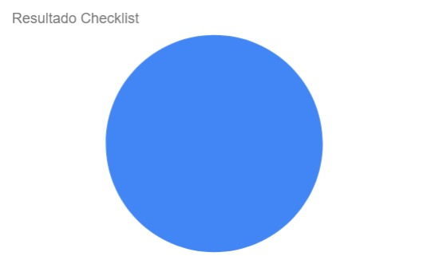

# Introdução 

A verificação do artefato do site escolhido é uma forma de validar o que foi feito pelo Grupo 4, Domínio Público, na construção do artefato dos sites avaliados.

## Objetivo

O objetivo desse artefato é verificar a qualidade do [Sites avaliados](docs/planejamento/sites_avaliados.md) realizado pelo grupo 4, com o site Domínio.

## Metodologia

A metodologia a ser utilizada será a Inspeção por meio do uso de Checklists, baseadas nas perguntas presentes no plano de ensino da matéria e nos padrões desejados para se haver num artefato desse tipo. A checklist criada pode ser visualizada na Tabela 1:

Tabela 1: Verificação dos Sites Avaliados

|  ID   |                          Critério                           | Resultados |
| :---: | :---------------------------------------------------------: | :--------: |
|   1   |                O artefato possui introdução?                |            |
|   2   |      O artefato possui histórico de versão atualizado?      |            |
|   3   |        Os textos estão em norma padrão e sem erros?         |            |
|   4   |               O artefato possui Bibliografia?               |            |
|   5   | São evidenciados todos os sites escolhidos por cada membro? |            |
|   6   |          Cada site avaliado possui uma descrição?           |            |
|   7   |     São evidenciados os problemas de cada site exposto?     |            |

Fonte: [Harryson Martins](https://github.com/harry-cmartin) 

## Checklist executado

O checklist feito apos a verificação pode ser visualizado a seguir na Tabela 2:

Tabela 1: Execução da verificação do Site escolhido

| Verificação |                          Avaliação                          | Sugestões |
| :---------: | :---------------------------------------------------------: | :-------: |
|      1      |                O artefato possui introdução?                |    Sim    |
|      2      |      O artefato possui histórico de versão atualizado?      |    Sim    |
|      3      |        Os textos estão em norma padrão e sem erros?         |    Sim    |
|      4      |               O artefato possui Bibliografia?               |    Sim    |
|      5      | São evidenciados todos os sites escolhidos por cada membro? |    Sim    |
|      6      |          Cada site avaliado possui uma descrição?           |    Sim    |
|      7      |     São evidenciados os problemas de cada site exposto?     |    Sim    |

Fonte: [Harryson Martins](https://github.com/harry-cmartin) 

## Problemas Encontrados

Nessa verificação não foram encontrados problemas a serem corrigidos.

## Verificação

Video 1: Gravação da verificação do artefato Sites Avaliados

<iframe width="560" height="315" src="https://www.youtube.com/embed/PivHyW_ViDk?si=CvwBUvgiolv-YSTc" title="YouTube video player" frameborder="0" allow="accelerometer; autoplay; clipboard-write; encrypted-media; gyroscope; picture-in-picture; web-share" allowfullscreen></iframe>

Fonte: [Gustavo França](https://github.com/gustavofbs) 

 

## Resultados 

Aqui serão expostos os resultados obtidos a partir dos checklists, em forma gráfica sobre o artefato Sites Avaliadoso verificado, com as opções "Sim", "Não" e "Não se aplica". No Gráfico 1 é possível ver os resultados:

Gráfico 1: Resultados da verificação do Perfil de usuário

Fonte: [Gustavo França](https://github.com/gustavofbs)

## Bibliografia 

> Verificação. Repositório do Grupo Domínio Público da disciplina de Interação Humano Computador da Universidade de Brasília, 2023. Disponível em: <<https://interacao-humano-computador.github.io/2023.2-Dominio-Publico/verficacao/verificacao_grupo_5/etapa_planejamento/sites_avaliados/>>. Acesso em: 2 de nov de 2023.

## Referências Bibliograficas

<a id="FRM3" href="#anchor_1">1.</a> BARBOSA, S. D. J.; SILVA, B. S. Interação Humano-Computador. Rio de Janeiro: Elsevier, 2011.

## Histórico de Versões

| Versão | Data  | Descrição                            | Autor(es)                                            | Revisor(es)                                    |
| ------ | ----- | ------------------------------------ | ---------------------------------------------------- | ---------------------------------------------- |
| 1.0    | 02/12 | Construção e elaboração do documento | [Harryson Martins](https://github.com/harry-cmartin) | [Ana Catarina](https://github.com/an4catarina) |